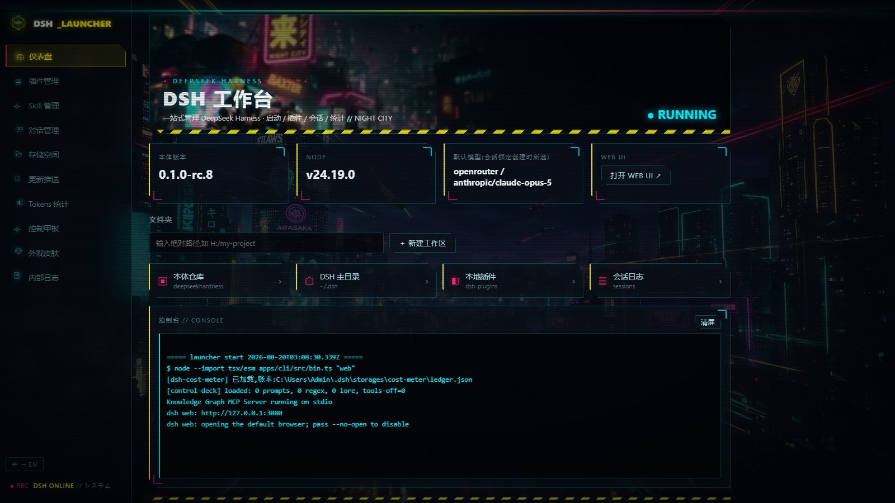
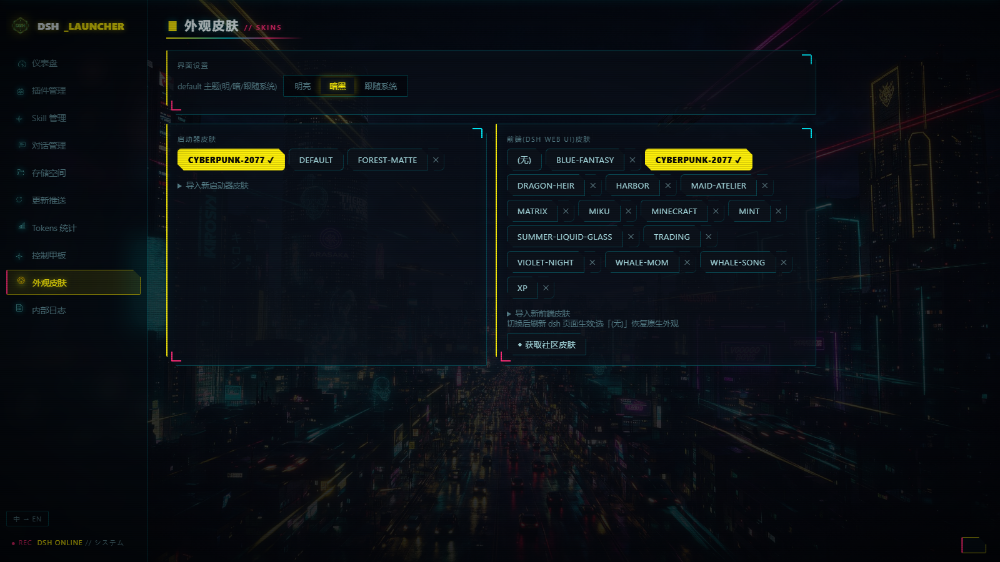

# DSH Suite — the DeepSeek Harness power-user workbench

[中文](README.zh.md) | **English**

> A complete toolkit that turns [DeepSeek Harness (dsh)](https://github.com/deepseek-ai/deepseek-harness) from a CLI tool into a visual workstation: a cyberpunk desktop launcher + 22 production-grade plugins + 7 engineering skills + 3 in-dsh skills.
> **Zero core rewrites** — every capability is delivered through official plugin extension points, so the upstream core stays independently upgradable at all times.
> Current vendored core: **dsh 0.1.1-rc.2** (upstream tag `dsh-v0.1.1-rc.2`). See [CHANGELOG.md](CHANGELOG.md).



| SillyTavern-grade Control Deck | Skin manager + community skin market |
|---|---|
|  |  |

<details><summary>More: CC-style token analytics (heatmap / streaks / Moby-Dick easter egg)</summary>


</details>

---

## ✦ What is this

DeepSeek Harness is DeepSeek's official agent framework — powerful, but natively CLI-only with a plain web UI. DSH Suite adds on top of it:

- **A desktop launcher** (UX inspired by 秋叶 aaaki's ComfyUI packs): double-click an EXE for one-click start/stop, plugin market, skill market, skin market, token analytics, session browser, and one-click updates — all graphical; dsh cold-starts in about 1.5 s from the built CLI;
- **The Control Deck**: SillyTavern-grade multi-entry leveled prompt injection, regex scripts, World Info lorebooks, and sampling overrides, edited in a GUI and hot-reloaded within 1.5 s;
- **A cost stack**: live multi-provider balances, automatic model price sync, cache-hit rates, and a CC-style usage heatmap;
- **Safety & speed**: destructive-command blocking, hover model prices, HTTP quick-workspace creation, and frontend skin injection;
- **Memory & context**: see and edit every session's active compaction summary, and a lightweight long-term memory (compaction summaries + extracted facts + notes, BM25 / optional local-embedding recall, injected as a separate context row, `memory_recall` / `memory_note` tools).

Everything ships as **plugins / skills / a standalone launcher** — not one line of the vendored core is modified, so the core can be replaced by any upstream release.

## ✦ Quick start

Prerequisites: Windows 10/11, [Git](https://git-scm.com/), [Node.js `^22.19 || >=24` — 24 LTS recommended, 23.x is excluded by the core](https://nodejs.org/), Edge or Chrome.

```bat
git clone https://github.com/WZZNNE/DSH-CyberWorkStation.git
cd DSH-CyberWorkStation
setup.cmd
```

`setup.cmd` automatically: uses the bundled `core/` source tree (dsh 0.1.1-rc.2; falls back to cloning upstream when absent) → installs deps and builds (build:lib + build:web) → registers all suite plugins → links the core packages the plugins import (`launcher/peer-links.mjs`) → opens the launcher.

Daily use afterwards: double-click `launcher/DSH启动器.exe`. Manual mode: `node launcher/server.mjs` then visit `http://127.0.0.1:3090`.

> Remember to configure an API key on the launcher's Credentials page or in dsh Settings → Credentials (`OPENROUTER_API_KEY` / `DEEPSEEK_API_KEY`; an environment variable of the same name still wins — `settings.yaml` only holds the reference name, never the secret).
> Core checked out elsewhere? Point `DSH_REPO` at it; override the launcher port with `DSH_LAUNCHER_PORT`.
> Maintainer-local material (runtime logs, caches, maintainer tests and notes) lives under the git-ignored `.local/` directory; user data that must stay where the launcher reads it (converted community skins, `active.txt` state files, `plugins/node_modules` peer links) is ignored by individual rules instead.

## ✦ How it differs from stock dsh (feature matrix)

| Capability | Stock dsh | Suite | Form | Authorship |
|---|---|---|---|---|
| Visual management workbench | ✗ CLI only | 10+ pages, zh/en bilingual, light/dark/system | Standalone app (EXE + zero-dep Node server) | Original |
| One-click start / stop | ✗ manual commands | Boots the built CLI in ≈1.5 s (≈20 s via the tsx source launch), auto-opens the browser; stop reaps the whole console process tree | Launcher | Original |
| Embedded console | ✗ separate window | Aki-style embedded console, live output, autoscroll | Launcher | Original |
| Plugin management | CLI (`dsh plugin`) | Graphical list + ~150 built-in capability rows + one-click update | Launcher | Original |
| Plugin market | ✗ | Live npm search, one-click install, jump to project page | Launcher (npm registry API) | Original |
| Skill market | ✗ | Live GitHub search, one-click install into `~/.dsh/skills` | Launcher (GitHub API) | Original |
| Community skin market | ✗ | npm skin packages are **converted in place to local CSS** and managed on the Skins page (switch/delete/import) — never leaking into the plugin system | Launcher | Converter original; skin content belongs to its authors (e.g. the [@linxin666 collection](https://github.com/zhu1090093659/dsh-web-ui)) |
| Token analytics | ✗ | GitHub-style heatmap, streaks, per-model split, daily detail | Launcher (reads cost-meter-plus ledger) | Original |
| Costs / balances | ✗ | Live balances (OpenRouter/OpenAI/local), auto price catalog sync, cache-hit strip | Plugin `dsh-cost-meter-plus` | Fork of [Han-1413141/dsh-cost-meter](https://github.com/Han-1413141/dsh-cost-meter) (MIT) |
| Usage panel, de-peaked | - | Removes peak/off-peak price display | Plugin `dsh-token-usage-plus` | Fork of [Tastelessor/dsh-usage-stats](https://github.com/Tastelessor/dsh-usage-stats) (MIT) |
| Destructive-command blocking | ask-confirm only | `rm -rf`, formats, raw device writes, force pushes, fork bombs … denied outright | Plugin `dsh-safe-guard` | Original |
| Control Deck (ST-grade) | ✗ | Tabbed editor with presets, SillyTavern World Info / regex-script / prompt-preset import & export, macros, display-layer AI-output regex — see the tutorial below | Plugin `dsh-control-deck` | Original; semantics aligned with [SillyTavern](https://github.com/SillyTavern/SillyTavern) (behavior reference, no code included) |
| Frontend skin injection | ✗ | Injects `~/.dsh/frontend-skin.css` into the dsh web UI | Plugin `dsh-skin-loader` | Original |
| Hover model prices | ✗ | Model picker shows input/output USD per million tokens on hover | Plugin `dsh-price-hint` | Original |
| Quick workspace | manual GUI steps | One-click HTTP creation by absolute path (dashboard) | Plugin `dsh-quick-workspace` | Original |
| Model parameters (any model) | ✗ (edit settings.yaml by hand) | Context window / max output / thinking levels per model for every route — DeepSeek official, OpenRouter, local LM Studio / Ollama …; local models are probed and auto-taught their levels so the native picker offers them (one page, one Save per row) | Plugin `dsh-local-reasoning` + launcher "Model parameters" page | Original |
| Memory & context | Compaction summary is model-written and read-only (a collapsible row in the chat); no automatic memory across sessions (stock: an `@session` mention pulls a read-only snapshot of another session; or an MCP memory server if you wire one) | Launcher page lists every session (open or not); pick one to see its context pressure, the **active compaction summary (editable — saved as a real compaction record, the model continues from your text)**, compaction history and `/compact` on demand; long-term memory stores compaction summaries, model-extracted facts and notes, recalls them lexically (BM25, CJK-aware) or with a local `/v1/embeddings` model, injects relevant items as ONE separate context row, and gives the model `memory_recall` / `memory_note` | Plugin `dsh-memory-lite` + launcher "Memory & context" page | Original |
| Config backup | ✗ | One JSON bundle of the suite's `~/.dsh` configuration (settings.yaml as-is, deck + presets, web search, safety rules, model params, memory, profile patches, skills, hooks, frontend skin); restore keeps a copy of the current files; the credential store (`.credentials.yaml`) and session logs are never included | Launcher Storage page | Original |
| Web search, ST-style | DeepSeek-only `web_search` tool, no page reader | **`web_fetch` page reader** for every model (public http(s) only; runs in the harness, not the sandbox, so HTTPS works); Serper / SerpApi / Tavily / Brave / SearXNG / DeepSeek official (the official source needs only `DEEPSEEK_API_KEY` and works with any chat model); OpenRouter `:online` variants one click away on the Model parameters page (OpenRouter routes that carry their own `models` list; a catalog-only route must generate one on the dsh settings page first); four ways, set **once for the whole deployment** (dsh Settings → 联网搜索, or the Control Deck tab — same file) — off / **let the model decide** (tool call served by the chosen provider) / **search on trigger words** (ST trigger semantics: backticks / `$N` regex / phrases / always, template, budget, SSRF-guarded page visits; results added as a separate context message, your words untouched); keys stored through the dsh credential store; test button / **use the API provider's own search** (OpenRouter searches server-side through the `:online` model suffix, created automatically and **billed per search**; routes without such a switch fall back to the tool) | Plugin `dsh-web-search-plus` + Control Deck tab | Original; trigger semantics follow SillyTavern Extension-WebSearch (no code included) |
| Editing / deleting chat messages | ✗ (the log is append-only; the UI offers no edit) | Edit or delete any message, yours **and** the assistant's, three ways: display-only (browser), hide, or **change what the model reads** (a real `compaction/prune` + surface replace, shadow price intact); delete one message or a whole turn; fork a new session from any completed turn (the first turn cannot be a fork point) | Plugin `dsh-chat-editor` (header ✎ + assistant-actions) | Original |
| Temporary chats | ✗ every session lives in a workspace directory | One click makes a throwaway conversation in `$DSH_HOME/scratch/` with a shipped **chat-only preset** (no filesystem writes, no shell, jobs, subagents or workflows; `POST /new` may name another preset, which opts out of that sandbox), grouped in its own workspace; nothing is auto-deleted | Plugin `dsh-temp-chat` (sidebar button) | Original |
| Image / video / voice APIs | ✗ text only | Four kinds behind one settings panel: image (OpenAI-compatible, Gemini, Replicate, fal), video (Sora, Veo, Replicate, fal, MiniMax), speech (OpenAI-compatible incl. local Kokoro, ElevenLabs, Fish Audio, MiniMax), transcription (OpenAI-compatible incl. local Whisper) plus a custom-HTTP adapter; results are saved, listed and **played inline in the chat** | Plugin `dsh-media-lab` (`generate_image` / `generate_video` / `text_to_speech` / `transcribe_audio`) | Original |
| Desktop pet | ✗ | A companion with its own persona, lorebook and **separate multimodal API**; knows what the harness is doing (announces start / finish), talks first on four frequency bands, reminds you, speaks and listens, generates its own artwork, and — behind a three-level permission (none / ask / full) — reads the screen or drives mouse and keyboard; 8–24 frame sprite animations and a click-to-talk desktop window; three windows: in-dsh floating, WinForms desktop sprite, or an Edge app window | Plugin `dsh-desktop-pet` + dsh skill `desktop-pet` | Original |
| Safety rules UI | - | Extra deny / ask-first / **auto-allow** regexes (deny > ask > allow, built-ins always first) hot-loaded from `~/.dsh/safe-guard.json` | Plugin `dsh-safe-guard` + Control Deck tab | Original |
| Credentials in the system keyring | ✗ plaintext `.credentials.yaml` | API keys stored in the **Windows Credential Manager** (`dsh:<NAME>`); the environment still wins, secrets migrate on the next save, a keyring failure falls back to the plaintext path | Plugin `dsh-credentials-keyring` | Original |
| LAN /api fence for remote access | ✗ a 0.0.0.0 bind trusts every LAN IP on `/api` | When mobile remote is on, an **unpaired** LAN device gets 403 on `/api` — the auto-derived LAN authorities are stripped from the trust list **in a plugin, with zero core change**, so the fence survives a core upgrade | Plugin `dsh-lan-fence` | Original |
| Community ecosystem adoption | - | Nine community plugins adopted through the launcher's plugin market (not by `setup.cmd`; on this core `dsh-context` needs ≥ 0.40 — 0.13 registered its projections with a field the core no longer reads, so its 上下文 tab never loaded): vision bridge (image reading + OCR/grounding, 26 tools for text-only models; since v1.8.0 the Chinese-UI fork `dsh-vision-bridge-zh`), @file mentions, workbench sidebar (files/Git/terminal/browser), **scan-to-pair mobile remote** (pairing-gated; an unpaired LAN device gets 403 on `/api` — the `dsh-lan-fence` plugin strips the auto-derived LAN authorities in place (zero core change)), timed self-prompts, chat import (Claude Code/Codex/ChatGPT/Cursor), voice input, desktop notifications, auto-retry | vision-bridge / at-file / better-sidebar / remote-web-ui / automation / chat-import / voice-input / notification / retry | Community (see CHANGELOG v1.6.0; two candidates rejected for incompatibility / data hazard) |
| Session grouping / export | CLI export | Sessions grouped by workspace with filter and one-click ZIP export through the core's `/api/session.export` | Launcher | Original |
| Upstream tag upgrade & self-check | ✗ | Local vs latest upstream release, upgrade the vendored core to any tag (download → mirror → install → build), launcher self-check panel, log filter / copy / download | Launcher | Original |
| AI skin studio (one-shot skins) | ✗ | Ask the agent for a launcher/frontend skin in chat: it gathers requirements first (style/colors/light-dark/background art), **asks the user for an image instead of fabricating one** when it cannot generate images (or calls an image-generation tool when it can), inlines local art as data URIs, and installs+applies in one call | Plugin `dsh-skin-studio` (registers the `skin_studio` tool) + dsh skill `skin-studio` | Original |
| Engineering skills | ✗ | Architecture / plugin / frontend / ops / playbook / testing / local-models seven-pack | Claude Code skills | Original |
| **Core rewrites** | - | **0 lines** — everything above goes through official extension points | - | - |

## ✦ Control Deck tutorial

> "Control Deck" page in the launcher sidebar, organised in tabs (Prompts / Regex / World Info / Sampling & context / Web search / Safety rules / Quick start). Every save **hot-reloads within 1.5 s** — no dsh restart. Semantics match SillyTavern, so ST veterans feel at home instantly; the top bar saves / loads / deletes **presets** and imports / exports **SillyTavern World Info, regex-script and prompt-preset JSON** (or the whole deck).

### 1. Prompt injection (multi-entry, leveled)

Each entry has:
- **Name / text**: what gets injected;
- **order**: lower numbers sort earlier — multiple entries stack by order;
- **position**: `system` (into the system prompt) or `user-prefix` (added as a separate context message right after your message); **role** is your own annotation (ST prompt-manager field, round-trips on export);
- **interval**: 1 = every user message; N>1 = once every N user messages of the same session (periodic reminders; tool turns do not count);
- **enabled**: toggle per entry without deleting it;
- **macros** (global switch): `{{date}} {{time}} {{weekday}} {{isodate}} {{isotime}} {{model}} {{provider}} {{workspace}} {{newline}} {{random:a,b,c}} {{roll:2d6}}` expand in prompt text and lore content.

### 2. Regex scripts (ST runRegexScript semantics)

Rewrites user input / world-info content, with SillyTavern-compatible fields:
- **findRegex** with flags used as written (no `g` = first match only, like ST's `regexFromString`) and **replaceString** with ST's `runRegexScript` tokens: `{{match}}` (any case, = `$0`), `$1`… with any number of digits, `$<name>`; no `$$` escape (`$$5` is `$` + group 5), `$&` stays literal;
- **trimStrings**: substrings stripped from every substituted value;
- **placement**: scope — `user_input` (rewrites your message before the model sees it), `world_info` (rewrites injected lore) or `ai_output` (**display only**: rewrites the assistant text in the dsh web page — the log and the model's context stay untouched).

### 3. World Info (full ST field set)

Scans recent conversation and injects lore when keys match:
- **keys**: primary keywords, `/regex/flags` supported; **secondaryKeys + selectiveLogic**: `andAny / andAll / notAny / notAll`;
- **constant 🔵**: always injected, no key needed; **probability**: percentage gate after a match;
- **order**; **caseSensitive / matchWholeWords** (whole-word by default, auto-skipped for CJK text);
- **Recursion**: one entry's content can trigger another (`excludeRecursion / preventRecursion / delayUntilRecursion` + global `maxRecursionSteps`);
- **inclusion group + groupWeight**: mutually exclusive within a group, weighted pick; **prioritize** (highest order wins) and **useGroupScoring** (most key hits wins) like ST;
- **sticky / cooldown / delay** measured in message counts;
- **Global settings**: `scanDepth` (how many recent messages to scan; entries may override it), `budgetChars` (injection budget), `minActivations` / `maxDepth` (scan deeper history until enough entries fire), `includeNames` (scan buffer carries `User:` / `Assistant:` prefixes).

Activated lore (like user-prefix and interval prompts) is added as a **separate plugin-sourced context message right after your message** — the core's own pattern for injected context (≈ SillyTavern "in-chat, depth 0"); your words are never rewritten, the row renders as context rather than as a user bubble, and earlier injections are never re-scanned. dsh's log-derived history cannot be spliced at deeper positions without breaking the request-reconstruction invariant. Per-entry `caseSensitive` / `matchWholeWords` may be left on "global" to follow the global World Info settings (ST's Case-sensitive / Match whole words).

### 4. Sampling overrides (with a master switch)

**When "enable sampling override" is unchecked, the plugin touches no request parameters at all** — nothing can be passed by accident. When checked, you can override temperature, maxTokens, and stop sequences (up to 4).
Reasoning effort is deliberately **not** in the Control Deck: the native model picker already owns it, and two controllers would fight — local models are taught their levels automatically (see the **Model parameters** page, `dsh-local-reasoning`).

**Max context**: dsh has no SillyTavern-style "truncate history" cap (session logs must be reconstructable byte for byte); the equivalent knob is the per-model `contextWindow` (core compaction fires at 80 % of it with the shipped standard / code / cordis presets that mount `compaction-basic`; the `minimal` preset has no compaction). The Sampling & context tab lists every local model's window (local routes only) next to what LM Studio / Ollama actually loaded and links to the **Model parameters** page, where any model — DeepSeek official, OpenRouter, local — gets its own `contextWindow` and `maxTokens` (max output per reply); that resolves the "dsh assumes 262,144 while LM Studio loaded 8k" conflict. When compaction has happened, the **Memory & context** page shows the summary the model now sees and lets you edit it (§9).

### 5. Tool switches

List tool names to deny them at the `tools/pre-execute` stage (e.g. disable `web_search`).

### 6. Web search tab (`dsh-web-search-plus`)

Four modes, written once for the whole deployment (this tab and dsh Settings → 联网搜索(全局) write the same `~/.dsh/web-search.json`): **off** (the model's `web_search` tool is denied), **let the model decide** (the model calls `web_search` when it wants; the chosen provider — DeepSeek official or any API below — answers the call), **search on trigger words** (for models without tool calling; SillyTavern Web Search semantics: when a trigger matches — `` `backticks` ``, regex group 1, phrases, or always — the plugin searches first and adds the formatted results as a separate context message right after yours (your own words stay untouched); ideal for local models without tool calling), and **use the API provider's own search** (on OpenRouter the request switches to the `<model>:online` variant, which OpenRouter serves server-side — any model, **billed per search**; a route without such a switch falls back to the tool). Providers: Serper, SerpApi, Tavily, Brave, SearXNG and DeepSeek official. Keys are written through the dsh credential store (`~/.dsh/.credentials.yaml`), never by the launcher; a **Test search** button shows latency and the injected preview.

### 7. Safety rules tab (`dsh-safe-guard`)

The built-in deny list always applies; add your own **deny** regexes (blocked outright) or **ask-first** regexes (approval prompt in the dsh web UI) — one per line, case-insensitive, hot-loaded from `~/.dsh/safe-guard.json`.

### 8. Presets, SillyTavern import / export, one Save button

The single **Save & hot-reload (all tabs)** button at the bottom writes the deck, the web-search config and the safety rules together (API keys are stored separately through the Save key button). 
Save / load / delete whole decks as named presets (`~/.dsh/control-deck-presets/*.json`). Import and export use SillyTavern's own JSON: World Info (`entries{}` with `selectiveLogic` 0-3, recursion, group, sticky/cooldown/delay …), regex scripts (`findRegex` as `/pattern/flags`, `placement` 1 / 2 / 5), prompt presets (`prompts[]` + `prompt_order`), or the whole deck. The in-dsh skill `control-deck-authoring` (installed to `~/.dsh/skills/`) teaches the agent every field so you can ask it to write lore and regexes for you.

### 9. Memory & context (`dsh-memory-lite`)

dsh compacts the oldest history into a model-written `<compacted-summary>` checkpoint at `contextWindow × 0.8` (or on `/compact`); nothing is truncated, but the checkpoint could only be read (a collapsible row in the chat), not changed, and there was no memory between sessions. The **Memory & context** page adds both:

- **Session context**: every session (open or not) with its context pressure against the compaction threshold, the **active compaction summary in an editable box**, the compaction history and a "Compact now" button. Saving an edit appends a genuine compaction bracket (`compaction/start` → `compaction/summary` → replacement checkpoint → `compaction/end`, provider `dsh-memory-lite` / model `manual-edit`) that replaces the active checkpoint, so the log stays append-only and byte-exact, the token meter's shadow-price protocol holds, and the model continues from your text on the next request. Sessions that are not open are resumed with their recorded preset, edited, flushed and disposed again.
- **Long-term memory**: model-written compaction summaries are stored automatically (latest per session; an edited summary is stored when you press "Store in long-term memory"), the session's own model extracts durable facts every 8 human turns (global = about you, workspace = about the project), and you or the model (`memory_note`) add notes. Recall is BM25 over ASCII words + CJK bigrams (optional cosine blend through a local OpenAI-compatible `/v1/embeddings` endpoint — LM Studio, Ollama); on a session's first turn pinned + relevant items go in as ONE separate `[Memory recall]` context row after your message, later turns only add relevant items not injected before. Items can be pinned, scoped, edited, exported / imported. Config `~/.dsh/memory-lite.json`, data `~/.dsh/memory/memory.json`.

## ✦ Inside dsh itself (chat editing, temp chats, media APIs, the pet, credentials, model list, drops)

Nine of the plugins put their own panels into the dsh page rather than the launcher, because that is
where the conversation is: the four below, plus the Credentials Center section (`dsh-credentials-center`,
also a launcher page), the model-list sync card (`dsh-provider-sync`), the Chinese vision card
(`dsh-vision-bridge-zh`), the import note card (`dsh-import-note`) and the drop handler (`dsh-drop-files`, no panel).

### Editing and deleting messages (`dsh-chat-editor`)

The session header gets a **✎** button listing every node in the log — role, whether it is still on
the surface, what shadowed it. Each row offers four actions: **改** and **删除**, each moving both
views at once (what you see and what the model reads), **折叠** (fold it away in the transcript;
click to open it again), and
**从这里分叉** (a new session seeded up to that point). Assistant rows also get an inline edit entry.

The log itself is never rewritten: a model-visible edit appends a `compaction/prune` (carrying the
shadowed range, seqs and token count) followed by a surface `replace`, which is exactly how the core
compacts. Editing an assistant message lands as a user-role correction with explicit framing,
because `assistant/message` requires an open step. Display overrides live in
`$DSH_HOME/chat-edits.json` and are matched by text, so a shifting log cannot repaint the wrong row.

### Temporary chats (`dsh-temp-chat`)

**🗒 临时对话** in the sidebar footer opens a conversation that belongs to no project: a fresh
`$DSH_HOME/scratch/tmp-…` directory, a shared "临时对话 / Temporary chats" workspace, and a shipped
chat-only preset (no filesystem, shell, jobs, subagents or workflows). Nothing is deleted
automatically; `POST /dsh-temp-chat/clean` removes a folder and refuses while it is still open.

### Media APIs (`dsh-media-lab`)

Settings → **多媒体 API**: image, video, speech and transcription, each with its own provider, base
URL, model, key and a 试生成 button. The model gets `generate_image`, `generate_video`,
`text_to_speech` and `transcribe_audio`; results land in `$DSH_HOME/media/` with a sidecar and are
**played inline in the chat**. Eleven built-in providers (OpenRouter fronts images and video on one key) plus a custom-HTTP adapter (URL + headers +
body template + result path), and a local server needs no key.

### Desktop pet (`dsh-desktop-pet`)

**🐾 桌宠** in the sidebar opens a floating companion inside dsh; Settings → **桌宠** configures
everything else: persona and appearance (pet-only or global), its own multimodal API, lorebook,
expressions — each a still drawing with a named motion or a real **8–24 frame animation** with its
own frame rate — the user profile distilled from your own past messages (editable, erasable), the
three-level screen / control permission, four proactive frequency bands, voice, reminders,
conversations, and the desktop window — a WinForms sprite or an Edge app window, both driven by a C#
host compiled on demand with the .NET Framework compiler Windows already has. The sprite window is
a per-pixel-alpha layered window, so a cut-out drawing keeps its soft edge and the empty part of the
window is click-through; click the pet and a one-line box opens under it to talk to it. The companion
skill `desktop-pet` walks the model through designing a pet, listing the artwork it needs, generating
that artwork in-chat, and turning it into frame animations through image-to-video.

## ✦ Launcher page tour

| Page | What it does |
|---|---|
| Dashboard | Status (RUNNING flip effect), core & Node versions, default model, start (lightning FX) / stop, folder shortcuts, quick workspace, embedded console |
| Plugins | Installed plugins + built-in capability list, market search & install, one-click update |
| Skills | Local skill list + GitHub market install |
| Sessions | Sessions grouped by workspace (newest first), filter box, one-click ZIP export through the core endpoint |
| Storage | Sizes per store, one-click open, **config backup / restore** (JSON bundle) |
| Update | Local vs latest upstream release, one-click git pull + build, **upgrade the vendored core to any upstream tag**, plugin update, launcher self-check panel, live progress log |
| Tokens | Totals & hit-rate overview, GitHub-style heatmap, streaks, per-model, daily detail |
| Credentials | Every API credential reference with its bindings, status and source; alias / note; set / replace / delete through the core store; **refresh model list** (OpenRouter catalog sync) and **dsh default model** (route → model, writes `agent-default-model`) |
| Skins | Launcher skins and dsh frontend skins managed separately: switch / delete / CSS import / community market. Built-in: `default` (launcher), `cyberpunk-2077` and `night-city-holo` (both) |
| Control Deck | The ST-grade tabbed editor described above (prompts / regex / world info / sampling & context / web search / safety rules / quick start), presets, ST import-export |
| Model parameters | Every route's models: context window / max output / thinking levels (local routes: probe, auto-teach, thinking mode, api switch); OpenRouter `:online` web-search variants; filter box, collapsed large routes |
| Memory & context | Session list; per session: context pressure, editable active compaction summary, compaction history, compact-now; long-term memory items (search / pin / scope / edit / export / import), settings, recall test |
| Logs | Launcher internals / dsh output / update logs, errors-only filter, keyword filter, copy, download |

The 🌐 icon at the bottom-left switches zh/en (server messages follow); the default skin supports light / dark / follow-system.

## ✦ The skin system

- **Launcher skins** (`launcher/skins/launcher/`): `cyberpunk-2077` (Cyberpunk 2077 × Edgerunners, Jimeng-AI-generated art) and `default` (three-state theme).
- **dsh frontend skins** (`launcher/skins/frontend/`): injected into the dsh web UI via the `dsh-skin-loader` plugin. Pick "(none)" to restore stock looks. The active skin copy is re-synced every time the launcher starts, so an updated bundled skin file takes effect after a launcher restart.
- **Community skin market**: search npm skin packages and install with one click (results are double-filtered for the dsh ecosystem + skin semantics, so unrelated packages never slip in). The launcher **converts each package in place into a single local CSS file** (manifest-v2 asset dirs, legacy client.js plugin format — executed out of process under Node's permission model —, plain CSS packages, and aggregator shells via up to two levels of dependency recursion are all supported); background art is inlined as data URIs and layered exactly like the original skin-center runtime — painted on the body above its background color, beneath the translucent panels, with light/dark variants following the dsh theme attribute. Converted skins are then switched/deleted like your own — skins never end up in the plugin system. Converted files are git-ignored (copyright stays with the original authors).

## ✦ Plugin roster

| Plugin | Responsibility | Verification |
|---|---|---|
| `dsh-control-deck` | ST-grade prompts/regex/lorebook/sampling (pure-function engine + thin host shell), presets, ST import/export, display-only AI-output regex | 48 maintainer cases (11 semantics + 15 adversarial + 17 v3 engine/format + 5 host-shell) |
| `dsh-safe-guard` | Destructive-command denial (deny, no confirm noise) + hot-loaded deny / ask-first / auto-allow user rules (deny > ask > allow, built-ins always first) | 46 maintainer cases (38 + 6 bypass-adversarial + 2 user-rules) |
| `dsh-credentials-keyring` | Windows Credential Manager backend for the credential seam: env still wins, secrets migrate on write, records inherited, every keyring failure falls back to the stock path | 12 maintainer cases |
| `dsh-cost-meter-plus` | Balances / prices / cache hits / ledger | 9 maintainer cases |
| `dsh-token-usage-plus` | De-peaked usage panel (kept in the repo, not in the default profile since v1.8.0: the cost meter covers it) | live smoke |
| `dsh-skin-loader` | Frontend skin injection | live smoke |
| `dsh-price-hint` | Hover model prices | live smoke |
| `dsh-quick-workspace` | HTTP quick workspace | 2 maintainer cases |
| `dsh-skin-studio` | Model-facing skin studio: the `skin_studio` tool plus a guided requirements flow, installing through the launcher API; companion dsh skill (`dsh-skills/skin-studio`, installed to `~/.dsh/skills/`) carries the variable tables and templates | 9 maintainer cases (4 + 5 adversarial) |
| `dsh-local-reasoning` | Model parameters for every route (DeepSeek official / OpenRouter / local): context window, max output, thinking levels (Ollama native reasoning_effort, gpt-oss efforts, Qwen3 soft switch on LM Studio) written with revision-checked settings writes (models[] entry / modelOverrides / llm-deepseek list), backend probing, auto-teach, editable levels, OpenRouter `:online` variants | 16 maintainer cases (8 pure + 8 host-shell) |
| `dsh-memory-lite` | Memory across compaction and sessions: compaction-summary deposit, fact extraction, BM25 / optional embedding recall, first-turn + relevance injection as a separate context row, `memory_recall` / `memory_note` tools, per-session context view with **editable compaction summary** (written as a real compaction bracket), compact-now, JSON store | 36 maintainer cases (26 pure + 10 host-shell) |
| `dsh-web-search-plus` | SillyTavern-style web search: five providers + DeepSeek official, four modes (off / tool call / trigger-word injection / **the API provider's own search**) configured once in dsh Settings, ST trigger semantics, template / budget / SSRF-guarded page visits, credential-store keys; **`web_fetch` page reader** built from the core's tool definition over an address-pinned transport behind a public-address guard (the shipped presets keep it off) | 53 maintainer cases |
| `dsh-chat-editor` | Editing and deleting chat messages: display-only overrides, hide, model-visible edits through a real `compaction/prune` + surface replace (assistant edits land as framed user corrections), delete message / turn, fork from any completed turn, cold-session resume | 15 maintainer cases |
| `dsh-temp-chat` | Project-less conversations: scratch directory per chat, shared workspace, shipped chat-only agent preset, global tools masked, guarded cleanup | 9 maintainer cases |
| `dsh-media-lab` | Image / video / speech / transcription APIs behind one settings panel, eleven providers plus a custom-HTTP adapter, per-kind source switch (custom / borrow a DSH provider, host + key resolved together, fail-closed), model+price discovery filtered by capability, TTS voice presets, reference-guided image generation (OpenRouter `input_references` + seed + resolution tier), files saved to `$DSH_HOME/media` and played inline in the chat, four model tools | 104 maintainer cases (60 adapters + 33 host-shell + 6 model-scout + 5 source/config) |
| `dsh-desktop-pet` | Desktop companion: own persona / lorebook / multimodal API, user profile distilled from your own history, task awareness, proactive bands, reminders, voice in and out, 8–24 frame sprite animations, click-to-talk layered desktop window that leans and stretches while dragged (frames cached per window size, no repaint per move), three-level screen & control permission, in-dsh + WinForms + Edge windows, companion pet-making skill; full-parameter lorebook (keywords / secondary keys / logic / probability / order / scan depth) with override-or-coexist against the control deck's world info, and a max-input token budget | 94 maintainer cases (34 pure + 60 host-shell) |
| `dsh-provider-sync` | Keeps every OpenRouter route's model list current: boot + every 24 h + a Settings card; new models added, limits refreshed, reasoning-effort ladder declared for reasoning-capable models | 15 unit |
| `dsh-drop-files` | Drop any non-image file on the chat: saved under the workspace's `.dsh-uploads/` and referenced as `@.dsh-uploads/<name>` (images stay with the core rail) | 9 unit |
| `dsh-credentials-center` | One page for every credential reference: bindings (llm routes, media, search, pets, memory), status, source, alias, note; set / delete through the core store; **spare keys per reference** (several secrets, switch with one click, the replaced one is kept); launcher page + Settings section | 18 unit |
| `dsh-vision-bridge-zh` | Chinese-UI fork of the community vision bridge (MIT): same routing, a card you can read | live smoke |
| `dsh-import-note` | One card under Plugins: what the community session importer does with source system prompts (kept off by default; at most a context message inside the imported session, never dsh's own prompt); shown only while the importer is installed | 2 maintainer cases |
| `dsh-lan-fence` | LAN /api fence for mobile remote: strips the auto-derived LAN authorities from the connection fence in place (a patch layer of the profile, not a bundle — registered by `launcher/dsh-patch-layers.mjs`) | 6 maintainer cases |
The maintainer test suite (504 cases) is kept out of the published tree, under the git-ignored `.local/tests/`.

## ✦ Engineering skills (seven-pack)

Copy the folders under `skills/` into `~/.claude/skills/` and Claude Code masters the dsh codebase:
`dsh-architecture` (Cordis model) · `dsh-plugin-dev` (plugin contract) · `dsh-frontend-dev` (client slots) · `dsh-env-ops` (environment ops) · `dsh-playbook` (tuning playbook) · `dsh-testing` (test layering) · `dsh-local-models` (LM Studio / Ollama routes, thinking levels, context alignment).

In-dsh skills (`dsh-skills/`, copied to `~/.dsh/skills/` by `setup.cmd`): `skin-studio` (skin craft) · `control-deck-authoring` (prompts / regex / lore / presets and SillyTavern migration) · `desktop-pet` (designing a pet: persona, artwork checklist, prompt recipes).

## ✦ Why zero core rewrites work

dsh is built on the Cordis plugin framework; the suite only uses these **official extension points**:

- `ctx.systemPrompt.section()` — sectioned system-prompt injection;
- `agent/pre-step` — rewrite messages entering the model (regex / world info / prefixes);
- `agent/request` — merge request parameters (sampling overrides);
- `tools/pre-execute` — allow/deny tool calls (safety blocking / tool switches);
- `llm/stream` + `ctx.sessionProjections` — usage capture and the per-session cost projection (cost-meter);
- `ctx.webServer.register()` — mount HTTP endpoints (quick workspace / skin serving / price hints);
- `session/event` / `agent/status` / `ctx.tools.register()` / `ctx.agents.resume()` + `agent.runMaintenance()` + `session.append()` — the memory plugin's summary deposit, fact extraction, tools and the summary-edit compaction bracket (the same append-only surface-replace protocol `compaction-basic` uses);
- the client `__ModuleLoader__` slot — frontend injection (skins / price hints / cost & usage panels).

The launcher is a fully separate process that talks to the core only via CLI and HTTP.

## ✦ FAQ

**Q: A task failed with `MISSING_CREDENTIAL: deepseek-official` — is that a bug?**
No. dsh sessions **pin the model chosen at creation time**. If a session was created on the official DeepSeek model while you only configured an OpenRouter key, that session keeps using the official channel and reports the missing credential. Fix: start a new session (default model shows on the dashboard), switch models inside the session, or add `DEEPSEEK_API_KEY`.

**Q: Where did my market-installed skin go?**
The "dsh frontend skins" section of the Skins page — never the plugin list (v1 briefly installed them as plugins; that's fixed, with conversion).

**Q: UI changes not showing?**
Browser cache — hard-refresh with `Ctrl+F5`.

**Q: Do Control Deck edits need a restart?**
No — saves hot-reload within 1.5 s.

**Q: Can I change what the model remembers after compaction?**
Yes — Memory & context → pick the session → edit the active summary → Save. It is written as a new compaction record (the original stays in the log); the next request uses your text. Sessions that are not open are resumed, edited and closed again.

**Q: Does the memory plugin cost extra model calls?**
Only fact extraction (one short call every 8 human turns on the session's own model; switch it off in Memory & context → Settings) — plus "Compact now" when you click it. Deposit, recall and injection are local; embeddings are optional and off by default (default endpoint LM Studio; Ollama or any OpenAI-compatible `/v1/embeddings` works).

**Q: dsh takes 20 s to start instead of 1.5 s?**
The core has not been built (`core/apps/cli/lib/bin.js` missing) and the launcher fell back to the tsx source launch. Run `corepack pnpm build:lib && corepack pnpm build:web` inside `core/` (or "Update core" on the Update page).

## ✦ License & credits

Original suite code is MIT (see [LICENSE](LICENSE)). Forked plugins keep their upstream MIT licenses: [dsh-cost-meter](https://github.com/Han-1413141/dsh-cost-meter) (Han-1413141), [dsh-usage-stats](https://github.com/Tastelessor/dsh-usage-stats) (Tastelessor). Control Deck semantics align with [SillyTavern](https://github.com/SillyTavern/SillyTavern) (behavior reference only, no code included). Community skin content belongs to its authors and keeps whatever license its source package declares (check each package before redistributing; some skins are non-commercial). Launcher artwork generated with Jimeng AI by the suite author. Launcher UX pays homage to [秋叶 aaaki's ComfyUI pack launcher](https://space.bilibili.com/12566101).
