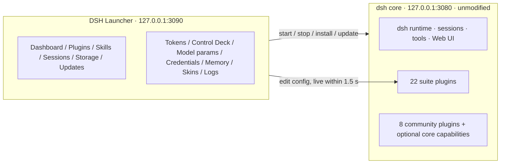
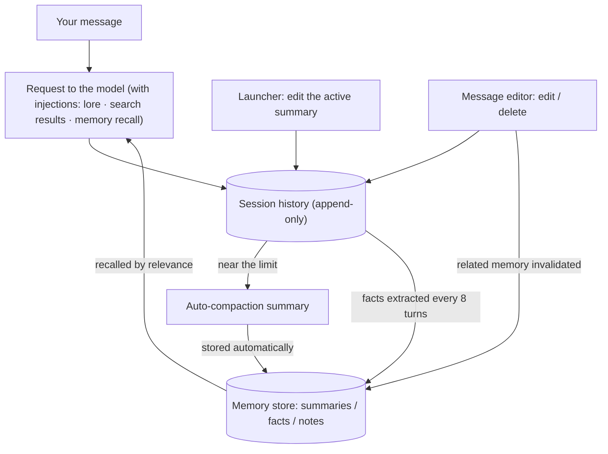

# DSH CyberWorkStation — the DeepSeek Harness workbench

[中文](README.zh.md) | **English**

> Turns DeepSeek Harness from a command-line tool into a visual workstation: a desktop launcher + 22 plugins + 10 skills, zero changes to the core.
> Vendored core: **dsh 0.1.5-rc.2** (upstream tag `dsh-v0.1.5-rc.2`).

`core: 0.1.5-rc.2` · `plugins: 22` · `skills: 10` · `license: MIT`


## Contents

- [00 · What this is](#overview)
- [01 · The DSH Launcher: 13 pages](#launcher)
- [02 · Inside dsh itself](#dsh)
- [03 · What the screenshots cannot show](#beyond)
- [04 · Context and memory](#memory)
- [05 · Full plugin roster: original / fork / adopted](#roster)
- [06 · Skills](#skills)
- [07 · Skins and artwork](#skins)
- [08 · License and credits](#principles)

---

<a id="overview"></a>

## 00 · What this is

**DSH CyberWorkStation** turns [DeepSeek Harness (dsh)](https://github.com/deepseek-ai/deepseek-harness) from "a CLI plus a plain web UI" into a visual workstation. It consists of one desktop launcher and 22 plugins:

- **The DSH Launcher**: a management panel you open by double-clicking an EXE — 13 pages for one-click start / stop, plugin and skill markets, sessions and storage, updates and self-check, token analytics, the Control Deck, model parameters, the Credentials Center, memory and context, skins, logs.
- **Panels inside dsh**: 22 plugins add their features directly to dsh's own pages — Settings gains a Credentials Center, model-list sync, web search, media APIs, a desktop pet, usage & cost; the conversation gains message editing, temporary chats, file drops, thinking levels…

"The core" means the upstream deepseek-harness vendored under `core/`, not a line of it modified, so it can be upgraded to any upstream version at any time.

### Highlights

- **The core is untouched.** Every capability is a plugin or a separate program; upgrading the core loses nothing.
- **Everything is graphical.** What used to mean editing `settings.yaml` or typing `dsh plugin` commands is now a few clicks; configuration changes take effect within 1.5 seconds, no restart.
- **Keys have a home.** API keys go only into dsh's credential store (with the keyring plugin, the Windows Credential Manager), never into config files; every panel is reachable from this machine only.
- **Reuse before rewriting.** Of the 22 suite plugins, 19 are original and 3 are forks; 8 community plugins are adopted unchanged — all listed in the roster.

### At a glance

| Part | Count | Notes |
|---|---|---|
| DSH Launcher | 13 pages · zh / en · 3 skins | `launcher/`, double-click `DSH启动器.exe`; the core starts in about 1.5 s |
| Suite plugins | 22 (19 original · 3 forks) | `plugins/`, registered automatically at setup |
| Community plugins | 8 + 1 MCP memory server | installed from the launcher's plugin market, not in the repo |
| Optional in-tree core capabilities | 10 upstream packages | persistent terminal, scheduling, LSP, MCP client, Claude Code / Codex hook bridges |
| Engineering skills | 7 (Claude Code) | architecture / plugins / frontend / ops / playbook / testing / local models |
| In-dsh skills | 3 | skin studio, control-deck authoring, desktop-pet making |
| Skins | 3 launcher · 2 frontend · community skins on demand | managed on the launcher's Skins page |



### Quick start

Prerequisites: Windows 10/11, Git, Node.js `^22.19 || >=24` (24 LTS recommended), Edge or Chrome.

```bat
git clone https://github.com/WZZNNE/DSH-CyberWorkStation.git
cd DSH-CyberWorkStation
setup.cmd
```

`setup.cmd` installs dependencies, builds the core (5–10 minutes the first time), registers all suite plugins and skills, then opens the launcher. After that, double-click `launcher/DSH启动器.exe`. Enter API keys on the launcher's Credentials page or in dsh Settings → Credentials Center.

---

<a id="launcher"></a>

## 01 · The DSH Launcher: 13 pages

The launcher is a small standalone program: double-click `DSH启动器.exe` and it opens `http://127.0.0.1:3090` in a chromeless app window. It listens on this machine only and the page carries its own access token. The "中 → EN" switch at the bottom left toggles the language.

The screenshots were taken with the core OFFLINE, so pages that need dsh running (Model parameters, Credentials, Memory & context) show placeholders; what they show when online is described under each figure.

### Fig. 01 · Dashboard


**What it does**

The banner shows the run state (OFFLINE / RUNNING); four cards show the core version, the Node version, the default model (with a link to change it in the Credentials Center) and "Open WEB UI". The Folders row creates a workspace from an absolute path; four shortcut cards open the core repo, the `~/.dsh` home, the plugins folder and the session logs. The console in the middle streams the core's output. Bottom right: "Start" and "Exit".

**What we built**

- One-click start in about 1.5 seconds when the core is built; falls back to the source launch automatically when it is not.
- Exit stops only dsh's own process, never other terminals or programs; repeated clicks never start a second copy.
- "New workspace" creates it from the typed path; refresh the dsh page and it is selectable (the core's own "+" button does nothing for ungrouped sessions).

> **Not in the picture** The Start button has an electric-current effect in the skin, RUNNING is a flip animation; deep links such as `#deck` open a page directly.

### Fig. 02 · Plugins


**What it does**

Type an npm package name or a `link:` local path to install; the table lists every plugin in the web profile with version, source (npm / link), whether it is mounted as a bundle layer, and "Uninstall". Community and suite plugins share the same table. Below: the Plugin Market (search npm, install in one click) and the read-only list of the core's own hundred-odd built-in rows.

**What we built**

- Install, uninstall, market install and one-click update all go through the core's own plugin command — identical to doing it on the command line.
- The two plugins referenced by the profile patch (credential keyring, LAN fence) are blocked from uninstalling, with migration steps, so the next boot never loads a missing module.
- The market filters npm results to the dsh ecosystem; skin packages never end up in the plugin list (there is a separate skin market).

> **Not in the picture** The 8 community plugins were installed from this page. `dsh-context` needs version 0.40 or later; the self-check names outdated versions.

### Fig. 03 · Skills


**What it does**

Two sources of skills: the user folder `~/.dsh/skills` (the suite installs `control-deck-authoring`, `desktop-pet`, `skin-studio` there) and the 12 development-process skills shipped with the core's source. Each row shows source and description. The Skill Market searches GitHub repositories by keyword and unpacks one into the user folder.

**What we built**

- The three in-dsh skills are original: Skin Studio (let the model make skins), Control Deck Authoring (let the model write prompts / regex / lorebooks or migrate SillyTavern assets), Desktop Pet (from persona to asset list).
- The repo also ships 7 engineering skills for Claude Code; they are not on this page — see "Skills".

### Fig. 04 · Sessions


**What it does**

Every session under `~/.dsh/sessions`, grouped by working directory (newest first, with counts and last-active time), filterable by workspace / session id; "Open sessions folder" jumps to Explorer; expand a group to export one session as a ZIP (dsh must be running). A "≈" before a group name marks a best-effort directory guess.

**What we built**

- This page is read-only: there is no delete button — delete sessions in Explorer.
- The `tmp\2026…` folders in the screenshot are the scratch directories the Temporary Chat plugin creates per temp session.

### Fig. 05 · Storage


**What it does**

The table sizes 9 key directories (core repo, `~/.dsh`, sessions, storages, profile, plugins, user skills, launcher, node_modules), each openable in one click. **Config backup** bundles the suite's configuration under `~/.dsh` into one JSON: `settings.yaml`, the Control Deck and presets, web search, safety rules, model parameters, the memory store, profile patches, skills, hooks, the frontend skin; "Preview" lists the files first; "Restore" saves a copy of the current files before writing.

**What we built**

- Backups never include the credential file or session logs; restore accepts only whitelisted files, rejects out-of-bounds or oversized bundles, and flags which files need a dsh restart.
- A restored memory store is merged in even while dsh is running.

### Fig. 06 · Updates


**What it does**

The Version card compares the local core with the latest upstream release (flagged when newer) and offers three update paths: update the core (git pull + build), upgrade to the latest upstream tag, upgrade to a specific tag. The Plugins card updates every plugin in the profile. The **self-check** covers eight items: Node version, pnpm, ports, the core checkout, plugin peer links, config files, whether the built CLI exists, the plugins registered in the web profile. Update output scrolls live below.

**What we built**

- "Upgrade to tag" swaps the whole core for any upstream version and rebuilds; because the core is untouched, it can be done at any time without losing suite features.
- The self-check reads its plugin roster from `plugins/`, so a new plugin is checked the moment it lands; outdated community plugins are named.

### Fig. 07 · Tokens


**What it does**

A Claude-Code-style usage overview: Overview / Models tabs, All / 30d / 7d ranges; eight cards — sessions, messages, total tokens, active days, current and longest streak, busiest day, favourite model; a 26-week heat map; a per-day table of calls, cache hits / misses, output and cost.

**What we built**

- The data comes from the cost plugin's ledger; the launcher only reads it.
- Local models are free: a loopback route is billed only when it names a paid vendor and carries that vendor's credential.
- The Models tab splits tokens and cost per model.

### Fig. 08 · Control Deck


**What it does**

A SillyTavern-grade prompt workbench. Top bar: **presets** (save / load / delete) and **import / export** (the whole deck, or SillyTavern's World Info / regex script / prompt preset JSON). Seven tabs: **Prompts** (multiple leveled entries, macros such as `{{date}}`, `{{model}}`, `{{random:a,b}}`, optional interval), **Regex scripts** (applied to user input / World Info / the displayed AI output), **World Info** (keyword hits inject lore; the full SillyTavern field set), **Sampling & context** (temperature / max output / stop words behind a master switch; a tool-disable list), **Web search**, **Safety rules**, **Quick start**. One "Save & hot-reload" button at the bottom writes every tab, live within 1.5 seconds.

**What we built**

- Injection never rewrites your words: prompts and matched lore are added as one separate context entry right after your message.
- Fields share SillyTavern's names and meaning, so ST users learn nothing new; ST World Info, regex and prompt-preset JSON import and export directly.
- A broken regex cannot stall dsh: rules run on a separate thread; one that overruns is disabled and named in the status line.
- Unsaved edits survive late replies from preset loads or imports; a failed save keeps the draft.

> **Not in the picture** The Web search and Safety tabs are shown in the dsh Settings screenshots (both sides write the same configuration). The field reference lives in the `control-deck-authoring` skill, so you can let the model write entries for you.

### Fig. 09 · Model parameters


**What it does**

Set the context window (`contextWindow`) and max output (`maxTokens`) of any model, plus **thinking levels** where the route allows it; local models (LM Studio / Ollama) can be probed and taught recommended levels, which then appear in dsh's own model picker. Toolbar: probe LM Studio / Ollama, refresh, auto-teach levels to local models that declare none, filter by model id. dsh was not running when the screenshot was taken, so the list is empty.

**What we built**

- Online, every route (DeepSeek official, OpenRouter, local) lists every model with its effective values; each row saves on its own.
- Local models are taught levels by family; on/off-only models such as Qwen3 get `/no_think` appended automatically when Off is chosen. This resolves the "dsh defaults to 262,144 but the local server loaded 8k" conflict.
- OpenRouter routes get a one-click add / remove `:online` web-search variant per row.
- Saving one row never discards drafts in other rows.

### Fig. 10 · Credentials Center


**What it does**

Online, every **API credential reference** (e.g. `OPENROUTER_API_KEY`) is listed: configured or not, where it is stored, which features are bound to it (model routes, media, web search, desktop pets, memory embeddings), alias and note, plus set / replace / delete and **spare keys**; add a reference, filter to bound ones. Two cards below: **Model list** — "Refresh model list" syncs OpenRouter's latest catalog into the route; **dsh default model** — pick a route, then a model. dsh Settings has a section of the same name; both write the same place.

**What we built**

- The reference list is assembled automatically; a new route or plugin appears by itself. Secret values are never echoed.
- Spare keys: a reference can hold several secrets; switch with one click and the replaced one is kept as a spare.
- The default model is validated against the route's list before it is written, so a non-existent id never lands.

### Fig. 11 · Memory & context


**What it does**

Three tabs. **Session context**: for every session (open or not) the context pressure against the compaction threshold, **the active compaction summary — editable**, the compaction history, "Compact now" and "Store in memory". **Long-term memory**: summary / fact / note items with search, pin, scope, edit, delete, import / export. **Settings**: store summaries, extract facts, injection mode, items per injection, memory tools for the model, optional vector recall, and a recall test. dsh was not running in the screenshot.

**What we built**

The summary dsh writes after compaction used to be read-only, and nothing was remembered across sessions; this page adds both — editing the summary and cross-session memory. See "Context and memory".

### Fig. 12 · Skins


**What it does**

Three blocks: **UI settings** (light / dark / system for the `default` skin); **launcher skins** (`cyberpunk-2077` / `default` / `night-city-holo`, applied instantly, CSS import); **frontend (DSH WEB UI) skins** ("(none)" restores stock / `cyberpunk-2077` / `night-city-holo`, refresh the dsh page to apply, import, "Get community skins" opens the market). Both sides wear the Night City holo skin in the screenshot.

**What we built**

- Launcher skins and dsh frontend skins are managed separately; both accept your own CSS.
- The community skin market converts npm skin packages into local CSS, after which they are switched or deleted like your own skins and never mix into the plugin system.
- Built in: `night-city-holo` (graphite base, holographic cyan hairlines, 2077 gold for the active state) and `cyberpunk-2077` (neon yellow × electric cyan).

### Fig. 13 · Logs


**What it does**

Four sources: launcher log, dsh output, core update, plugin update; errors-only filter, keyword filter, copy, download the full file.

**What we built**

Update, skin conversion and backup-restore output all land here; the access token never appears in a log.

---

<a id="dsh"></a>

## 02 · Inside dsh itself

The next 14 figures are dsh's own pages. Some panels come from suite plugins (original or forked), some from community plugins (adopted), some are stock — each figure states which.

### Fig. 14 · Message editor

*dsh-chat-editor · original*


**What it does**

The ✎ in the session header opens this panel: every node of the conversation with its role, turn, whether the model can still see it (hidden by compaction) and its length. Four actions per message: **Edit** and **Delete** (both change what you see and what the model sees at once), **Fold** (display only, one click reopens), **Fork** (a new session from before this point). The screenshot shows an assistant message being edited.

**What we built**

- Your messages and the AI's can both be edited and deleted; the original text always stays in the log and can be traced.
- Editing an AI message lands as a labelled correction; a deleted message cannot be edited back.
- Fork starts a new session from any completed turn (the first turn cannot be a fork point).
- Editing or deleting a message invalidates any memory extracted from it — see "Context and memory".

### Fig. 15 · The conversation

*core + several plugins*


**What it does**

A real session. Suite and community elements visible: the "Temporary chats" group in the left column; the balance / today's cost / cache-hit bar at the bottom left, "Import session" and a row of icons (mobile remote, temp chat, pet, pet chats); the ✎ in the session header and the Conversation / Trajectory / Context tabs; the microphone next to the composer and the model picker; two status lines at the bottom (the upper one is stock, the lower one is the cost plugin's per-session cost and token split); the Files panel on the right. The page colours come from the `night-city-holo` frontend skin.

**What we built**

- Everything added sits in the core's native slots — the icon row at the bottom of the sidebar, sections in Settings, buttons in the session header, icons beside the composer — without changing the layout.

> **Not in the picture** Dropping any non-image file onto the chat stores it in the workspace and inserts a reference; typing `@` opens a file picker; the `/context` command opens the context breakdown; the pet is a draggable floating window inside dsh.

### Fig. 16 · Thinking level

*core picker + dsh-local-reasoning*


**What it does**

The level dropdown next to the model picker: Default / Off / Low / Medium / Xhigh. The picker is stock, but a local model has no levels of its own — these were written by the Model parameters page.

**What we built**

- Local models are taught levels by family; OpenRouter models get theirs from Model-list sync.
- On/off-only models such as Qwen3: Off appends `/no_think`, any other level appends `/think`.
- Note: a new session locks its model at creation; changing the model in the picker also rewrites the global default.

### Fig. 17 · Settings → Credentials Center

*dsh-credentials-center · original*


**What it does**

The same data as the launcher's Credentials page. One card per reference: name, status, source, set / replace, delete, spare keys; a second line with alias, note and **binding chips** (which model routes, media, search or pets use this key). The left column is the full list of Settings sections: General, Models, Credentials, Plugins, Agent presets, Session import, Model-list sync, Web search (global), Media APIs, Desktop pet, Usage & cost, File mentions, Sidebar cards.

**What we built**

- With the credential keyring plugin installed, secrets live in the Windows Credential Manager; a same-named environment variable still wins.

### Fig. 18 · Settings → Plugins → Plugin configuration

*core slot + several plugin cards*


**What it does**

One card per plugin with settings: **Terminal**, **Agent loop**, **Web search** (stock), **Context** (preferences of the community `dsh-context`), **Image understanding** (`dsh-vision-bridge-zh`: images are first described by the chosen vision model, then handed to the chat model, so text-only models can "see"), **Session import · system prompt** (`dsh-import-note`). The "Plugin list" tab is a read-only inventory.

**What we built**

- The "Session import · system prompt" card says one thing: imported sessions never override dsh's or any plugin's system prompt.
- "Image understanding" is a Chinese-UI fork of the community vision bridge; routes and configuration are unchanged, and a few issues (multi-image comparison, directory limits, race judging) were fixed.

### Fig. 19 · Settings → Session import

*dsh-chat-import · community (adopted)*


**What it does**

The community plugin's own page: an **import system prompt** switch (off by default); **two-way sync** — external → DSH (watch Claude / Codex / Grok Build for new sessions, import incrementally), DSH → external (write new turns back), interval in seconds, "Sync now".

**What we built**

- Not modified. It imports sessions from 19 agents (Claude Code, Codex, ChatGPT, Cursor, Gemini, opencode, Kimi CLI…) and exports back to three; "Import session" in the sidebar is its entry.

### Fig. 20 · Settings → Model-list sync

*dsh-provider-sync · original*


**What it does**

Keeps the OpenRouter route's model list current: last sync, interval (24 h), "Sync now", a switch that appends a note to Claude model names, and per-route counts (474 models in the screenshot, 16 new, 23 changed, 310 with thinking levels). The "Refresh model list" button on the Credentials page calls the same sync.

**What we built**

- New models are added, names / context windows / output limits refreshed, thinking levels declared for reasoning-capable models; anything you edited by hand is kept.
- Claude models get a "not available for OpenRouter native search" note: OpenRouter's server-side web search does not answer Claude, so the web-search plugin routes Claude through tool search instead.

### Fig. 21 · Settings → Web search (global)

*dsh-web-search-plus · original*


**What it does**

Configured once (the launcher's Control Deck tab shares the same configuration). **Mode**: off / let the model decide / search on trigger words / the API provider's own search. **Source**: SearXNG (a self-hosted instance in the screenshot), Serper, SerpApi, Tavily, Brave, DeepSeek official. **Open page text**: after a search, open the top N results and hand their text to the model as well. **`web_fetch` page reader** switch: lets the model read any public web page. Below: Save, Test search, and a read-only card of saved credentials.

**What we built**

- Four modes for four situations: off = offline; let the model decide = the model calls the search tool when it needs to; trigger words = for local models without tool calling (SillyTavern-style: a backtick phrase, keyword or regex hit searches first, then answers); provider search = OpenRouter's server-side search, any model, billed per search.
- `web_fetch` lets any model read web pages — public addresses only; private and loopback addresses are refused. The core's shipped presets mount their own `web_fetch` per session; the plugin applies the same guard to those calls through an execute hook, so the switch and the address rules hold either way.
- "Open page text" saves a tool round trip; text extraction can use a local trafilatura service.
- Keys are stored in dsh's credential store; "Test search" shows results and timing.

### Fig. 22 · Settings → Media APIs

*dsh-media-lab · original*


**What it does**

Image generation, video generation, speech synthesis and speech recognition in one panel: per kind, choose provider, endpoint, model (fetchable list), size or resolution, API key, and "Try it" for a live round trip. Files are saved under `~/.dsh/media` and play directly in the conversation; local services need no key. In the screenshot, images go to OpenRouter's gpt-image-2 and video to OpenRouter's hailuo-3.

**What we built**

- Four new model tools: `generate_image`, `generate_video`, `text_to_speech`, `transcribe_audio`; results appear right in the conversation.
- Nine providers (OpenAI-compatible, OpenRouter, Gemini, Veo, Replicate, fal, ElevenLabs, Fish Audio, MiniMax) plus a custom HTTP adapter; "shared DSH API" borrows a route saved on the Models page so you never enter a key twice.
- Image-to-video, reference-guided image generation, TTS voice presets, automatic clean-up of old files.
- A section may only use its own provider's key; internal addresses returned by a provider are refused.

### Fig. 23 · Settings → Desktop pet

*dsh-desktop-pet · original*


**What it does**

The current pet (create / delete), enable and show switches; **persona** (name, personality and voice, appearance, greeting, scope); **chat model** (follow dsh / share a DSH provider / its own endpoint and key). Further down: lorebook, expressions and frame animations, owner profile, permissions, proactive-talk frequency, voice, reminders, look, desktop window.

**What we built**

- The pet has its own persona, lorebook, multimodal API and chat history; it knows what you are working on (one line when a task starts and finishes), talks first on four frequency bands, sets reminders, speaks and listens, and can draw itself.
- Three windows: a floating pet inside dsh, a desktop sprite (per-pixel transparency, drag and resize, click to talk), an Edge app window; the window comes back after a dsh restart.
- Screen reading and computer control each have three permission levels (never / ask / full); as soon as anything you did not type yourself enters the conversation (a screenshot, a search result, uploaded material), control requests must be confirmed with a card.
- An expression can be one drawing with a motion, or an 8–24 frame animation at its own frame rate.

> **Not in the picture** Pet conversations are managed in their own page opened from 💬 in the sidebar; the Look section adjusts the bubble or lets the image model draw the bubble, input bar and send key. The companion skill `desktop-pet` walks the model from persona to artwork.

### Fig. 24 · Settings → Usage & cost

*dsh-cost-meter-plus · fork*


**What it does**

UI language; **official account balance** (total, grant, top-up, refresh); today / this month / all-time cost cards; today's sessions; token statistics and heat map; per-model statistics; further down, budget, price table and the vendors' Coding Plan quota panels.

**What we built**

- Upstream [dsh-cost-meter](https://github.com/Han-1413141/dsh-cost-meter) provides per-session / daily / historical cost, official price sync, a 90+ model price catalog, 7 Coding Plan quotas, budgets and alerts, zh / en UI.
- We added: multi-vendor balances (DeepSeek / OpenRouter / local / OpenAI, each shown as its API allows), automatic OpenRouter price sync, a cache-hit bar in the sidebar, per-session token split, free local routes, and a "money first" order on the settings page.

### Fig. 25 · Settings → Sidebar cards

*dsh-better-sidebar · community (adopted)*


**What it does**

Settings of the VS Code-style right-hand workbench (files, editor, terminal, Git, browser, background tasks): open by default in new sessions, default width, open chat files in the sidebar, expose a sidebar tool to the model, position compatibility mode, and switches for each content tab.

**What we built**

Not modified. The Files panel on the right of Fig. 15 is this plugin.

### Fig. 26 · Trajectory

*stock*


**What it does**

The session trajectory view: Duration / Turns / Calls scales, a time strip, and every step in order with its text, tool calls and result previews.

**What we built**

Stock, unchanged. Compare with the next figure: the trajectory answers "what was done", the context tab answers "what the model is carrying right now".

### Fig. 27 · Context

*dsh-context 0.52.2 · community (adopted)*


**What it does**

The context dashboard: **context stats** (turns, steps, tool calls, injections, compactions, prunes); **token stats** (cache-hit ring); **timing** (model calls / tool runs / overhead); **current context** (200.1k / 262.1k, 76% used, split into system prompt, tool definitions, user messages, injected context, assistant messages, tool results); **context trend** (one bar per request, compactions and prunes marked); **context browser** (every item expands to its actual content); **context events**; **file activity**.

**What we built**

- Not modified; needs version 0.40 or later — the launcher self-check names outdated versions.
- This is where the suite's effects become visible: how much the tool definitions weigh, what the Control Deck / search / memory injected, at which step compaction happened, how far the current request is from the threshold.

---

<a id="beyond"></a>

## 03 · What the screenshots cannot show

Some capabilities have no panel of their own, or only a corner of one. Grouped by purpose.

### Safety

- **Destructive-command blocking** (`dsh-safe-guard`, original): `rm -rf /`, `git push --force` without a lease, raw device writes, `mkfs`, Windows drive-root deletes / formats, fork bombs and the like are denied outright without disturbing the normal approval flow; on the Control Deck's Safety tab you add your own **deny**, **ask** (approval card) and **auto-allow** patterns, live within 1.5 seconds.
- **Keys in the system keyring** (`dsh-credentials-keyring`, original): API keys are stored in the Windows Credential Manager instead of a plaintext file; environment variables still win; a keyring failure only means a lookup fails, never a lost key.
- **LAN fence for mobile remote** (`dsh-lan-fence`, original): with the scan-to-pair remote enabled, unpaired LAN devices get 403 on dsh's `/api` while the pairing channel keeps working; pure plugin, so a core upgrade cannot reopen the hole.
- **Local only**: the launcher listens on 127.0.0.1 and every request carries a token; every suite endpoint that writes configuration refuses cross-site requests and foreign hosts.

### Conversation

- **Temporary chats** (`dsh-temp-chat`, original): one sidebar button opens a chat that belongs to no project, in a shared "Temporary chats" workspace, running a chat-only preset (no files, no terminal); nothing is deleted automatically, a clean-up button removes the folder when you want.
- **File drops** (`dsh-drop-files`, original): drop any non-image file onto the chat; it is saved into the current workspace's `.dsh-uploads/` and `@.dsh-uploads/<name>` is inserted into the composer for the model to read with its file tools; 25 MB per file; PDF / Office / archives are stored but the model cannot read them, and the drop says so.
- **Skin Studio** (`dsh-skin-studio` + skill `skin-studio`, original): ask the model in chat to make a skin for the launcher or dsh; it asks about style, primary colour, light/dark and background image first, then writes and applies the CSS; with no image and no image model it asks you for one instead of inventing.
- **Hover prices** (`dsh-price-hint`, original): hover any model in the picker to see input / output / cache prices per million tokens.
- **Quick workspace** (`dsh-quick-workspace`, original): create a workspace from a path on the launcher dashboard (the directory is created if missing).
- **Frontend skin injection** (`dsh-skin-loader`, original): applies the frontend skin chosen in the launcher to the dsh page.

### Optional core capabilities we switched on (upstream packages)

| Capability | What it gives you |
|---|---|
| Persistent terminal (the three `dsh-terminal` packages) | the model can open a persistent PTY, send commands interactively, read output, send signals, with background jobs |
| Scheduling (`dsh-schedule`) | remind the agent at a time or on a fixed rate |
| LSP code intelligence (the three `dsh-lsp` packages) | a TypeScript language server; the model can go to definition, find references, hover types |
| MCP client + reference memory server | the official knowledge-graph memory example (entities / relations / observations); independent from the suite's memory plugin |
| Claude Code / Codex hook bridges | reuse hooks.json files in Claude Code or Codex format |

---

<a id="memory"></a>

## 04 · Context and memory

This chapter covers the launcher's Memory & context page and the `dsh-memory-lite` plugin: how dsh manages context on its own, what enters the context and where to control it, and how memory is recorded and used.

### 1. What dsh does by itself

- History is append-only and never truncated. Near the limit (80% of the context window) dsh compacts the oldest stretch into a summary; from then on the model sees the summary instead of the original; `/compact` triggers it by hand.
- The limit is each model's `contextWindow`, 262,144 by default; local models rarely load that much, so set the real value per model on the launcher's Model parameters page or compaction happens in the wrong place.
- Stock dsh has no cross-session memory: in a new session the model remembers nothing.

### 2. What enters the context, and where to adjust it

| Content | From | Adjust in | Default budget |
|---|---|---|---|
| System prompt entries | Control Deck → Prompts | Control Deck | by entry order |
| Matched World Info, user-prefix prompts | Control Deck → World Info / Prompts | Control Deck | 8000 characters, scans the last 6 messages |
| Search results (trigger mode) | Web search | dsh Settings → Web search (global) | character budget; up to 5 pages opened |
| Page text ("open page text", `web_fetch`) | Web search | same | 2000 characters per page (adjustable); 200,000 for a full page read |
| Memory recall | Memory & context | launcher → Memory & context → Settings | 4000 characters, at most 5 items |
| Text descriptions of images (text-only models) | Image understanding | dsh Settings → Plugins → Image understanding | images up to 4 MP / 20 MB |
| Tool definitions | tools registered by the core and plugins | Control Deck tool switches; temporary chats mask all tools by default | about 94 items, 17.6k tokens in the screenshot |

Every injection is **one separate context entry placed after your message**; your words are never rewritten. To see the effect: the context ring beside the composer, the session's Context tab (community plugin `dsh-context`), the pressure bar on the launcher's memory page.



### 3. Session context tab: view and edit the compaction summary

- **View**: for every session (open or not) the context pressure against the threshold, the active summary, the compaction history.
- **Edit**: change the summary text and save; from the next request on the model continues from your text; the original stays in the session log.
- **Compact now**: compact before the threshold. **Store in memory**: save the current summary as a memory item.
- When editing is refused: the session is answering, compacting, or that summary has already been replaced by a newer compaction.

### 4. Long-term memory tab: remembering across sessions

**What is stored.** Three kinds of items:
- **Summaries** — every automatic compaction summary is stored (the latest per session);
- **Facts** — every 8 turns the session's own model extracts "things worth remembering long-term" (can be disabled, interval adjustable);
- **Notes** — written by you on the page, or by the model through the `memory_note` tool.

Each item has a scope: **global** (about you) or **this workspace only** (about a project); items can be pinned, edited, deleted, imported / exported, and unpinned ones cleared in one click.

**How it is used.** On the first turn of a new session, pinned and relevant items are added as one context entry after your message; on later turns only relevant items not yet injected are added. The injection mode ("pinned + relevant on the first turn / first turn only / off"), items per injection and the character budget are adjustable. Recall is keyword-based (Chinese supported) and can use a local embeddings endpoint (LM Studio / Ollama) for semantic recall; the "recall test" on the Settings tab shows what a sentence would inject. The model also gets `memory_recall` / `memory_note` tools, which can be turned off.

**After editing the source conversation.** If a message is edited or deleted with the message editor, facts and summaries taken from it are invalidated: they stay on the memory page with a label for you to inspect and are no longer recalled automatically; sessions that already received them get a withdrawal or correction notice at their next step. Saving an item's text on the memory page confirms it and makes it valid again.

### 5. Where the files are

- Settings: `~/.dsh/memory-lite.json` (enabled, store summaries, extract facts, interval, injection mode, items per injection, character budget, model tools, embeddings endpoint).
- Data: `~/.dsh/memory/memory.json` (items) and `vectors.json` (optional embeddings).
- Both are part of the launcher's config backup; a restore is merged in while dsh is running.

### 6. FAQ

**Does it cost extra model calls?** Only fact extraction (one short request every 8 turns, with the session's own model, can be disabled) and a manual "Compact now"; recall and injection are local.

**Is the original text still there after editing a summary?** Yes. The edit is a new record appended to the log; the Context tab's event list shows it.

**Will memory drag in things from other projects?** Facts are global or workspace-scoped, and workspace items are recalled only in the same directory; later turns have a relevance gate; the total injection is budgeted; the recall test shows it in advance.

---

<a id="roster"></a>

## 05 · Full plugin roster: original / fork / adopted

**Original** = written from scratch (a feature may follow another program's behaviour, but none of its code; noted where so); **fork** = built on someone else's open-source project, upstream license kept, changes listed; **adopted** = third-party projects used as-is, not a line changed. Versions as installed on this machine.

### Program

Standalone program, not a dsh plugin.

| Plugin / program | Version | Provenance | Role | Where |
|---|---|---|---|---|
| `DSH Launcher` | 13 pages | original | One-click start / exit, plugin and skill markets, sessions and storage, updates and self-check, token analytics, Control Deck, model parameters, Credentials Center, memory & context, skins, logs; zh / en. Its UX pays homage to 秋叶 aaaki's ComfyUI launcher (experience only, no code). | launcher/ |

### Suite plugins · original

19 plugins.

| Plugin | Version | Provenance | Role | Where |
|---|---|---|---|---|
| `dsh-control-deck` | 0.3.1 | original | SillyTavern-grade Control Deck: leveled prompts, regex scripts, World Info, sampling overrides, tool switches, presets, ST JSON import/export, live within 1.5 s. Follows SillyTavern's behaviour without its code. | launcher → Control Deck |
| `dsh-safe-guard` | 0.2.0 | original | Destructive-command blocking + custom deny / ask / allow rules. | Control Deck → Safety |
| `dsh-credentials-keyring` | 0.1.0 | original | API keys in the Windows Credential Manager. | Credentials Center "source" column |
| `dsh-skin-loader` | 0.1.0 | original | Skins the dsh web page. | launcher → Skins |
| `dsh-price-hint` | 0.1.0 | original | Hover prices in the model picker. | dsh model picker |
| `dsh-quick-workspace` | 0.1.0 | original | Create a workspace from a path. | launcher dashboard |
| `dsh-skin-studio` | 0.1.0 | original | Let the model make skins in chat (`skin_studio` tool). | chat |
| `dsh-local-reasoning` | 0.1.1 | original | Context window / max output / thinking levels for any model; local models probed and taught; OpenRouter `:online` variants. | launcher → Model parameters |
| `dsh-web-search-plus` | 0.5.0 | original | Four web-search modes, six sources, `web_fetch` page reader, automatic page text. Trigger semantics follow SillyTavern's WebSearch extension without its code. | dsh Settings → Web search (global), Control Deck |
| `dsh-memory-lite` | 0.1.0 | original | Editable compaction summaries, compact now; long-term memory (summaries / facts / notes) with automatic injection and the `memory_recall` / `memory_note` tools. | launcher → Memory & context |
| `dsh-chat-editor` | 0.1.0 | original | Edit / delete / fold any message, fork from any turn. | session header ✎ |
| `dsh-temp-chat` | 0.1.1 | original | Temporary chats that belong to no project. | sidebar button |
| `dsh-media-lab` | 0.1.1 | original | Image / video / TTS / STT with nine providers plus custom endpoints; results play in the chat. | dsh Settings → Media APIs |
| `dsh-desktop-pet` | 0.2.2 | original | Desktop pet: persona, lorebook, own API, proactive talk, reminders, voice, frame animation, screen / control permissions, three windows. | dsh Settings → Desktop pet, sidebar |
| `dsh-lan-fence` | 0.1.0 | original | Fences `/api` from unpaired LAN devices during mobile remote. | (no panel) |
| `dsh-provider-sync` | 0.2.0 | original | Automatic OpenRouter model-list sync with thinking levels for reasoning models. | dsh Settings → Model-list sync |
| `dsh-drop-files` | 0.1.1 | original | Drop any file onto the chat. | chat drag & drop |
| `dsh-credentials-center` | 0.3.0 | original | Every API key on one page: bindings, aliases, spare keys, default model. | launcher → Credentials + dsh Settings |
| `dsh-import-note` | 0.1.0 | original | One card: session import never overrides system prompts. | dsh Settings → Plugins |

### Suite plugins · forks

3 forks, all of MIT projects, upstream license kept.

| Plugin | Version | Provenance | Upstream / license | Role | Where |
|---|---|---|---|---|---|
| `dsh-cost-meter-plus` | 1.5.19-plus.4 | fork | Han-1413141/dsh-cost-meter 1.5.19 · MIT | Upstream: per-session / daily / historical cost, official price sync, 90+ model price catalog, 7 Coding Plan quotas, budget alerts, zh / en. **Ours**: multi-vendor balances, automatic OpenRouter price sync, cache-hit bar, per-session token split, free local routes, money-first settings page. | dsh Settings → Usage & cost, sidebar |
| `dsh-token-usage-plus` | 2.1.0-plus.1 | fork | Tastelessor/dsh-usage-stats 2.1.0 · MIT | Upstream: usage cards + heat map + official peak/off-peak pricing. **Ours**: peak/off-peak display removed, OpenRouter prices filled from the cost ledger. Not mounted by default (the cost page covers it), still in the repo. | (not mounted by default) |
| `dsh-vision-bridge-zh` | 0.4.5-zh.2 | fork | @goodandready/dsh-vision-bridge 0.4.5 · MIT | Upstream: vision for text-only models (automatic rewriting + 26 vision tools: describe, OCR, grounding, crop, long screenshots, PDF, video…). **Ours**: Chinese UI; fixes to multi-image comparison, directory limits and race judging. | dsh Settings → Plugins → Image understanding |

### Community plugins · adopted

8 plugins + 1 MCP server, installed from the launcher's plugin market, not a line changed. Two candidates were rejected: `dsh-auto-approval` (incompatible with the current core) and `dsh-filesnap` (recorded sessions cannot be opened after uninstalling it).

| Plugin | Version | Provenance | Upstream / license | Role | Where |
|---|---|---|---|---|---|
| `dsh-context` | 0.52.2 | adopted | bowenliang123 · Apache-2.0 | Context dashboard (composition, trend, events, browser, file activity) and the `/context` command. Needs 0.40+. | session → Context tab |
| `dsh-better-sidebar` | 0.19.1 | adopted | omdsh-dev · MIT | VS Code-style right sidebar: files / editor / terminal / Git / browser / background tasks. | dsh Settings → Sidebar cards, right panel |
| `@linxin666/dsh-remote-web-ui` | 0.3.22 | adopted | zhu1090093659/dsh-web · Apache-2.0 | Scan-to-pair remote for phones / PCs sharing the same web GUI, one-time tokens, revocable devices, optional Cloudflare tunnel. | sidebar phone icon |
| `dsh-automation` | 0.2.0-alpha.0 | adopted | Ephemeral-AI-Lab · MIT | Timed / recurring self-prompts inside a session. Needs Node ≥ 24 (stay on 0.1.4 under Node 22). | chat |
| `dsh-chat-import` | 0.11.5 | adopted | Nwflower · MIT | Import sessions from 19 agents (Claude Code / Codex / ChatGPT / Cursor / Gemini…); two-way sync. | sidebar "Import session", dsh Settings → Session import |
| `dsh-voice-input-web` | 0.1.2 | adopted | CrazyGummies · MIT | Microphone in the composer, browser speech recognition, no keys. | composer |
| `dsh-notification` | 0.1.1 | adopted | nishit130 · MIT | Desktop and webhook notifications when the agent finishes, errors or waits for approval. | (background) |
| `@syncended/dsh-retry` | 0.2.3 | adopted | syncended · MIT | Automatic retries on transient model errors, interrupted-session recovery. | (background) |
| `@modelcontextprotocol/server-memory` | 2026.7.4 | adopted | Model Context Protocol project · MIT | MCP knowledge-graph memory server, mounted through the core's MCP client. | model tools |

### Core and optional in-tree capabilities · adopted

Official deepseek-harness code, zero changes.

| Package | Version | Provenance | Upstream / license | Role | Where |
|---|---|---|---|---|---|
| `deepseek-harness (core/)` | 0.1.5-rc.2 | upstream | deepseek-ai · MIT | The full upstream source, vendored and unmodified; the launcher upgrades it to any upstream version. Ships 12 development-process skills. | core/ |
| `dsh-terminal / -bash / tool-terminal` | 0.1.5-rc.2 | upstream | in-tree | Persistent terminal and six model tools. | profile patch |
| `dsh-schedule` | 0.1.5-rc.2 | upstream | in-tree | Scheduled reminders. | profile patch |
| `dsh-lsp / lsp-stdio / tool-lsp` | 0.1.5-rc.2 | upstream | in-tree | LSP code intelligence (TypeScript). | profile patch |
| `dsh-mcp-client` | 0.1.5-rc.2 | upstream | in-tree | MCP client. | profile patch |
| `dsh-hooks-claude-code / -codex` | 0.1.5-rc.2 | upstream | in-tree | Claude Code / Codex hook bridges. | profile patch |

### Totals

| Category | Count |
|---|---|
| Original programs | 1 (the DSH Launcher) |
| Original plugins | 19 |
| Forked plugins | 3 (cost-meter-plus, token-usage-plus, vision-bridge-zh) |
| Adopted community plugins | 8 + 1 MCP server |
| Adopted optional core packages | 10 |
| Original skills | 7 engineering + 3 in-dsh |
| Skills shipped with the core | 12 (adopted) |
| Original skins | 3 launcher · 2 frontend |
| Lines changed in the core | 0 |

---

<a id="skills"></a>

## 06 · Skills

Two kinds: engineering skills for **Claude Code** (`skills/`, copy to `~/.claude/skills/`) and skills for **the model inside dsh** (`dsh-skills/`, copied to `~/.dsh/skills/` at setup, visible on the launcher's Skills page). All original.

### Engineering skills (Claude Code, 7)

| Skill | For |
|---|---|
| `dsh-architecture` | understanding dsh's plugin system, profiles / bundles / patches, the turn flow — read before touching the core |
| `dsh-plugin-dev` | writing dsh plugins: tools, hooks, permission gates, commands, model adapters |
| `dsh-frontend-dev` | changing the dsh web UI: panels, settings cards, sidebar items, themes |
| `dsh-env-ops` | setting up, upgrading and troubleshooting build / install / startup errors (Windows first) |
| `dsh-playbook` | how to run it, configure models and keys, make it faster and cheaper, install plugins |
| `dsh-testing` | which tests to run, how to write them, how to refresh snapshots |
| `dsh-local-models` | LM Studio / Ollama routes, thinking levels, context-window alignment |

### In-dsh skills (3)

| Skill | For |
|---|---|
| `skin-studio` | letting the model make launcher or dsh skins (variable tables, templates, background images) |
| `control-deck-authoring` | letting the model write prompts, regex, lorebooks and presets, or migrate SillyTavern assets |
| `desktop-pet` | letting the model build a pet with you: requirements, persona, asset list, artwork, plugin config |

### Shipped with the core (adopted)

The core ships 12 development-process skills (code review, documentation standards, pre-push checks, translation…), listed on the launcher's Skills page as repo skills.

---

<a id="skins"></a>

## 07 · Skins and artwork

Launcher skins and dsh frontend skins are managed separately, both switched and imported on the launcher's Skins page.

| Skin | Side | Provenance | Notes |
|---|---|---|---|
| `default` | launcher | original | light / dark / system |
| `cyberpunk-2077` | launcher + frontend | original | neon yellow × electric cyan, chamfered cards, glitch, electric effects; artwork generated with 即梦 AI |
| `night-city-holo` | launcher + frontend | original | graphite base, holographic cyan hairlines, 2077 gold active state, vector navigation icons, no scanlines or flicker; the Night City backdrop was generated with gpt-image-2 |
| Community skins | frontend | community authors (adopted) | converted from npm into local CSS by "Get community skins" (miku, matrix, minecraft, xp and a dozen others have been used); each keeps its own license, none is committed |

Other artwork: the pet's holographic UI set (bubble, input bar, send key) ships with the pet plugin; the expression frames of the pet "王胖子" were generated with gpt-image-2 and keyed out locally.

---

<a id="principles"></a>

## 08 · License and credits

- Original suite code: **MIT** (`LICENSE`).
- Forked plugins keep their upstream MIT licenses: [Han-1413141/dsh-cost-meter](https://github.com/Han-1413141/dsh-cost-meter), [Tastelessor/dsh-usage-stats](https://github.com/Tastelessor/dsh-usage-stats), [@goodandready/dsh-vision-bridge](https://www.npmjs.com/package/@goodandready/dsh-vision-bridge).
- Adopted community plugins carry their own licenses (MIT / Apache-2.0), see the roster; community skins belong to their authors.
- The Control Deck and web search follow the behaviour of [SillyTavern](https://github.com/SillyTavern/SillyTavern) and its WebSearch extension (behaviour only, none of their code).
- The launcher's UX pays homage to [秋叶 aaaki's ComfyUI launcher](https://space.bilibili.com/12566101).
- Core: [deepseek-ai/deepseek-harness](https://github.com/deepseek-ai/deepseek-harness) (MIT).
- Launcher artwork generated with 即梦 AI; the Night City backdrop and the pet frames with gpt-image-2.

Screenshots taken 2026-09-11 on dsh 0.1.1-rc.2 (the vendored core is 0.1.5-rc.2 now); launcher screenshots show dsh not running.
