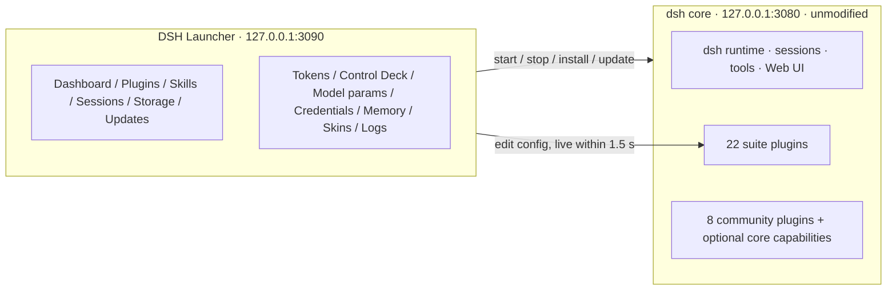
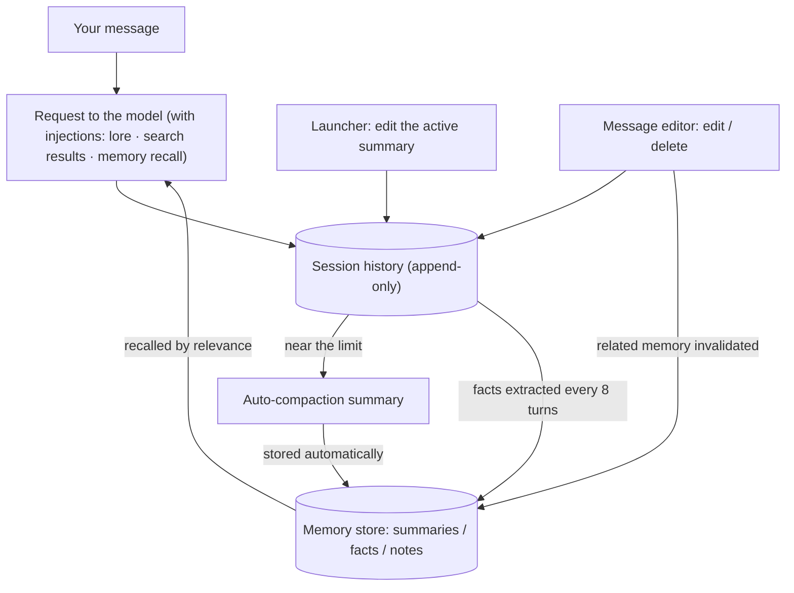

# DSH CyberWorkStation

[中文](README.zh.md) | **English**

DSH CyberWorkStation is a desktop launcher and a set of 22 plugins for [DeepSeek Harness (dsh)](https://github.com/deepseek-ai/deepseek-harness). It is built for people who want to run dsh as a daily tool rather than a command-line experiment: start it with a double-click, keep every setting and every key in one place, see what the model is doing and what it costs, and pick up new capabilities without opening a config file. The upstream core sits unchanged under `core/`, so all of this survives a core upgrade.

Vendored core: dsh 0.1.5-rc.2 (upstream tag `dsh-v0.1.5-rc.2`).

`core: 0.1.5-rc.2` · `plugins: 22` · `skills: 10` · `license: MIT`

If this is useful to you, a star helps other dsh users find it.


## Contents

- [What this is](#overview)
- [The launcher, page by page](#launcher)
- [Inside dsh itself](#dsh)
- [What the screenshots cannot show](#beyond)
- [Context and memory](#memory)
- [Plugin roster](#roster)
- [Skills](#skills)
- [For contributors](#contributors)
- [Skins and artwork](#skins)
- [License and credits](#license)

---

<a id="overview"></a>

## What this is

Out of the box, dsh is a command-line agent with a functional but plain web UI. Everything around it, from choosing a model to installing a plugin, happens in a terminal or in `settings.yaml`. This repository wraps that core in two layers so that the whole workflow happens on screen.

The first layer is the DSH Launcher, a small program of its own. Double-clicking it opens a window with 13 pages that together cover the life cycle of a dsh installation: starting and stopping the core, installing plugins and skills, browsing sessions and storage, updating and checking the environment, reading token statistics, editing the Control Deck, tuning model parameters, managing credentials, editing memory and context, switching skins, and reading logs.

The second layer is a set of 22 plugins that live inside dsh's own pages. They add a Credentials Center, model-list sync, web search, media APIs, a desktop pet and a usage-and-cost page to Settings, and message editing, temporary chats, file drops and thinking levels to the conversation itself. Nothing is bolted on top of the interface; each panel appears where a built-in one would. Of the 22, 19 were written for this suite and 3 are forks of other people's MIT projects; 8 further community plugins are used as they are, and the roster at the end lists each one with its provenance.

"The core" throughout this document means the upstream deepseek-harness checked out under `core/`. It is used exactly as published, which is what lets the Updates page swap it for any upstream version.

A few properties shape how the whole thing feels in use. Every feature is a plugin or a separate program, so a core upgrade never costs you a feature. A setting changed on a launcher page or in dsh's Settings is picked up within about 1.5 seconds, with no restart step. API keys go into dsh's credential store, or into the Windows Credential Manager when the keyring plugin is installed, and nowhere else. Both the launcher and dsh listen on this machine only.

### At a glance

| Part | Count | Notes |
|---|---|---|
| DSH Launcher | 13 pages · zh / en · 3 skins | `launcher/`, double-click `DSH启动器.exe`; the core is up in about 5 s |
| Suite plugins | 22 (19 original · 3 forks) | `plugins/`, registered automatically at setup |
| Community plugins | 8 + 1 MCP memory server | installed from the launcher's plugin market, not in the repo |
| Optional in-tree core capabilities | 10 upstream packages | persistent terminal, scheduling, LSP, MCP client, Claude Code / Codex hook bridges |
| Engineering skills | 7 (Claude Code) | architecture / plugins / frontend / ops / playbook / testing / local models |
| In-dsh skills | 3 | skin studio, control-deck authoring, desktop-pet making |
| Skins | 3 launcher · 2 frontend · community skins on demand | managed on the launcher's Skins page |



### Quick start

You need Windows 10 or 11, Git, Node.js `^22.19 || >=24` (24 LTS is the comfortable choice) and Edge or Chrome.

```bat
git clone https://github.com/WZZNNE/DSH-CyberWorkStation.git
cd DSH-CyberWorkStation
setup.cmd
```

`setup.cmd` installs dependencies, builds the core (5 to 10 minutes the first time), registers the suite plugins and skills, and opens the launcher. From then on, the launcher is the entry point: double-click `launcher/DSH启动器.exe`, press Start, and open the web UI from the dashboard. API keys are entered on the launcher's Credentials page or in dsh Settings under Credentials Center, where each key is also bound to the features that use it.

---

<a id="launcher"></a>

## The launcher, page by page

The launcher is a standalone program that runs beside dsh. Double-click `DSH启动器.exe` and it opens `http://127.0.0.1:3090` in a chromeless app window, listening on this machine only and carrying its own access token. The pages run down the left edge; the "中 → EN" switch at the bottom left changes the language of the whole launcher.

The screenshots in this section and the next were taken on an earlier core release (0.1.1-rc.2) than the vendored one, and the launcher pages with the core offline. Pages that read from a running dsh (Model parameters, Credentials, Memory & context) therefore show placeholders; what they show once dsh is online is described under each figure.

### Fig. 1: Dashboard


The dashboard is the page you land on, and it answers two questions before you read anything else: is dsh running, and where do I go next. The banner at the top shows the state, OFFLINE or RUNNING. Under it, four cards give the core version, the Node version, the current default model with a link to change it on the Credentials page, and an "Open WEB UI" button that takes you into dsh. The Folders row creates a new workspace from an absolute path, and four shortcut cards open the core repository, the `~/.dsh` home, the plugins folder and the session logs in Explorer. The console in the middle streams the core's output as it starts and runs. Start and Exit sit at the bottom right.

Start brings the core up in about five seconds when it has been built and falls back to a source launch when it has not; clicking it twice does not start a second copy. Exit stops dsh's own process and nothing else. A workspace typed into the Folders row exists as soon as you press the button, and a refresh of the dsh page makes it selectable. dsh's own "+" button cannot create a workspace for ungrouped sessions, so this row is where a new workspace comes from.

With the `cyberpunk-2077` skin active, Start carries an electric-current effect and the RUNNING state flips into place. Any page can also be opened directly by a deep link such as `#deck`.

### Fig. 2: Plugins


This page turns dsh's plugin command line into a form. At the top you type an npm package name or a `link:` path to a local folder and install it. The table beneath lists every plugin in the web profile with its version, its source (npm or link), whether it is mounted as a bundle layer, and an Uninstall button; community plugins and suite plugins share the same table. Further down, the Plugin Market searches npm and installs a result in one click, and a read-only list shows the hundred-odd rows the core mounts on its own.

Everything on this page, along with the one-click plugin update on the Updates page, goes through the core's own plugin command, so the result is exactly what you would get by typing it. Two plugins referenced by the profile patch, the credential keyring and the LAN fence, are protected: uninstalling one from here is refused and you are pointed to the migration steps instead, so the next boot never tries to load a module that is gone. The market filters npm results to the dsh ecosystem and keeps skin packages out of the plugin list, since skins have a market of their own. The community plugins in the roster were all installed this way.

### Fig. 3: Skills


Skills come from two places, and the page shows both: the user folder `~/.dsh/skills`, where the suite installs `control-deck-authoring`, `desktop-pet` and `skin-studio`, and the 12 development-process skills shipped with the core's source. Each row shows where the skill comes from and what it is for. The Skill Market at the bottom searches GitHub repositories by keyword and unpacks one into the user folder.

The three in-dsh skills are the suite's own. Skin Studio lets the model design skins for you. Control Deck Authoring lets it write prompts, regex scripts and lorebooks, or migrate SillyTavern assets. Desktop Pet walks it from a persona to an asset list. The repository also ships 7 engineering skills for Claude Code; they do not appear on this page; see [Skills](#skills).

### Fig. 4: Sessions


Every session under `~/.dsh/sessions` is listed here, grouped by working directory with the newest first. Each group header shows a count and the last-active time, and a filter narrows the list by workspace or session id. "Open sessions folder" jumps to Explorer, and expanding a group offers a ZIP export per session, for which dsh must be running. A "≈" before a group name marks a directory that was inferred rather than recorded.

The page is read-only: there is no delete button, and sessions are removed in Explorer. The `tmp\2026…` folders in the screenshot are scratch directories that the Temporary Chat plugin creates for each temporary session.

### Fig. 5: Storage


The table sizes nine directories (core repo, `~/.dsh`, sessions, storages, profile, plugins, user skills, launcher, node_modules), and each can be opened in a click. Below it, Config backup bundles the suite's configuration under `~/.dsh` into a single JSON file: `settings.yaml`, the Control Deck and its presets, web search, safety rules, model parameters, the memory store, profile patches, skills, hooks and the frontend skin. "Preview" lists the files before anything is written, and "Restore" saves a copy of the current files before replacing them.

A backup never includes the credential file or session logs. A restore accepts only whitelisted files, rejects bundles that reach outside the expected paths or exceed the size limit, and tells you which restored files need a dsh restart to take effect. The memory store needs none: a restored store is merged in while dsh is running.

### Fig. 6: Updates


The Version card compares the local core with the latest upstream release and offers three paths: update the core in place (git pull and build), upgrade to the latest upstream tag, or upgrade to a tag you name. The Plugins card updates every plugin in the profile at once. Below them, the self-check runs eight items: Node version, pnpm, ports, the core checkout, plugin peer links, config files, whether the built CLI exists, and the plugins registered in the web profile. Output from any of these scrolls at the bottom. A further card on this page repairs session logs in the old format that core 0.1.5 no longer accepts: preview first, then repair with dsh stopped.

"Upgrade to tag" swaps the whole core for any upstream version and rebuilds, and the suite's features are unaffected. The self-check knows every suite plugin, so a newly added one is covered without any registration step.

### Fig. 7: Tokens


The Tokens page is a usage overview in the style of Claude Code's usage report: Overview and Models tabs, All / 30d / 7d ranges, eight cards (sessions, messages, total tokens, active days, current and longest streak, busiest day, favourite model), a 26-week heat map, and a per-day table of calls, cache hits and misses, output and cost.

The numbers come from the cost plugin's ledger; the launcher reads it and keeps no second copy. Local models count as free: a loopback route is billed only when it names a paid vendor and carries that vendor's credential. The Models tab splits tokens and cost per model.

### Fig. 8: Control Deck


The Control Deck is a prompt workbench modelled on SillyTavern, for shaping what the model receives without editing files. The top bar holds presets (save, load, delete) and import/export, either of the whole deck or of SillyTavern's World Info, regex script and prompt preset JSON. Seven tabs follow. Prompts holds several leveled entries, with macros such as `{{date}}`, `{{model}}` and `{{random:a,b}}` and an optional injection interval. Regex scripts apply to user input, to World Info or to the displayed AI output. World Info injects lore when a keyword matches, with SillyTavern's full field set. Sampling and context puts temperature, max output and stop words behind a master switch and adds a tool-disable list. Web search mirrors the section of the same name in dsh Settings, Safety rules holds your own deny, ask and auto-allow patterns, and the last tab is a Quick start. One "Save & hot-reload" button at the bottom writes every tab at once.

Injection never rewrites your words: prompts and matched lore are added as one separate context entry right after your message. Fields share SillyTavern's names and meaning, so anyone who has used SillyTavern does not have to relearn them. A broken regex cannot stall dsh: rules run on a separate thread, and one that overruns is disabled and named in the status line. Edits you type while a preset load or an import is still in flight are kept when the reply arrives, and if a save fails your draft stays where it is.

The Web search tab mirrors Fig. 21, and both sides write the same configuration. The field reference lives in the `control-deck-authoring` skill, so you can let the model write entries for you.

### Fig. 9: Model parameters


Here you set the context window (`contextWindow`) and max output (`maxTokens`) of any model, plus thinking levels where the route allows them. The toolbar probes LM Studio or Ollama, teaches recommended levels to local models that declare none, refreshes the list and filters it by model id; levels taught here then appear in dsh's own model picker.

Once dsh is up, every route (DeepSeek official, OpenRouter, local) lists every model with its effective values, and each row saves on its own without disturbing drafts in the others. Local models are taught levels by family, and Fig. 16 shows what that looks like in the picker. This is also where you correct the context window: dsh defaults to 262,144, while a local server has often loaded 8k, and until the two agree compaction happens in the wrong place. OpenRouter rows get a one-click add or remove of the `:online` web-search variant.

### Fig. 10: Credentials Center


With dsh running, this page lists every API credential reference (for example `OPENROUTER_API_KEY`) with its status (configured or not), where it is stored, the features bound to it (model routes, media, web search, desktop pets, memory embeddings), an alias and a note, and the set / replace / delete actions, plus any spare keys. You can add a reference or filter to the bound ones. Two cards below handle the model side: Model list, whose "Refresh model list" syncs OpenRouter's latest catalog into the route, and dsh default model, where you pick a route and then a model. dsh Settings has a section of the same name, and both write the same place.

The reference list assembles itself; a new route or plugin appears without any registration step, and secret values are never echoed back. A reference can hold several secrets: switch with one click, and the replaced one is kept as a spare. The default model is validated against the route's list before it is written, so an id that does not exist never lands in the config.

### Fig. 11: Memory & context


Three tabs. Session context is the first: it shows each session's context pressure and its compaction summary, which you can edit. Long-term memory holds summary, fact and note items with search, pin, scope, edit, delete, import and export. Settings covers whether to store summaries and extract facts, the injection mode, items per injection, memory tools for the model, optional vector recall, and a recall test.

Stock dsh writes a summary after compaction that you can read but not change, and remembers nothing from one session to the next. This page adds both: editable summaries and cross-session memory. The full walkthrough is in [Context and memory](#memory).

### Fig. 12: Skins


Three blocks. UI settings picks light, dark or system for the `default` skin. Launcher skins lists `cyberpunk-2077`, `default` and `night-city-holo`, applied instantly, with CSS import. Frontend skins does the same for the dsh web UI: "(none)" restores the stock look, `cyberpunk-2077` and `night-city-holo` are built in, imports are accepted, "Get community skins" opens the market, and a refresh of the dsh page applies the choice. Both sides wear the Night City holo skin in the screenshot.

Launcher skins and dsh frontend skins are managed separately, and both accept your own CSS. The community skin market converts npm skin packages into local CSS; after that they are switched or deleted like your own skins and never mix into the plugin system. What each built-in skin looks like is in [Skins and artwork](#skins).

### Fig. 13: Logs


Four sources are available: the launcher log, dsh output, core updates and plugin updates. An errors-only filter, a keyword filter, copy and a download of the full file cover the usual needs. Update, skin-conversion and backup-restore output all land here, and the access token never appears in a log.

---

<a id="dsh"></a>

## Inside dsh itself

The next 14 figures are dsh's own pages. Some panels come from suite plugins, some from community plugins, some are stock; the line under each heading says which.

### Fig. 14: Message editor

*dsh-chat-editor · original*


The ✎ in the session header opens this panel: every node of the conversation with its role, its turn, whether the model can still see it (compaction hides older ones) and its length. Each message offers four actions. Edit and Delete change both what you see and what the model sees. Fold collapses the display only, and one click reopens it. Fork starts a new session from the point before this message. The screenshot shows an assistant message being edited.

Your messages and assistant messages can both be edited and deleted. An edited assistant message lands as a labelled correction. Deletion cannot be undone: the original text stays in the session log, but neither you nor the model sees it again. Fork works from any completed turn except the first. Editing or deleting a message also invalidates any memory that was extracted from it; see [Context and memory](#memory).

### Fig. 15: The conversation

*core + several plugins*


A real session, with the suite and community additions in view. In the left column: the "Temporary chats" group; the balance, today's cost and a cache-hit bar at the bottom; "Import session" and a row of icons for the mobile remote, temporary chat, the pet and pet chats. In the session header: the ✎ and the Conversation / Trajectory / Context tabs. Beside the composer: a microphone and the model picker. At the bottom: two status lines, the upper one stock and the lower one the cost plugin's per-session cost and token split. On the right: the Files panel. The colours come from the `night-city-holo` frontend skin.

Everything added sits in places the core already reserves for additions: the icon row at the bottom of the sidebar, sections in Settings, buttons in the session header, icons beside the composer. The layout is the one you already know. A few entry points are outside the frame: dropping a non-image file onto the chat stores it in the workspace and inserts a reference, typing `@` opens a file picker, the `/context` command opens the context breakdown, and the pet is a draggable floating window inside dsh.

### Fig. 16: Thinking level

*core picker + dsh-local-reasoning*


The level dropdown next to the model picker offers Default, Off, Low, Medium and Xhigh. The picker is stock, but a local model has no levels of its own; the ones shown here were written by the Model parameters page.

What the dropdown offers for a given model comes from the Model parameters page for local routes (see Fig. 9) and from the model-list sync for OpenRouter (see Fig. 20). For on/off-only models such as Qwen3, Off appends `/no_think` and any other level appends `/think`. A new session locks its model at creation, and changing the model in the picker also rewrites the global default.

### Fig. 17: Settings → Credentials Center

*dsh-credentials-center · original*


The same data as the launcher's Credentials page, presented as one card per reference: name, status, source, set / replace, delete, spare keys, and a second line with the alias, the note and binding chips that show which model routes, media, search or pets use this key. The left column lists every Settings section: General, Models, Credentials, Plugins, Agent presets, Session import, Model-list sync, Web search (global), Media APIs, Desktop pet, Usage & cost, File mentions, Sidebar cards.

With the credential keyring plugin installed, secrets live in the Windows Credential Manager; an environment variable of the same name still wins.

### Fig. 18: Settings → Plugins → Plugin configuration

*core slot + several plugin cards*


One card per plugin that has settings. Terminal, Agent loop and Web search are stock. Context holds the preferences of the community `dsh-context`. Image understanding is `dsh-vision-bridge-zh`, which has images described by the chosen vision model before handing them to the chat model, so text-only models can work with them. Session import · system prompt is `dsh-import-note`. The "Plugin list" tab is a read-only inventory.

The Session import card says one thing: imported sessions never override dsh's or any plugin's system prompt. Image understanding is a Chinese-UI fork of the community vision bridge; routes and configuration are unchanged.

### Fig. 19: Settings → Session import

*dsh-chat-import · community (adopted)*


The community plugin's own page: an import-system-prompt switch (off by default) and two-way sync. External → DSH watches Claude, Codex or Grok Build for new sessions and imports them incrementally; DSH → external writes new turns back. The interval is in seconds, with a "Sync now" button.

Used unmodified, it imports sessions from 19 agents (Claude Code, Codex, ChatGPT, Cursor, Gemini, opencode, Kimi CLI and others) and exports back to three. "Import session" in the sidebar is its entry point.

### Fig. 20: Settings → Model-list sync

*dsh-provider-sync · original*


This section keeps the OpenRouter route's model list current: last sync, interval (24 h), "Sync now", a switch that appends a note to Claude model names, and per-route counts (474 models in the screenshot, 16 new, 23 changed, 310 with thinking levels). The "Refresh model list" button on the Credentials page calls the same sync.

A sync adds new models, refreshes names, context windows and output limits, declares thinking levels for reasoning-capable models, and leaves anything you edited by hand alone. Claude models get a "not available for OpenRouter native search" note, because OpenRouter's server-side web search does not answer Claude; the web-search plugin routes Claude through tool search instead.

### Fig. 21: Settings → Web search (global)

*dsh-web-search-plus · original*


Web search is configured once, here, and the launcher's Control Deck tab shares the same configuration. Mode chooses between off, letting the model decide, searching on trigger words, and the API provider's own search. Source picks the engine: SearXNG (a self-hosted instance in the screenshot), Serper, SerpApi, Tavily, Brave or DeepSeek official. "Open page text" opens the top N results after a search and hands their text to the model as well. The `web_fetch` switch lets the model read any public web page. Below sit Save, Test search and a read-only card of saved credentials.

The four modes map to four situations. Off is for working offline. "Let the model decide" hands the model a search tool that it calls when it needs to. Trigger words serve local models without tool calling, SillyTavern-style: a backtick phrase, keyword or regex hit searches first and answers second. Provider search is OpenRouter's server-side search, billed per search, with Claude models excepted (see Fig. 20). `web_fetch` reads public addresses only and refuses private and loopback ones. dsh's own presets also provide a `web_fetch` tool, and the same switch and address rules apply to it, so the model cannot reach a private address by calling either copy. "Open page text" saves a tool round trip, and text extraction can use a local trafilatura service. Keys are stored in dsh's credential store, and "Test search" shows results and timing.

### Fig. 22: Settings → Media APIs

*dsh-media-lab · original*


Image generation, video generation, speech synthesis and speech recognition share one panel. For each kind you choose the provider, endpoint, model (the list can be fetched), size or resolution and API key, and "Try it" runs a live round trip so you know the settings work before the model needs them. Files are saved under `~/.dsh/media` and play directly in the conversation; local services need no key. In the screenshot, images go to OpenRouter's gpt-image-2 and video to OpenRouter's hailuo-3.

The model gains four tools, `generate_image`, `generate_video`, `text_to_speech` and `transcribe_audio`, and their results appear in the conversation. Nine providers are supported (OpenAI-compatible, OpenRouter, Gemini, Veo, Replicate, fal, ElevenLabs, Fish Audio, MiniMax) plus a custom HTTP adapter, and the "shared harness API (DSH)" source borrows a route saved on the Models page so a key is never entered twice. Image-to-video, reference-guided image generation, TTS voice presets and automatic clean-up of old files are included. Each of the four kinds uses the key of its own chosen provider and never borrows another's, and internal addresses returned by a provider are refused.

### Fig. 23: Settings → Desktop pet

*dsh-desktop-pet-cws · original*


The top of the page manages the current pet (create, delete) and its enable and show switches, then the persona (name, personality and voice, appearance, greeting, scope) and the chat model (follow dsh, share a DSH provider, or its own endpoint and key). Further down come the lorebook, expressions and frame animations, the owner profile, permissions, proactive-talk frequency, voice, reminders, look, and the desktop window.

The pet has its own persona, lorebook, multimodal API and chat history. It knows what you are working on (one line when a task starts and one when it finishes), talks first, at one of four frequencies, sets reminders, speaks and listens, and can draw itself. It can appear in three windows: a floating pet inside the dsh page; a desktop sprite (per-pixel transparency, drag and resize, click to talk); an Edge app window. The desktop window is restored after a dsh restart. Screen reading and computer control each have three permission levels (never, ask, full), and as soon as anything you did not type yourself enters the conversation, such as a screenshot, a search result or uploaded material, control requests must be confirmed with a card. An expression can be one drawing with a motion, or an 8 to 24 frame animation at its own frame rate.

Pet conversations are managed in their own page, opened from 💬 in the sidebar. The Look section adjusts the bubble or lets the image model draw the bubble, input bar and send key. The companion skill `desktop-pet` walks the model from persona to artwork.

### Fig. 24: Settings → Usage & cost

*dsh-cost-meter-plus · fork*


The page runs top to bottom: a UI-language switch and the official account balance (total, grant and top-up, with a refresh), cost cards for today, this month and all time, today's sessions, token statistics with a heat map, per-model statistics, and further down the budget, the price table and the vendors' Coding Plan quota panels.

The upstream [dsh-cost-meter](https://github.com/Han-1413141/dsh-cost-meter) provides per-session, daily and historical cost, official price sync, a price catalog of 90-odd models, 7 Coding Plan quotas, budgets and alerts, and a zh/en UI. This fork adds multi-vendor balances (DeepSeek, OpenRouter, local, OpenAI, each shown as its API allows), automatic OpenRouter price sync, a cache-hit bar in the sidebar, a per-session token split and free local routes, and moves balance and cost to the top of the settings page.

### Fig. 25: Settings → Sidebar cards

*dsh-better-sidebar · community (adopted)*


Settings for the VS Code-style right-hand workbench (files, editor, terminal, Git, browser, background tasks): open by default in new sessions, default width, open chat files in the sidebar, expose a sidebar tool to the model, position compatibility mode, and a switch per content tab. The Files panel on the right of Fig. 15 is this plugin.

### Fig. 26: Trajectory

*stock*


The Trajectory tab lays the session out over time: Duration / Turns / Calls scales at the top, a timeline below, and every step in order with its text, tool calls and result previews. The trajectory tells you what was done; the Context tab in the next figure tells you what the model is carrying right now.

### Fig. 27: Context

*dsh-context 0.52.2 · community (adopted)*


The dashboard opens with context stats (turns, steps, tool calls, injections, compactions, prunes) and token stats with a cache-hit ring, then timing for model calls, tool runs and overhead. The current context (200.1k of 262.1k, 76% used) is split into system prompt, tool definitions, user messages, injected context, assistant messages and tool results. A trend chart shows one bar per request with compactions and prunes marked, a context browser expands every item to its actual content, and context events and file activity follow.

It needs version 0.40 or later, and the launcher self-check names outdated versions. This is where the suite's effects become visible: how much the tool definitions weigh, what the Control Deck, search and memory injected, at which step compaction happened, and how far the current request is from the threshold.

---

<a id="beyond"></a>

## What the screenshots cannot show

Some capabilities have no panel of their own, or only a corner of one. They are grouped here by what they are for.

### Safety

Destructive-command blocking (`dsh-safe-guard`, original). Commands such as `rm -rf /`, `git push --force` without a lease, raw device writes, `mkfs`, Windows drive-root deletes and formats, and fork bombs are denied outright, without disturbing the normal approval flow for everything else. On the Control Deck's Safety tab you add your own deny, ask (approval card) and auto-allow patterns.

Keys in the system keyring (`dsh-credentials-keyring`, original). API keys are stored in the Windows Credential Manager instead of a plaintext file. Environment variables still win, and a keyring failure means a lookup fails, never a lost key.

LAN fence for the mobile remote (`dsh-lan-fence`, original). With the scan-to-pair remote enabled, unpaired LAN devices get 403 on dsh's `/api` while the pairing channel keeps working. It is a plugin, so a core upgrade leaves the fence in place.

Local only. Every launcher request carries a token, and every suite endpoint that writes configuration refuses cross-site requests and foreign hosts.

### Conversation

Temporary chats (`dsh-temp-chat-cws`, original). One sidebar button opens a chat that belongs to no project, in a shared "Temporary chats" workspace, running a chat-only preset with no files and no terminal. Nothing is deleted automatically; a clean-up button removes the folder when you want.

File drops (`dsh-drop-files`, original). Drop any non-image file onto the chat and it is saved into the current workspace's `.dsh-uploads/`, with `@.dsh-uploads/<name>` inserted into the composer for the model to read with its file tools; the limit is 25 MB per file. PDF, Office and archive files are stored but the model cannot read them, and the drop says so.

Skin Studio (`dsh-skin-studio-cws` plus the `skin-studio` skill, original). Ask the model in chat to make a skin for the launcher or for dsh. It asks about style, primary colour, light or dark and a background image first, then writes the CSS and applies it. With no image and no image model it asks you for one rather than inventing one.

### Smaller pieces

Three plugins need no panel at all. `dsh-price-hint` shows input, output and cache prices per million tokens when you hover a model in the picker. `dsh-quick-workspace` is what the dashboard's Folders row calls, and it creates the directory if it is missing. `dsh-skin-loader` applies the frontend skin chosen on the Skins page to the dsh page.

### Optional core capabilities switched on (upstream packages)

| Capability | What it gives you |
|---|---|
| Persistent terminal (the three `dsh-terminal` packages) | the model can open a persistent PTY, send commands interactively, read output and send signals, with background jobs |
| Scheduling (`dsh-schedule`) | remind the agent at a time or on a fixed rate |
| LSP code intelligence (the three `dsh-lsp` packages) | a TypeScript language server; the model can go to definition, find references and hover types |
| MCP client + reference memory server | the official knowledge-graph memory example (entities, relations, observations); independent from the suite's memory plugin |
| Claude Code / Codex hook bridges | reuse hooks.json files in Claude Code or Codex format |

---

<a id="memory"></a>

## Context and memory

This chapter covers the launcher's Memory & context page and the `dsh-memory-lite` plugin. It starts with what dsh does on its own, then shows what enters the context and where each part is controlled, and ends with how memory is recorded, recalled and corrected.

### 1. What dsh does by itself

History is append-only and never truncated. When the conversation nears the limit (80% of the context window), dsh compacts the oldest stretch into a summary, and from then on the model sees the summary instead of the original. `/compact` triggers the same step by hand.

The limit is each model's `contextWindow`, 262,144 by default. Local models rarely load that much, so set the real value per model on the launcher's Model parameters page; otherwise compaction happens in the wrong place.

Stock dsh has no cross-session memory. In a new session the model starts from nothing.

### 2. What enters the context, and where to adjust it

| Content | From | Adjust in | Default budget |
|---|---|---|---|
| System prompt entries | Control Deck → Prompts | Control Deck | by entry order |
| Matched World Info, user-prefix prompts | Control Deck → World Info / Prompts | Control Deck | 8000 characters, scans the last 6 messages |
| Search results (trigger mode) | Web search | dsh Settings → Web search (global) | character budget; up to 5 pages opened |
| Page text ("open page text", `web_fetch`) | Web search | same | 2000 characters per page (adjustable); 200,000 for a full page read |
| Memory recall | Memory & context | launcher → Memory & context → Settings | 4000 characters, at most 5 items |
| Text descriptions of images (text-only models) | Image understanding | dsh Settings → Plugins → Image understanding | images up to 4 MP / 20 MB |
| Tool definitions | tools registered by the core and plugins | Control Deck tool switches; temporary chats mask all tools by default | about 94 items, 17.6k tokens in Fig. 27 |

Every injection is one separate context entry placed after your message; your words are not rewritten. To see the effect, look at the context ring beside the composer, the session's Context tab (the community plugin `dsh-context`), or the pressure bar on the launcher's memory page.



### 3. Session context tab: view and edit the compaction summary

The tab shows, for every session, open or closed, the context pressure against the threshold, the active summary and the compaction history. You can change the summary text and save it; from the next request on, the model continues from your text, and the original stays in the session log. "Compact now" compacts before the threshold is reached, and "Store in memory" saves the current summary as a memory item. Editing is refused while the session is answering or compacting, or when that summary has already been replaced by a newer compaction.

### 4. Long-term memory tab: remembering across sessions

Three kinds of items are stored. Summaries are the automatic compaction summaries, the latest per session. Facts are extracted every 8 turns by the session's own model, which picks out what is worth remembering long-term; this can be disabled and the interval adjusted. Notes are written by you on the page, or by the model through the `memory_note` tool.

Each item has a scope: global, for things about you, or this workspace only, for things about a project. Items can be pinned, edited, deleted, imported and exported, and unpinned ones cleared in one click.

On the first turn of a new session, pinned and relevant items are added as one context entry after your message; on later turns only relevant items not yet injected are added. The injection mode (pinned plus relevant on the first turn, first turn only, or off), the items per injection and the character budget are all adjustable. Recall is keyword-based, Chinese included, and can use a local embeddings endpoint (LM Studio, Ollama) for semantic recall; the recall test on the Settings tab shows what a given sentence would inject. The model also gets `memory_recall` and `memory_note` tools, which can be turned off.

If a message is edited or deleted with the message editor, the facts and summaries taken from it are invalidated. They stay on the memory page with a label so you can inspect them and are no longer recalled automatically, and sessions that already received them get a withdrawal or correction notice at their next step. Saving an item's text on the memory page confirms it and makes it valid again.

### 5. Where the files are

Settings live in `~/.dsh/memory-lite.json` (enabled, store summaries, extract facts, interval, injection mode, items per injection, character budget, model tools, embeddings endpoint). Data lives in `~/.dsh/memory/memory.json` for the items and `vectors.json` for the optional embeddings. Both are part of the launcher's config backup, and a restore is merged in while dsh is running.

### 6. Questions that come up

Does it cost extra model calls? Only fact extraction, which is one short request every 8 turns with the session's own model and can be disabled, and a manual "Compact now". Recall and injection are local.

Is the original text still there after editing a summary? Yes. The edit is a new record appended to the log, and the Context tab's event list shows it.

Will memory drag in things from other projects? Facts are global or workspace-scoped, and workspace items are recalled only in the same directory. Later turns have a relevance gate, the total injection is budgeted, and the recall test shows the outcome in advance.

---

<a id="roster"></a>

## Plugin roster

Original means written for this suite; a feature may follow another program's behaviour, but none of its code, and the table says where. Fork means built on someone else's open-source project, with the upstream license kept and the changes listed. Adopted means a third-party project used as it is. Versions are those installed at the time of writing.

### Program

Standalone program, not a dsh plugin.

| Plugin / program | Version | Provenance | Role | Where |
|---|---|---|---|---|
| `DSH Launcher` | 13 pages | original | Start / exit, plugin and skill markets, sessions and storage, updates and self-check, token analytics, Control Deck, model parameters, Credentials Center, memory & context, skins, logs; zh / en. Its UX follows 秋叶 aaaki's ComfyUI launcher (experience only, no code). | launcher/ |

### Suite plugins · original

19 plugins.

| Plugin | Version | Provenance | Role | Where |
|---|---|---|---|---|
| `dsh-control-deck` | 0.3.1 | original | Control Deck modelled on SillyTavern: leveled prompts, regex scripts, World Info, sampling overrides, tool switches, presets, ST JSON import/export. Follows SillyTavern's behaviour without its code. | launcher → Control Deck |
| `dsh-safe-guard` | 0.2.0 | original | Destructive-command blocking plus custom deny / ask / allow rules. | Control Deck → Safety |
| `dsh-credentials-keyring` | 0.1.0 | original | API keys in the Windows Credential Manager. | Credentials Center "source" column |
| `dsh-skin-loader` | 0.1.0 | original | Skins the dsh web page. | launcher → Skins |
| `dsh-price-hint` | 0.1.0 | original | Hover prices in the model picker. | dsh model picker |
| `dsh-quick-workspace` | 0.1.0 | original | Create a workspace from a path. | launcher dashboard |
| `dsh-skin-studio-cws` | 0.1.0 | original | Let the model make skins in chat (`skin_studio` tool). | chat |
| `dsh-local-reasoning` | 0.1.1 | original | Context window, max output and thinking levels for any model; local models probed and taught; OpenRouter `:online` variants. | launcher → Model parameters |
| `dsh-web-search-plus` | 0.5.0 | original | Four web-search modes, six sources, the `web_fetch` page reader, automatic page text. Trigger semantics follow SillyTavern's WebSearch extension without its code. | dsh Settings → Web search (global), Control Deck |
| `dsh-memory-lite` | 0.1.0 | original | Editable compaction summaries, compact now; long-term memory (summaries, facts, notes) with automatic injection and the `memory_recall` / `memory_note` tools. | launcher → Memory & context |
| `dsh-chat-editor` | 0.1.0 | original | Edit, delete or fold any message, fork from any turn. | session header ✎ |
| `dsh-temp-chat-cws` | 0.1.1 | original | Temporary chats that belong to no project. | sidebar button |
| `dsh-media-lab` | 0.1.1 | original | Image, video, TTS and STT with nine providers plus custom endpoints; results play in the chat. | dsh Settings → Media APIs |
| `dsh-desktop-pet-cws` | 0.2.2 | original | Desktop pet: persona, lorebook, own API, proactive talk, reminders, voice, frame animation, screen and control permissions, three windows. | dsh Settings → Desktop pet, sidebar |
| `dsh-lan-fence` | 0.1.0 | original | Fences `/api` from unpaired LAN devices during mobile remote. | (no panel) |
| `dsh-provider-sync` | 0.2.0 | original | Automatic OpenRouter model-list sync with thinking levels for reasoning models. | dsh Settings → Model-list sync |
| `dsh-drop-files` | 0.1.1 | original | Drop any file onto the chat. | chat drag and drop |
| `dsh-credentials-center` | 0.3.0 | original | Every API key on one page: bindings, aliases, spare keys, default model. | launcher → Credentials + dsh Settings |
| `dsh-import-note` | 0.1.0 | original | One card: session import never overrides system prompts. | dsh Settings → Plugins |

### Suite plugins · forks

3 forks, all of MIT projects, upstream license kept.

| Plugin | Version | Provenance | Upstream / license | Role | Where |
|---|---|---|---|---|---|
| `dsh-cost-meter-plus` | 1.5.19-plus.4 | fork | Han-1413141/dsh-cost-meter 1.5.19 · MIT | Upstream: per-session, daily and historical cost, official price sync, a 90-odd model price catalog, 7 Coding Plan quotas, budget alerts, zh / en. Added here: multi-vendor balances, automatic OpenRouter price sync, cache-hit bar, per-session token split, free local routes, balance and cost moved to the top of the settings page. | dsh Settings → Usage & cost, sidebar |
| `dsh-token-usage-plus` | 2.1.0-plus.1 | fork | Tastelessor/dsh-usage-stats 2.1.0 · MIT | Upstream: usage cards, heat map, official peak/off-peak pricing. Added here: peak/off-peak display removed, OpenRouter prices filled from the cost ledger. Not mounted by default, since the cost page covers it; kept for anyone who wants the separate usage page. | (not mounted by default) |
| `dsh-vision-bridge-zh` | 0.4.5-zh.2 | fork | @goodandready/dsh-vision-bridge 0.4.5 · MIT | Upstream: vision for text-only models (automatic rewriting and 26 vision tools: describe, OCR, grounding, crop, long screenshots, PDF, video). Added here: Chinese UI; more reliable multi-image comparison and directory handling. | dsh Settings → Plugins → Image understanding |

### Community plugins · adopted

8 plugins and 1 MCP server, installed from the launcher's plugin market and used as they are. Two plugins you may see on npm are not recommended with this core: `dsh-auto-approval` (incompatible with the current core) and `dsh-filesnap` (recorded sessions cannot be opened after uninstalling it).

| Plugin | Version | Provenance | Upstream / license | Role | Where |
|---|---|---|---|---|---|
| `dsh-context` | 0.52.2 | adopted | bowenliang123 · Apache-2.0 | Context dashboard (composition, trend, events, browser, file activity) and the `/context` command. Needs 0.40+. | session → Context tab |
| `dsh-better-sidebar` | 0.19.1 | adopted | omdsh-dev · MIT | VS Code-style right sidebar: files, editor, terminal, Git, browser, background tasks. | dsh Settings → Sidebar cards, right panel |
| `@linxin666/dsh-remote-web-ui` | 0.3.22 | adopted | zhu1090093659/dsh-web · Apache-2.0 | Scan-to-pair remote for phones or PCs sharing the same web GUI, one-time tokens, revocable devices, optional Cloudflare tunnel. | sidebar phone icon |
| `dsh-automation` | 0.2.0-alpha.0 | adopted | Ephemeral-AI-Lab · MIT | Timed and recurring self-prompts inside a session. Needs Node ≥ 24 (under Node 22 use its 0.1.4). | chat |
| `dsh-chat-import` | 0.11.5 | adopted | Nwflower · MIT | Import sessions from 19 agents (Claude Code, Codex, ChatGPT, Cursor, Gemini and others); two-way sync. | sidebar "Import session", dsh Settings → Session import |
| `dsh-voice-input-web` | 0.1.2 | adopted | CrazyGummies · MIT | Microphone in the composer, browser speech recognition, no keys. | composer |
| `dsh-notification` | 0.1.1 | adopted | nishit130 · MIT | Desktop and webhook notifications when the agent finishes, errors or waits for approval. | (background) |
| `@syncended/dsh-retry` | 0.2.3 | adopted | syncended · MIT | Automatic retries on transient model errors, interrupted-session recovery. | (background) |
| `@modelcontextprotocol/server-memory` | 2026.7.4 | adopted | Model Context Protocol project · MIT | MCP knowledge-graph memory server, mounted through the core's MCP client. | model tools |

### Core and optional in-tree capabilities · adopted

Official deepseek-harness code, unchanged.

| Package | Version | Provenance | Upstream / license | Role | Where |
|---|---|---|---|---|---|
| `deepseek-harness (core/)` | 0.1.5-rc.2 | upstream | deepseek-ai · MIT | The full upstream source, vendored and unmodified; the launcher upgrades it to any upstream version. Ships 12 development-process skills. | core/ |
| `dsh-terminal / -bash / tool-terminal` | 0.1.5-rc.2 | upstream | in-tree | Persistent terminal and six model tools. | profile patch |
| `dsh-schedule` | 0.1.5-rc.2 | upstream | in-tree | Scheduled reminders. | profile patch |
| `dsh-lsp / lsp-stdio / tool-lsp` | 0.1.5-rc.2 | upstream | in-tree | LSP code intelligence (TypeScript). | profile patch |
| `dsh-mcp-client` | 0.1.5-rc.2 | upstream | in-tree | MCP client. | profile patch |
| `dsh-hooks-claude-code / -codex` | 0.1.5-rc.2 | upstream | in-tree | Claude Code / Codex hook bridges. | profile patch |

### Totals

| Category | Count |
|---|---|
| Original programs | 1 (the DSH Launcher) |
| Original plugins | 19 |
| Forked plugins | 3 (cost-meter-plus, token-usage-plus, vision-bridge-zh) |
| Adopted community plugins | 8 + 1 MCP server |
| Adopted optional core packages | 10 |
| Original skills | 7 engineering + 3 in-dsh |
| Skills shipped with the core | 12 (adopted) |
| Original skins | 3 launcher · 2 frontend |
| Lines changed in the core | 0 |

---

<a id="skills"></a>

## Skills

There are two kinds. Engineering skills are for Claude Code and live in `skills/`; copy them to `~/.claude/skills/` and they guide an agent working on this repository. Skills for the model inside dsh live in `dsh-skills/`; setup copies them to `~/.dsh/skills/`, and they show up on the launcher's Skills page. All of them were written for this suite.

### Engineering skills (Claude Code, 7)

| Skill | For |
|---|---|
| `dsh-architecture` | understanding dsh's plugin system, profiles / bundles / patches and the turn flow; read before working against the core's internals |
| `dsh-plugin-dev` | writing dsh plugins: tools, hooks, permission gates, commands, model adapters |
| `dsh-frontend-dev` | changing the dsh web UI: panels, settings cards, sidebar items, themes |
| `dsh-env-ops` | setting up, upgrading and troubleshooting build, install and startup errors (Windows first) |
| `dsh-playbook` | how to run it, configure models and API keys, make it faster and cheaper, install plugins |
| `dsh-testing` | which tests to run, how to write them, how to refresh snapshots |
| `dsh-local-models` | LM Studio / Ollama routes, thinking levels, context-window alignment |

### In-dsh skills (3)

| Skill | For |
|---|---|
| `skin-studio` | letting the model make launcher or dsh skins (variable tables, templates, background images) |
| `control-deck-authoring` | letting the model write prompts, regex, lorebooks and presets, or migrate SillyTavern assets |
| `desktop-pet` | letting the model build a pet with you: requirements, persona, asset list, artwork, plugin config |

### Shipped with the core (adopted)

The core ships 12 development-process skills (code review, documentation standards, pre-push checks, translation and so on). They appear on the launcher's Skills page as repo skills.

---

<a id="contributors"></a>

## For contributors

The suite plugins are the `plugins/dsh-*` folders: plain ES-module packages with no build step. `plugins/_shared` is the shared kit `dsh-cyberworkstation-kit`, which holds the stored-session reader and the loopback write fence that the suite's routers use; `launcher/peer-links.mjs` links it next to the core's packages so that plugins can import it. The launcher itself is `launcher/`, with `server.mjs` on top and the pieces under `lib/`. The vendored core under `core/` is never edited by hand.

Useful commands from the repository root: `npm run lint` (ESLint, flat config), `npm run peer-links` (recreate the plugin links), `npm run readme:zh` (README.zh.md is generated from `docs/showcase-src/content`), and `npm run repair:preview` / `npm run repair` (the session-log repair script; dsh must be stopped).

Comments are written in English. Suite files are LF, enforced by `.gitattributes`; the vendored core keeps its own rules.

---

<a id="skins"></a>

## Skins and artwork

Both kinds of skin are switched and imported on the launcher's Skins page; the table says where each came from and what it looks like.

| Skin | Side | Provenance | Notes |
|---|---|---|---|
| `default` | launcher | original | light / dark / system |
| `cyberpunk-2077` | launcher + frontend | original | neon yellow and electric cyan, chamfered cards, glitch and electric effects; artwork generated with 即梦 AI |
| `night-city-holo` | launcher + frontend | original | graphite base, holographic cyan hairlines, 2077 gold active state, vector navigation icons, no scanlines or flicker; the Night City backdrop was generated with gpt-image-2 |
| Community skins | frontend | community authors (adopted) | converted from npm into local CSS by "Get community skins" (miku, matrix, minecraft, xp and others are available); each keeps its own license, none is committed |

The pet's holographic UI set (bubble, input bar, send key) ships with the pet plugin. The expression frames of the pet "王胖子" were generated with gpt-image-2.

---

<a id="license"></a>

## License and credits

- Original suite code: MIT (`LICENSE`).
- Forked plugins keep their upstream MIT licenses: [Han-1413141/dsh-cost-meter](https://github.com/Han-1413141/dsh-cost-meter), [Tastelessor/dsh-usage-stats](https://github.com/Tastelessor/dsh-usage-stats), [@goodandready/dsh-vision-bridge](https://www.npmjs.com/package/@goodandready/dsh-vision-bridge).
- Adopted community plugins carry their own licenses (MIT / Apache-2.0), see the roster; community skins belong to their authors.
- The Control Deck and web search follow the behaviour of [SillyTavern](https://github.com/SillyTavern/SillyTavern) and its WebSearch extension (behaviour only, none of their code).
- The launcher's UX follows [秋叶 aaaki's ComfyUI launcher](https://space.bilibili.com/12566101).
- Core: [deepseek-ai/deepseek-harness](https://github.com/deepseek-ai/deepseek-harness) (MIT).
- Launcher artwork generated with 即梦 AI; the Night City backdrop and the pet frames with gpt-image-2.
