# DSH CyberWorkStation — DeepSeek Harness 全家桶工作台

**中文** | [English](README.md)

> 把 DeepSeek Harness 从命令行工具变成可视化工作站：桌面启动器 + 22 个插件 + 10 个 Skill，本体零改动。
> 当前内置本体：**dsh 0.1.1-rc.2**（上游 tag `dsh-v0.1.1-rc.2`）。

`core: 0.1.1-rc.2` · `plugins: 22` · `skills: 10` · `license: MIT`

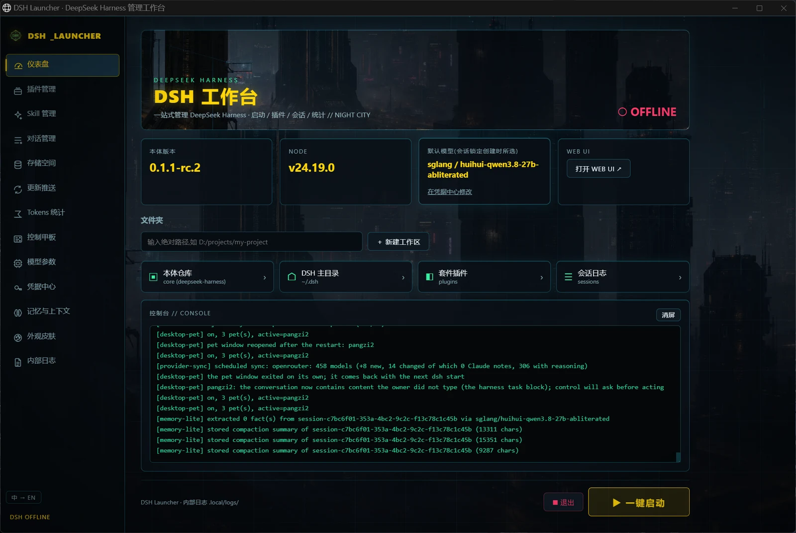

## 目录

- [00 · 这是什么](#overview)
- [01 · DSH 启动器：13 个页面](#launcher)
  - 图 01 · 仪表盘
  - 图 02 · 插件管理
  - 图 03 · Skill 管理
  - 图 04 · 对话管理
  - 图 05 · 存储空间
  - 图 06 · 更新推送
  - 图 07 · Tokens 统计
  - 图 08 · 控制甲板
  - 图 09 · 模型参数
  - 图 10 · 凭据中心
  - 图 11 · 记忆与上下文
  - 图 12 · 外观皮肤
  - 图 13 · 内部日志
- [02 · dsh 本体里的界面](#dsh)
  - 图 14 · 消息编辑
  - 图 15 · 对话主界面
  - 图 16 · 思考强度选择
  - 图 17 · 设置 → 凭据中心
  - 图 18 · 设置 → 插件 → 插件配置
  - 图 19 · 设置 → 会话导入
  - 图 20 · 设置 → 模型清单同步
  - 图 21 · 设置 → 联网搜索（全局）
  - 图 22 · 设置 → 多媒体 API
  - 图 23 · 设置 → 桌宠
  - 图 24 · 设置 → 用量与费用
  - 图 25 · 设置 → 文件提及
  - 图 26 · 设置 → 侧边卡片
  - 图 27 · 轨迹
  - 图 28 · 上下文
- [03 · 截图里看不到的部分](#beyond)
- [04 · 上下文与记忆管理](#memory)
- [05 · 全部插件清单：原创 / 二改 / 照搬](#roster)
- [06 · Skill 清单](#skills)
- [07 · 皮肤与美术](#skins)
- [08 · 许可与致谢](#principles)

---

<a id="overview"></a>

## 00 · 这是什么

**DSH CyberWorkStation** 把 [DeepSeek Harness（dsh）](https://github.com/deepseek-ai/deepseek-harness) 从"命令行工具 + 朴素 Web UI"变成一台可视化工作站。它由一个桌面启动器和 22 个插件组成：

- **DSH 启动器**：双击 EXE 打开的管理面板，13 个页面——一键启动 / 退出、插件与 Skill 市场、会话与存储、更新与自检、Tokens 统计、控制甲板、模型参数、凭据中心、记忆与上下文、皮肤、日志。
- **dsh 本体里的面板**：22 个插件把功能直接做进 dsh 的页面——设置里多出凭据中心、模型清单同步、联网搜索、多媒体 API、桌宠、用量与费用；对话里多出消息编辑、临时对话、拖文件、思考档位……

「本体」指内置在 `core/` 里的上游 deepseek-harness，一行未改，随时可以整体升级到任意上游版本。

### 特点

- **不改本体。** 所有能力都是外挂的插件和独立程序，升级本体不会丢功能。
- **图形化。** 以前要改 `settings.yaml`、敲 `dsh plugin` 命令的事，现在都在页面上点几下；配置改完 1.5 秒内生效，不用重启。
- **密钥有归处。** API Key 只进 dsh 的凭据库（装了钥匙串插件就进 Windows 凭据管理器），不写进配置文件；所有面板只能从本机访问。
- **能复用就复用。** 22 个套件插件里 19 个原创、3 个二次开发；另有 9 个社区插件原样采纳，全部列在「插件清单」里。

### 组成一览

| 组成 | 数量 | 说明 |
|---|---|---|
| DSH 启动器 | 13 个页面 · 中英双语 · 3 款皮肤 | `launcher/`，双击 `DSH启动器.exe`；本体约 1.5 秒启动 |
| 套件插件 | 22 个（原创 19 · 二改 3） | `plugins/`，安装时自动注册 |
| 社区插件 | 9 个 + 1 个 MCP 记忆服务器 | 在启动器插件市场里装，不进仓库 |
| 本体内置可选能力 | 10 个上游包 | 持久终端、定时提醒、LSP、MCP 客户端、Claude Code / Codex hook 桥 |
| 工程 Skill | 7 个（Claude Code） | 架构 / 插件 / 前端 / 运维 / 玩法 / 测试 / 本地模型 |
| dsh 内 Skill | 3 个 | 皮肤工坊、控制甲板编写、桌宠制作 |
| 皮肤 | 启动器 3 款 · 前端 2 款 · 社区皮肤按需转换 | 启动器「外观皮肤」页管理 |


```mermaid
flowchart LR
  subgraph L["DSH 启动器 · 127.0.0.1:3090"]
    L1["仪表盘 / 插件 / Skill / 会话 / 存储 / 更新"]
    L2["Tokens / 控制甲板 / 模型参数 / 凭据 / 记忆 / 皮肤 / 日志"]
  end
  subgraph D["dsh 本体 · 127.0.0.1:3080 · 零改动"]
    D0["dsh 运行时 · 会话 · 工具 · Web UI"]
    D1["22 个套件插件"]
    D2["9 个社区插件 + 本体可选能力"]
  end
  L -- "启动 / 停止 / 安装 / 更新" --> D
  L -- "改配置，1.5 秒生效" --> D1
```

### 快速开始

前置：Windows 10/11、Git、Node.js `^22.19 || >=24`（推荐 24 LTS）、Edge 或 Chrome。

```bat
git clone https://github.com/WZZNNE/DSH-CyberWorkStation.git
cd DSH-CyberWorkStation
setup.cmd
```

`setup.cmd` 会安装依赖、构建本体（首次约 5–10 分钟）、注册全部套件插件和 Skill，然后打开启动器。之后每次使用双击 `launcher/DSH启动器.exe` 即可。API Key 在启动器「凭据中心」页或 dsh 设置 → 凭据中心 里填。

---

<a id="launcher"></a>

## 01 · DSH 启动器：13 个页面

启动器是一个独立的小程序：双击 `DSH启动器.exe`，它以无地址栏的应用窗口打开 `http://127.0.0.1:3090`。只监听本机，页面自带访问令牌。左下角「中 → EN」一键切换中英文。

截图时本体处于 OFFLINE 状态，所以需要 dsh 在线才能读取的页面（模型参数、凭据中心、记忆与上下文）显示的是占位提示；在线后能看到什么，在各图说明里补充。

### 图 01 · 仪表盘


**功能**

顶部横幅显示运行状态（OFFLINE / RUNNING）；四张卡片是本体版本、Node 版本、默认模型（旁边直接链到凭据中心去改）和「打开 WEB UI」。「文件夹」一栏输入绝对路径就能新建工作区；下面四张快捷卡分别打开本体仓库、`~/.dsh` 主目录、插件目录和会话日志目录。中间的控制台实时滚动本体的输出。右下角是「一键启动」和「退出」。

**我们做了什么**

- 一键启动约 1.5 秒（本体已构建时），启动后自动可用；未构建时自动回退到源码方式启动。
- 退出只停 dsh 自己的进程，不会误杀其它终端或程序；重复点击不会启动第二份。
- 「新建工作区」输入路径即建，刷新 dsh 页面就能选用（本体自带的「+」按钮对未分组会话是无效的）。

> **图里没体现的** 「一键启动」在皮肤里带电流特效，RUNNING 状态是翻牌动画；`#deck` 这类地址深链可以直接打开对应页面。

### 图 02 · 插件管理

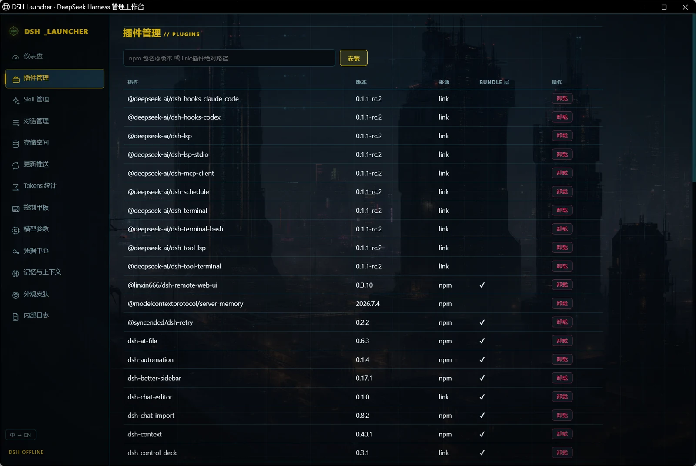

**功能**

上方输入 npm 包名或 `link:` 本地路径一键安装；表格列出 web profile 里的每个插件：版本、来源（npm / link）、是否作为 bundle 层挂载，以及「卸载」。社区插件和套件插件混排在同一张表里。表格下方是「插件市场」（搜 npm 一键安装）和「内置组合行」（本体自带的一百多行只读挂载清单）。

**我们做了什么**

- 安装、卸载、市场安装、一键更新都走本体自己的插件命令，和命令行操作完全等价。
- 两个被 profile 补丁引用的插件（凭据钥匙串、LAN 防线）卸载前会被拦住，并给出迁移步骤，避免下次启动加载不存在的模块。
- 插件市场按 dsh 生态过滤 npm 结果；皮肤包不会混进插件列表（另有皮肤市场）。

> **图里没体现的** 9 个社区插件就是从这一页装的。`dsh-context` 需要 0.40 以上版本，自检会点名过旧的版本。

### 图 03 · Skill 管理

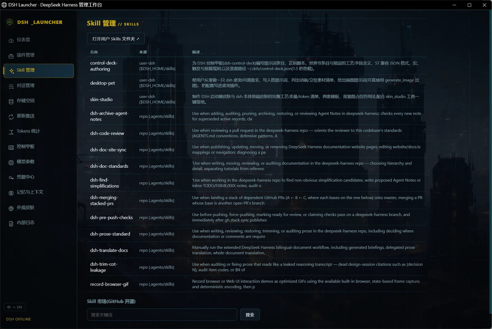

**功能**

列出两处 Skill：用户目录 `~/.dsh/skills` 里的（套件随安装放进去的 `control-deck-authoring`、`desktop-pet`、`skin-studio`）和本体源码自带的 11 个开发规程。每行显示来源与描述。下方「Skill 市场」按关键词搜 GitHub 仓库，一键下载解压到用户目录。

**我们做了什么**

- 三个 dsh 内 Skill 都是原创：皮肤工坊（让模型做皮肤）、控制甲板编写（让模型帮你写提示词 / 正则 / 世界书，或迁移 SillyTavern 资产）、桌宠制作（从人设到素材清单）。
- 仓库另有 7 个给 Claude Code 用的工程 Skill，不出现在这一页，见「Skill 清单」。

### 图 04 · 对话管理

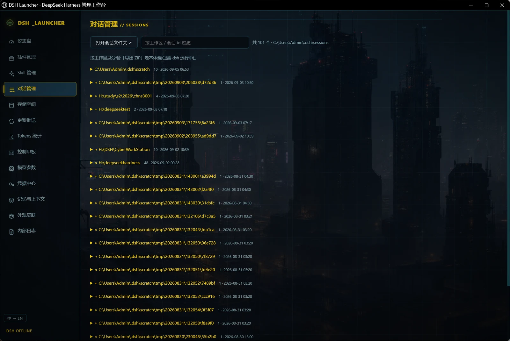

**功能**

`~/.dsh/sessions` 下的全部会话按工作目录分组（最新在前，组头显示数量与最近时间），可按工作区 / 会话 id 过滤，「打开会话文件夹」直达资源管理器，展开一组能对单个会话「导出 ZIP」（需要 dsh 在线）。组名前的「≈」表示目录是尽力推断的。

**我们做了什么**

- 这一页是只读的：没有删除按钮，删会话请在资源管理器里做。
- 截图里 `tmp\2026…` 那些目录是「临时对话」插件为每次临时会话建的草稿目录。

### 图 05 · 存储空间

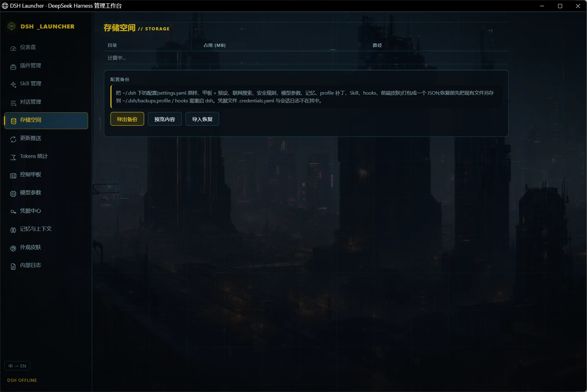

**功能**

上表统计 9 个关键目录（本体仓库、`~/.dsh`、会话、存储、profile、插件、用户 Skill、启动器、node_modules）的占用，每行可一键打开。下面的**配置备份**把套件在 `~/.dsh` 下的配置打成一个 JSON：`settings.yaml`、控制甲板与预设、联网搜索、安全规则、模型参数、记忆库、profile 补丁、Skill、hooks、前端皮肤；「预览内容」先列出文件再确认；「导入恢复」前会把现有文件另存一份。

**我们做了什么**

- 备份不包含密钥文件和会话日志；恢复只接受白名单内的文件，越界或超限的包会被拒绝，并标出哪些文件需要重启 dsh 才生效。
- 恢复的记忆库在 dsh 运行中也会被合并进来。

### 图 06 · 更新推送

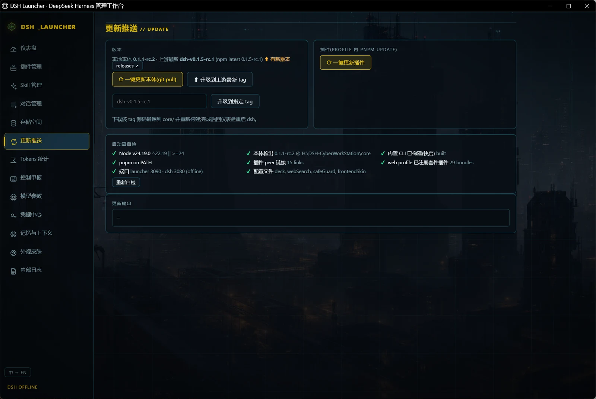

**功能**

左上「版本」卡对比本地本体与上游最新版本（有新版本时标出），三种更新方式：一键更新本体（git pull + 构建）、升级到上游最新 tag、升级到指定 tag。右上「插件」一键更新 profile 里的全部插件。中间的**启动器自检**八项：Node 版本、pnpm、端口、本体检出、插件 peer 链接、配置文件、内置 CLI 是否已构建、web profile 已注册的插件。下方实时滚动更新输出。

**我们做了什么**

- 「升级到 tag」可以把本体整体换成任意上游版本并重新构建；因为本体零改动，随时可做，套件功能不受影响。
- 自检的插件名单读自 `plugins/` 目录，新插件落地即被检查；过旧的社区插件会被点名。

### 图 07 · Tokens 统计

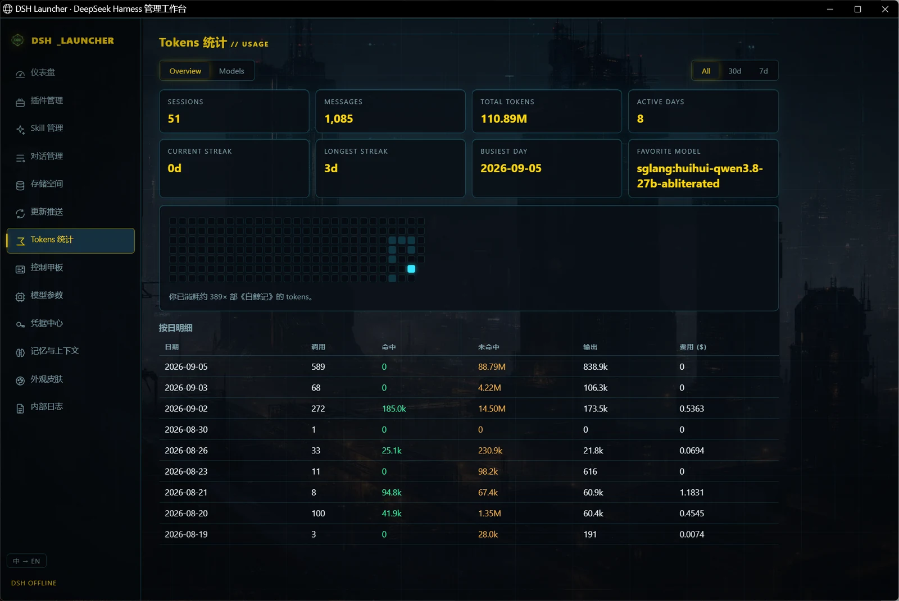

**功能**

Claude Code 风格的用量总览：Overview / Models 两个分页，All / 30d / 7d 时间窗；八张卡片——会话数、消息数、总 tokens、活跃天数、当前与最长连续天数、最忙的一天、最常用模型；26 周热力图；下方按日明细列出每天的调用数、缓存命中 / 未命中、输出与费用。

**我们做了什么**

- 数据来自费用插件的账本，启动器只读不另记一份。
- 本地模型免费：回环地址的路由只有命名了付费厂商且带该厂商凭据时才计费。
- Models 分页按模型拆分 tokens 与费用。

### 图 08 · 控制甲板

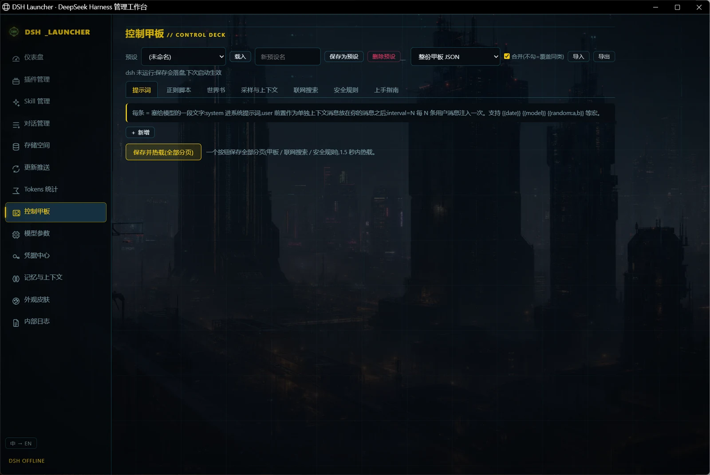

**功能**

SillyTavern 级的提示词工程台。顶栏：**预设**（保存 / 载入 / 删除）和**导入 / 导出**（整份甲板，或 SillyTavern 的世界书 / 正则脚本 / 提示词预设 JSON）。七个分页：**提示词**（多条分级注入，支持 `{{date}}`、`{{model}}`、`{{random:a,b}}` 等宏，可设间隔）、**正则脚本**（作用于用户输入 / 世界书 / AI 输出显示）、**世界书**（关键词命中就注入设定，全套 SillyTavern 字段）、**采样与上下文**（温度 / 最大输出 / 停止词总开关；工具禁用清单）、**联网搜索**、**安全规则**、**上手指南**。页底一个「保存并热载」写全部分页，1.5 秒内生效。

**我们做了什么**

- 注入不改写你的原话：提示词与命中的世界书作为单独一条上下文放在你的消息之后。
- 字段与 SillyTavern 同名同义，老用户零学习成本；ST 的世界书、正则、提示词预设 JSON 可直接导入导出。
- 写坏的正则不会拖垮 dsh：规则在独立线程里跑，超时的会被停用并在状态行点名。
- 正在编辑的内容不会被预设加载或导入的晚回复覆盖；保存失败保留草稿。

> **图里没体现的** 联网搜索与安全规则分页的内容见 dsh 设置里的对应截图（两边写的是同一份配置）。字段速查在 `control-deck-authoring` Skill 里，可以直接让模型替你写。

### 图 09 · 模型参数

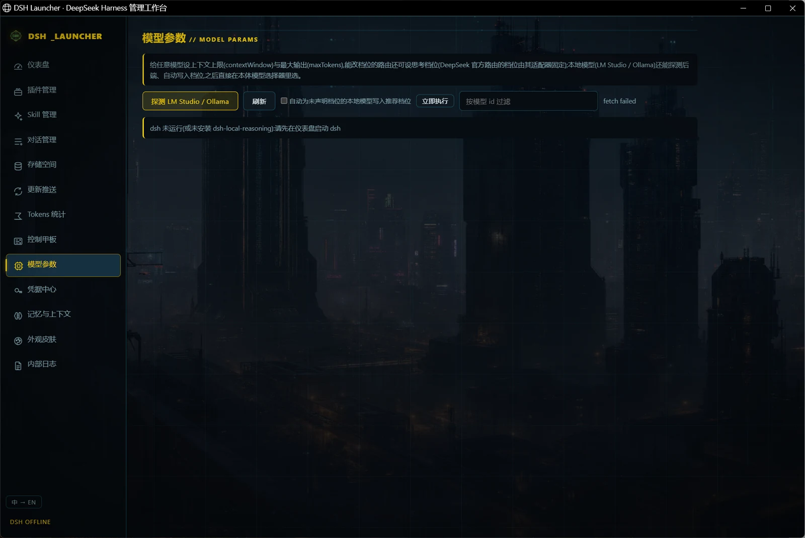

**功能**

给任意模型设上下文上限（`contextWindow`）与最大输出（`maxTokens`），能改档位的路由还可设**思考档位**；本地模型（LM Studio / Ollama）可以探测后端、自动写入推荐档位，之后直接在 dsh 的模型选择器里选。工具栏：「探测 LM Studio / Ollama」「刷新」「自动为未声明档位的本地模型写入推荐档位」、按模型 id 过滤。截图时 dsh 未运行，列表为空。

**我们做了什么**

- 在线时列出每条路由（DeepSeek 官方、OpenRouter、本地）的每个模型及当前生效值，每行单独保存。
- 本地模型按家族自动教会档位；只有开 / 关思考的模型（如 Qwen3）选 Off 时会自动附加 `/no_think`。这就是「dsh 默认 262,144 而本地只装了 8k」冲突的解法。
- OpenRouter 路由每行可一键加 / 删 `:online` 联网变体。
- 保存一行不会丢其它行的草稿。

### 图 10 · 凭据中心

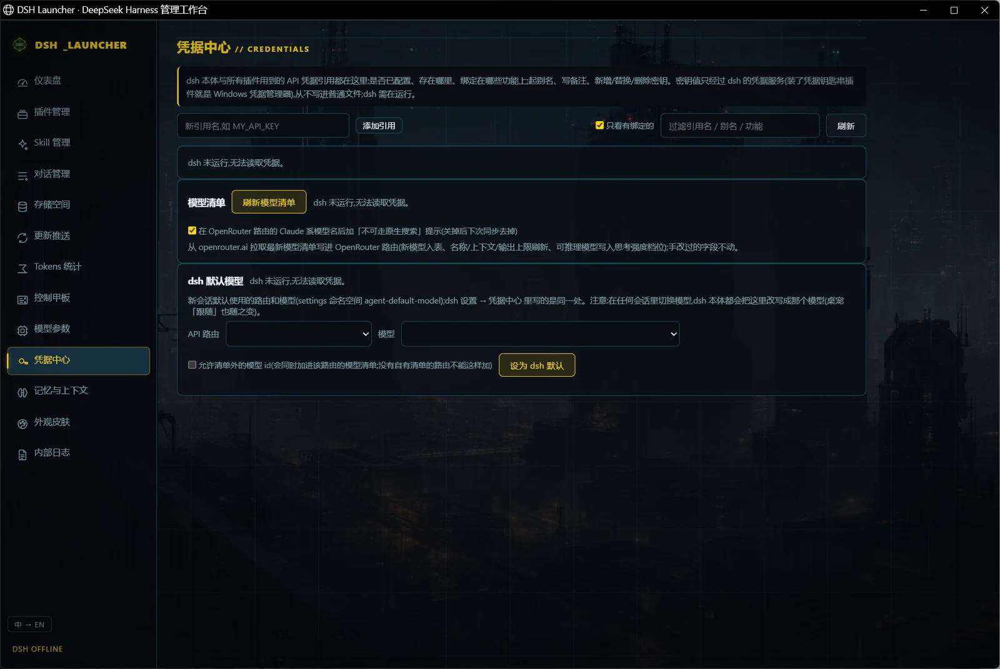

**功能**

在线时列出**每一个 API 凭据引用**（如 `OPENROUTER_API_KEY`）：是否已配置、存在哪里、绑定在哪些功能上（模型路由、多媒体、联网搜索、桌宠、记忆向量）、别名与备注，以及设置 / 替换 / 删除、**备用密钥**；可添加新引用、按「只看有绑定的」过滤。下方两张卡：**模型清单**——「刷新模型清单」把 OpenRouter 最新目录同步进路由；**dsh 默认模型**——选路由再选模型。dsh 设置里有同名分区，两边写的是同一处。

**我们做了什么**

- 引用列表自动汇总，新路由或新插件出现即自动列出；密钥值从不回显。
- 备用密钥：一个引用可以存多把，一键切换，被换下的自动留作备用。
- 默认模型写入前校验路由清单，避免写进一个不存在的 id。

### 图 11 · 记忆与上下文

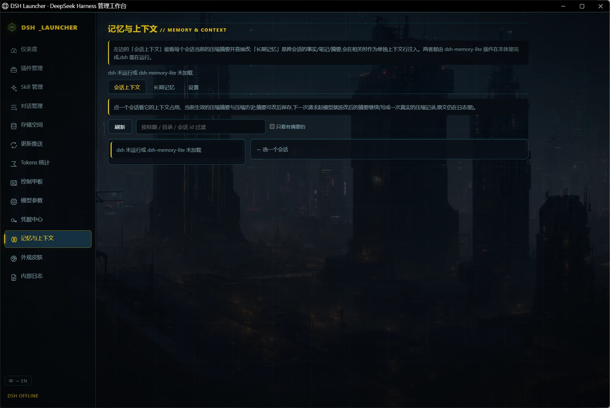

**功能**

三个分页。**会话上下文**：每个会话（打开与否都行）的上下文占用与压缩阈值、**当前生效的压缩摘要（可编辑）**、压缩历史、「立即压缩」「存入长期记忆」。**长期记忆**：摘要 / 事实 / 笔记条目，搜索、钉住、改范围、编辑、删除、导入导出。**设置**：自动存摘要、自动抽取事实、注入方式、每次注入条数、是否给模型记忆工具、可选向量召回，以及召回测试。截图时 dsh 未运行。

**我们做了什么**

本体压缩后的摘要以前只能看不能改，会话之间也没有记忆；这一页补上两件事：改摘要、跨会话记忆。详见「上下文与记忆管理」。

### 图 12 · 外观皮肤

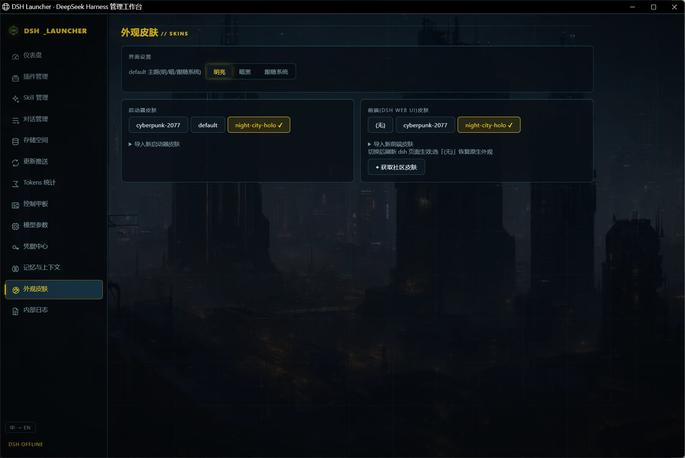

**功能**

三块：**界面设置**（`default` 皮肤的明 / 暗 / 跟随系统）；**启动器皮肤**（`cyberpunk-2077` / `default` / `night-city-holo`，切换即时生效，可导入 CSS）；**前端（DSH WEB UI）皮肤**（「(无)」恢复原生 / `cyberpunk-2077` / `night-city-holo`，刷新 dsh 页面生效，可导入，「获取社区皮肤」打开市场）。截图里两端都用夜之城全息皮肤。

**我们做了什么**

- 启动器皮肤与 dsh 前端皮肤分开管理，都能导入自制 CSS。
- 社区皮肤市场把 npm 上的皮肤包转换成本地 CSS，之后像自制皮肤一样切换、删除，不会混进插件系统。
- 内置 `night-city-holo`（石墨底、全息青细线、2077 金激活态）与 `cyberpunk-2077`（霓虹黄 × 电青）。

### 图 13 · 内部日志

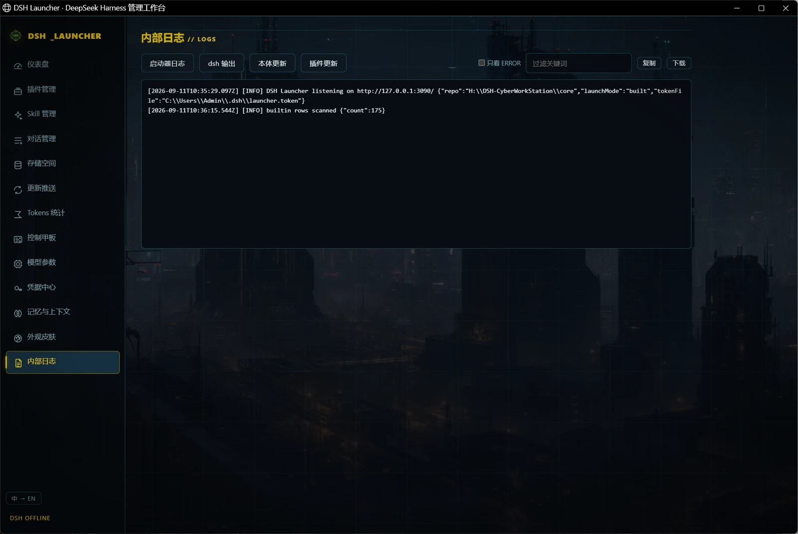

**功能**

四个来源：启动器日志、dsh 输出、本体更新、插件更新；只看 ERROR、关键词过滤、复制、下载完整文件。

**我们做了什么**

更新、皮肤转换、备份恢复的输出都在这里；日志里从不出现访问令牌。

---

<a id="dsh"></a>

## 02 · dsh 本体里的界面

下面 15 张图是 dsh 自己的页面。有的面板是套件插件加的（原创或二改），有的是社区插件（照搬），有的是本体自带——每张图都标明归属。

### 图 14 · 消息编辑

*dsh-chat-editor · 原创*

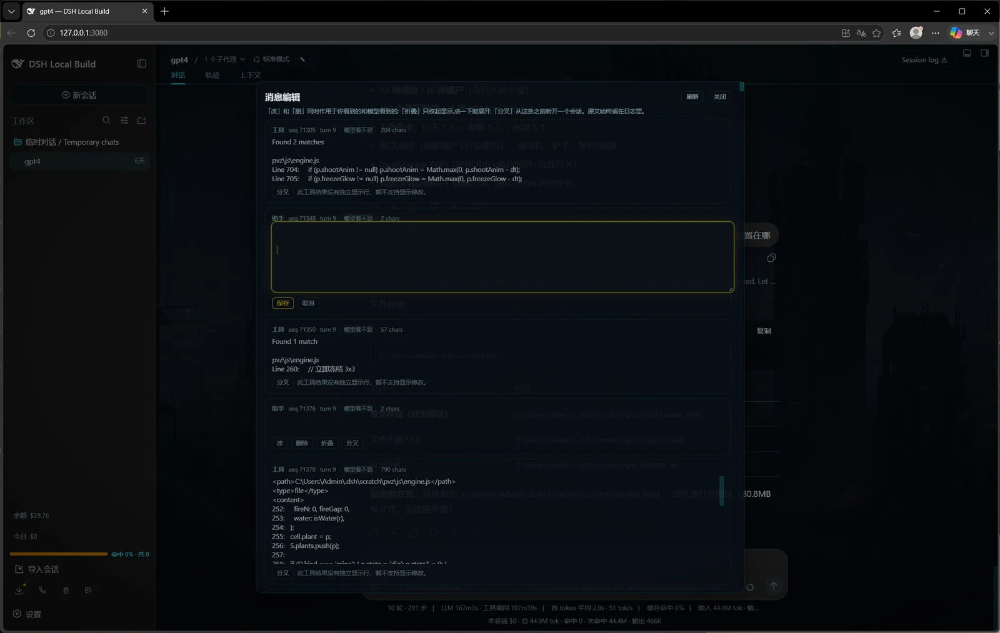

**功能**

会话标题栏的 ✎ 打开这个面板：整条对话的节点列表，每行标出角色、轮次、是否「模型看不到」（已被压缩遮住）和字数。每条消息四个操作：**改**、**删除**（这两个同时作用于你看到的和模型看到的）、**折叠**（只收起显示，点一下展开）、**分叉**（从这条之前新开一个会话）。截图里正在编辑一条助手消息。

**我们做了什么**

- 你的消息和 AI 的消息都能改、能删；原文始终留在日志里，随时可追溯。
- 改 AI 的话会落成一条带说明的更正；删除后不能再改回。
- 分叉从任意已完成的轮次开新会话（第一轮不能作为分叉点）。
- 改或删了消息，从这些消息里抽取的记忆会自动失效，见「上下文与记忆管理」。

### 图 15 · 对话主界面

*本体 + 多个插件*

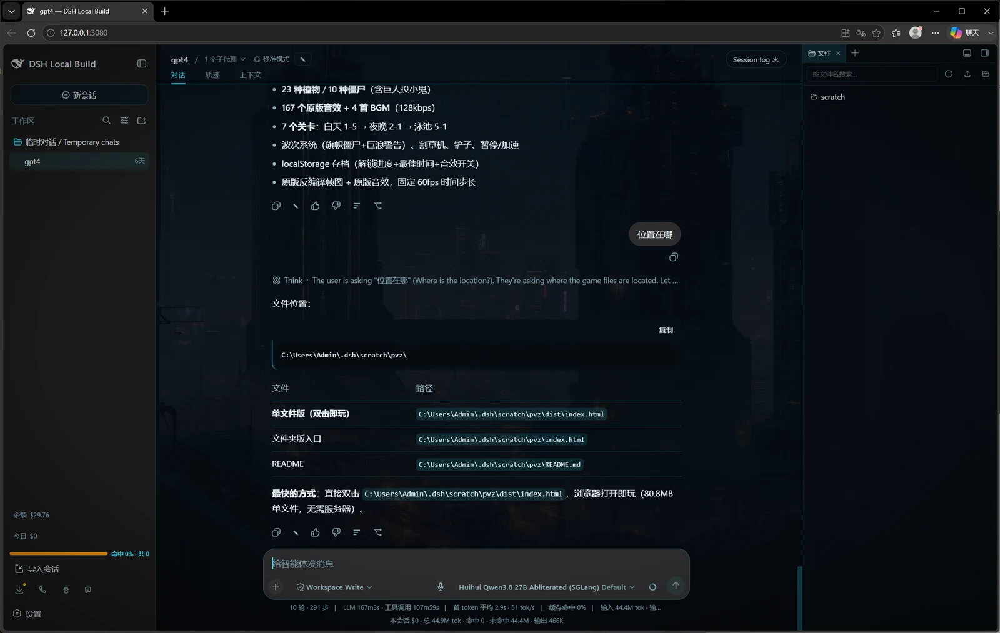

**功能**

一次真实会话。能看到的套件与社区元素：左栏的「临时对话 / Temporary chats」分组；左栏底部的余额 / 今日费用 / 缓存命中条、「导入会话」和一排图标（手机远程、临时对话、桌宠、桌宠对话）；会话头的 ✎ 与「对话 / 轨迹 / 上下文」三个分页；输入框旁的麦克风和模型选择器；底部两行统计（上行本体自带，下行是费用插件的本会话费用与 token 拆分）；右侧「文件」面板。整页配色来自前端皮肤 `night-city-holo`。

**我们做了什么**

- 所有加进去的东西都放在本体的原生位置：侧栏底部一排图标、设置里的分区、会话头的按钮、输入框旁的图标，不改变原有布局。

> **图里没体现的** 没截到的入口：拖任意非图片文件到对话区会自动存进工作区并写入引用；输入框输入 `@` 弹出文件选择器；`/context` 命令弹出上下文构成弹窗；桌宠在 dsh 内是可拖动的浮窗。

### 图 16 · 思考强度选择

*本体选择器 + dsh-local-reasoning*

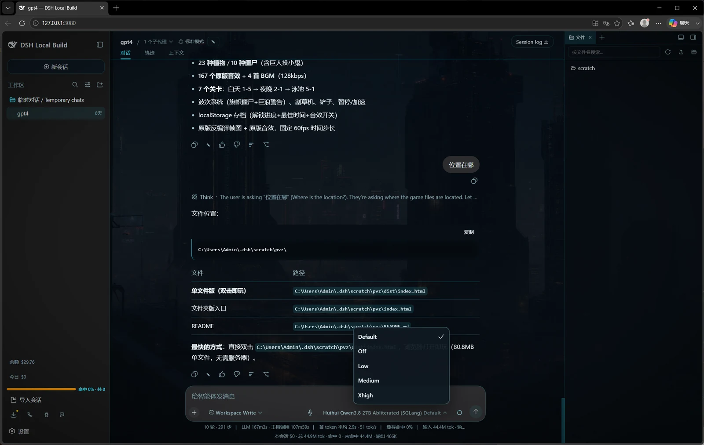

**功能**

模型选择器旁的档位下拉：Default / Off / Low / Medium / Xhigh。选择器是本体的，但本地模型原本没有任何档位——这些档位是「模型参数」页写进去的。

**我们做了什么**

- 本地模型按家族自动教会档位；OpenRouter 模型的档位由「模型清单同步」写入。
- 只有开 / 关思考的模型（如 Qwen3）：选 Off 附加 `/no_think`，其它档位附加 `/think`。
- 注意：新会话的模型在创建时锁定；在选择器里换模型会同时改写全局默认模型。

### 图 17 · 设置 → 凭据中心

*dsh-credentials-center · 原创*

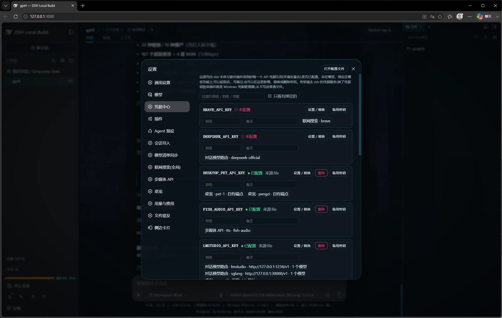

**功能**

与启动器凭据中心页同源。每个引用一张卡：名称、状态、来源、「设置 / 替换」「删除」「备用密钥」，第二行别名、备注和**绑定芯片**（这把 key 用在哪些模型路由、多媒体、搜索、桌宠上）。左侧是设置弹窗的完整分区列表：通用、模型、凭据中心、插件、Agent 预设、会话导入、模型清单同步、联网搜索（全局）、多媒体 API、桌宠、用量与费用、文件提及、侧边卡片。

**我们做了什么**

- 装了凭据钥匙串插件后，密钥保存在 Windows 凭据管理器里；同名环境变量仍然优先。

### 图 18 · 设置 → 插件 → 插件配置

*本体槽位 + 多个插件的卡片*

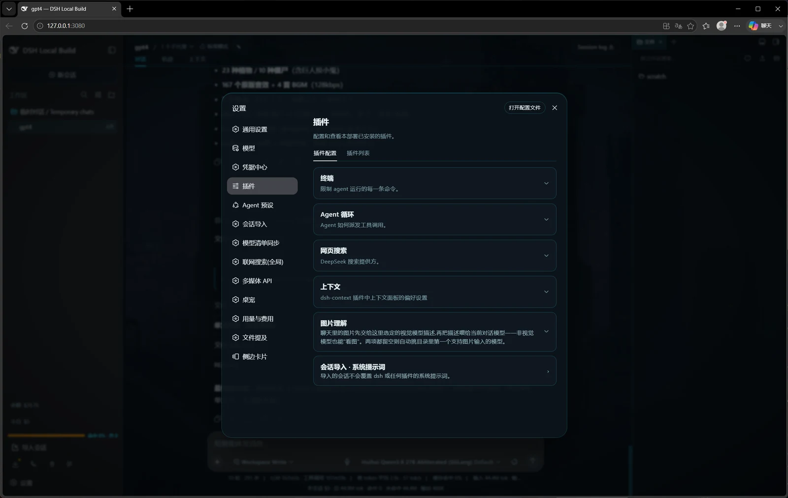

**功能**

每个带设置的插件一张卡：**终端**、**Agent 循环**、**网页搜索**（本体自带）、**上下文**（社区 `dsh-context` 的偏好）、**图片理解**（`dsh-vision-bridge-zh`：图片先交给选定的视觉模型描述，再喂给当前对话模型，非视觉模型也能"看图"）、**会话导入 · 系统提示词**（`dsh-import-note`）。旁边「插件列表」是只读的已装清单。

**我们做了什么**

- 「会话导入 · 系统提示词」卡只说一件事：导入的会话不会覆盖 dsh 或任何插件的系统提示词。
- 「图片理解」是社区视觉桥的中文界面分支，路由与配置不变，修正了多图比较、目录限制、竞速判定等几处问题。

### 图 19 · 设置 → 会话导入

*dsh-chat-import · 社区（照搬）*

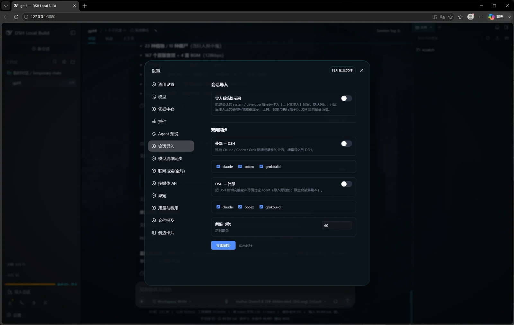

**功能**

社区插件自己的设置页：**导入系统提示词**开关（默认关）；**双向同步**：外部 → DSH（巡检 Claude / Codex / Grok Build 新增的会话，增量导入）、DSH → 外部（把 DSH 新增的轮次写回对应 agent），间隔秒数，「立即同步」。

**我们做了什么**

- 我们没有改这个插件。它支持 19 种 agent 的会话导入（Claude Code、Codex、ChatGPT、Cursor、Gemini、opencode、Kimi CLI……）与三种反向导出；侧栏「导入会话」是它的入口。

### 图 20 · 设置 → 模型清单同步

*dsh-provider-sync · 原创*

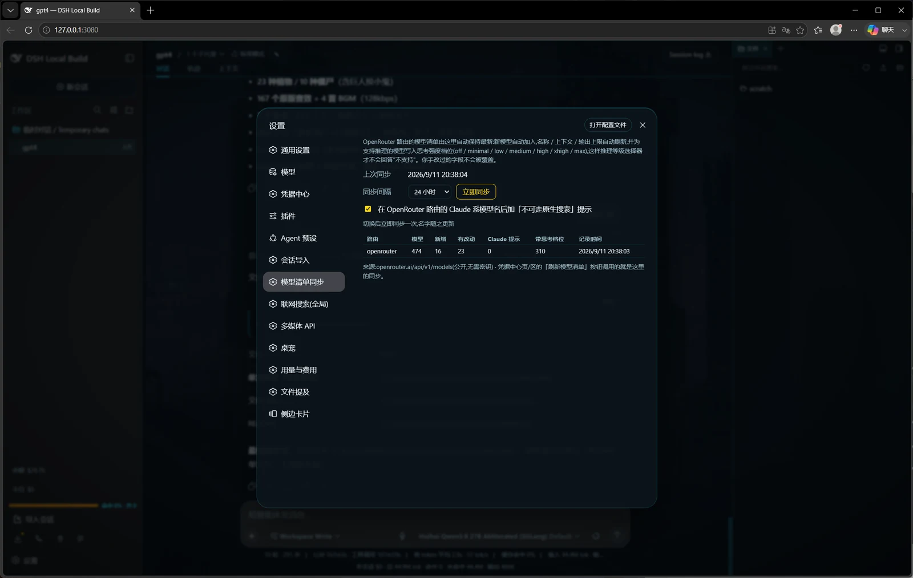

**功能**

让 OpenRouter 路由的模型清单自动保持最新：上次同步时间、同步间隔（24 小时）、「立即同步」、给 Claude 系模型名加提示的开关，以及每条路由的计数（截图里 474 个模型，本次新增 16、有改动 23、带思考档位 310）。凭据中心页的「刷新模型清单」按钮调的也是它。

**我们做了什么**

- 新模型自动入表，名称 / 上下文 / 输出上限自动刷新，可推理的模型写好思考档位；你手改过的字段原样保留。
- Claude 系模型名后附提示「不可走 OpenRouter 原生搜索」：OpenRouter 的服务端联网搜索对 Claude 不响应，联网搜索插件会让 Claude 走工具检索。

### 图 21 · 设置 → 联网搜索（全局）

*dsh-web-search-plus · 原创*

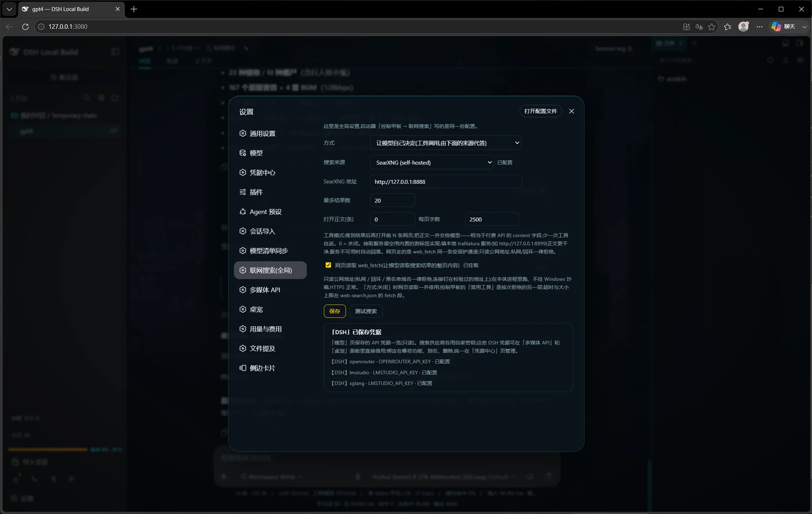

**功能**

全局配一次（启动器控制甲板的「联网搜索」分页是同一份配置）。**方式**：关闭 / 让模型自己决定 / 按触发词自动搜索 / 走 API 供应商的搜索。**搜索来源**：SearXNG（截图里是自建实例）、Serper、SerpApi、Tavily、Brave、DeepSeek 官方。**打开正文**：搜到结果后再打开前 N 条网页把正文一并交给模型。**网页读取 web_fetch** 开关：让模型读取公网网页的整页内容。下方「保存」「测试搜索」，以及只读的「已保存凭据」卡。

**我们做了什么**

- 四种方式对应四种场景：关闭 = 离线；让模型自己决定 = 模型按需调用搜索工具；按触发词 = 给不支持工具调用的本地模型（SillyTavern 式，命中反引号 / 短语 / 正则就先搜再答）；供应商搜索 = OpenRouter 服务端搜索，任何模型都行，按次另计费。
- `web_fetch` 让任何模型都能读网页，只读公网地址，私网与回环地址一律拒绝。
- 「打开正文」省掉一次工具往返；正文抽取可选接本地 trafilatura。
- 密钥经 dsh 凭据库保存；「测试搜索」直接看结果与耗时。

### 图 22 · 设置 → 多媒体 API

*dsh-media-lab · 原创*

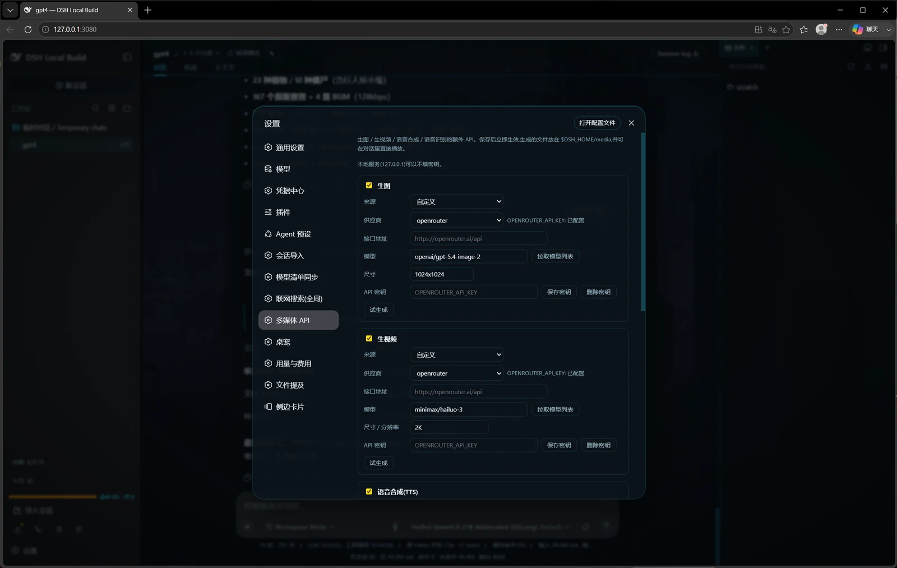

**功能**

生图 / 生视频 / 语音合成 / 语音识别四类接口一个面板：每类选供应商、接口地址、模型（可拉取列表）、尺寸或分辨率、API 密钥，「试生成」立即验证。生成的文件保存在 `~/.dsh/media`，可以直接在对话里显示和播放；本地服务不用填密钥。截图里生图走 OpenRouter 的 gpt-image-2，生视频走 OpenRouter 的 hailuo-3。

**我们做了什么**

- 模型多出四个工具：`generate_image`、`generate_video`、`text_to_speech`、`transcribe_audio`，结果直接出现在对话里。
- 九种供应商（OpenAI 兼容、OpenRouter、Gemini、Veo、Replicate、fal、ElevenLabs、Fish Audio、MiniMax）+ 自定义 HTTP 接口；「共享全局 API」直接借用模型页保存的路由，不用再填一次 key。
- 支持图生视频、参考图引导生图、TTS 音色预设、旧文件自动清理。
- 每个分区只能用自家供应商的密钥，供应商返回的内网地址会被拒绝。

### 图 23 · 设置 → 桌宠

*dsh-desktop-pet · 原创*

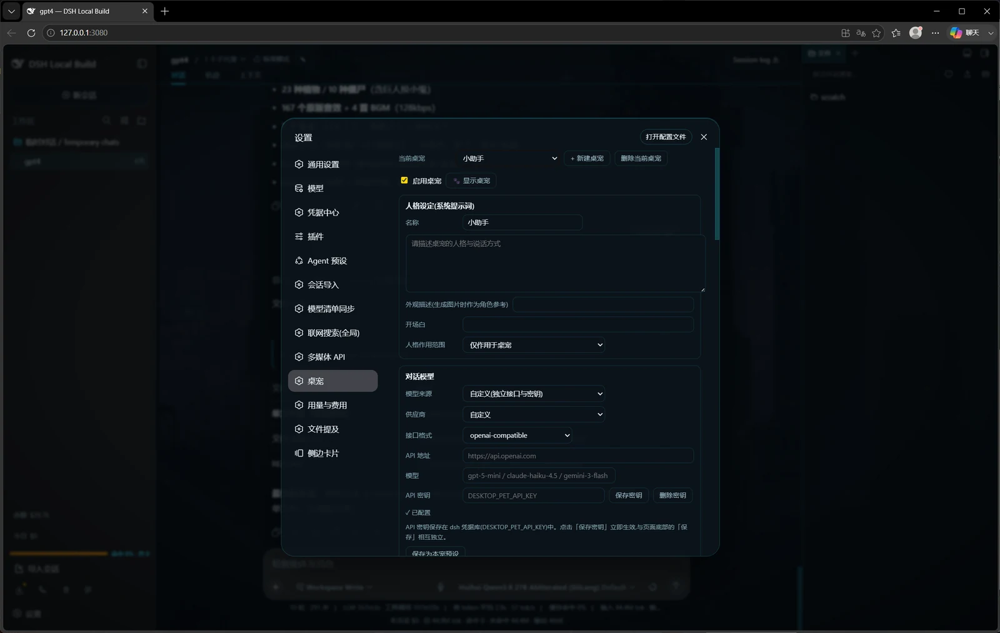

**功能**

当前桌宠（可新建 / 删除）、启用与显示开关；**人格设定**（名称、人格与说话方式、外观描述、开场白、作用范围）；**对话模型**（跟随 dsh / 共享 DSH 供应商 / 自定义接口与密钥）。往下还有设定集（世界书）、表情动作与序列帧、主人画像、权限、主动搭话频率、语音、提醒、外观、桌面窗口等分区。

**我们做了什么**

- 桌宠有自己的人格、设定集、多模态 API 和对话记录；知道你在做什么（任务开始 / 完成各说一句）、按四档频率主动搭话、能定提醒、能说能听、能给自己画图。
- 三种窗口：dsh 内浮窗、桌面精灵（逐像素透明、可拖动缩放、点一下就能说话）、Edge 应用窗口；dsh 重启后窗口自动回来。
- 看屏幕与操作电脑各有三档权限（不允许 / 每次询问 / 完全允许）；对话里一旦出现不是你亲手打的内容（截图、搜索结果、上传素材），控制请求就必须弹卡确认。
- 表情可以是一张静图配动作，或 8–24 帧自定帧率的序列帧动画。

> **图里没体现的** 桌宠对话在侧栏 💬 打开的独立页面里管理；「外观」分区可以调气泡样式，或让图片模型直接画出气泡、输入条、发送键三件套。配套 Skill `desktop-pet` 带着模型从人设到素材把一只宠物做出来。

### 图 24 · 设置 → 用量与费用

*dsh-cost-meter-plus · 二改*

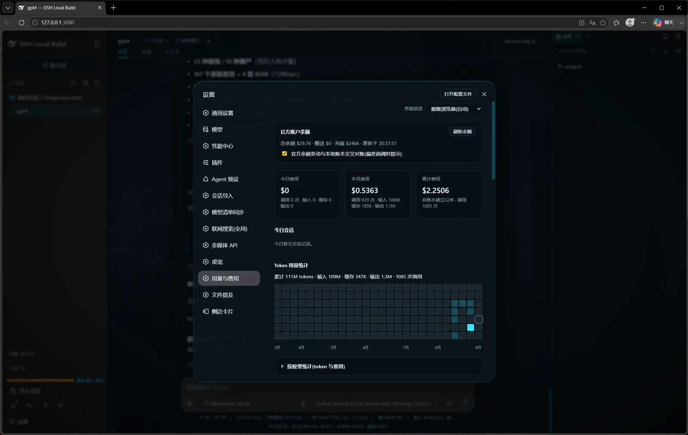

**功能**

界面语言；**官方账户余额**（总余额、赠送、充值、刷新）；今日 / 本月 / 累计费用三张卡；今日会话明细；Token 用量统计与热力图；按模型统计；往下还有预算、价格表、各家 Coding Plan 额度面板。

**我们做了什么**

- 上游 [dsh-cost-meter](https://github.com/Han-1413141/dsh-cost-meter) 提供本会话 / 当日 / 历史费用、官方价格同步、90+ 模型价格目录、7 家 Coding Plan 额度、预算与提醒、中英双语。
- 我们加的：多厂商余额（DeepSeek / OpenRouter / 本地 / OpenAI 各按其能力显示）、OpenRouter 价格自动同步、侧栏缓存命中条、会话行 token 拆分、本地路由免费、设置页"先看钱"的排序。

### 图 25 · 设置 → 文件提及

*dsh-at-file · 社区（照搬）*

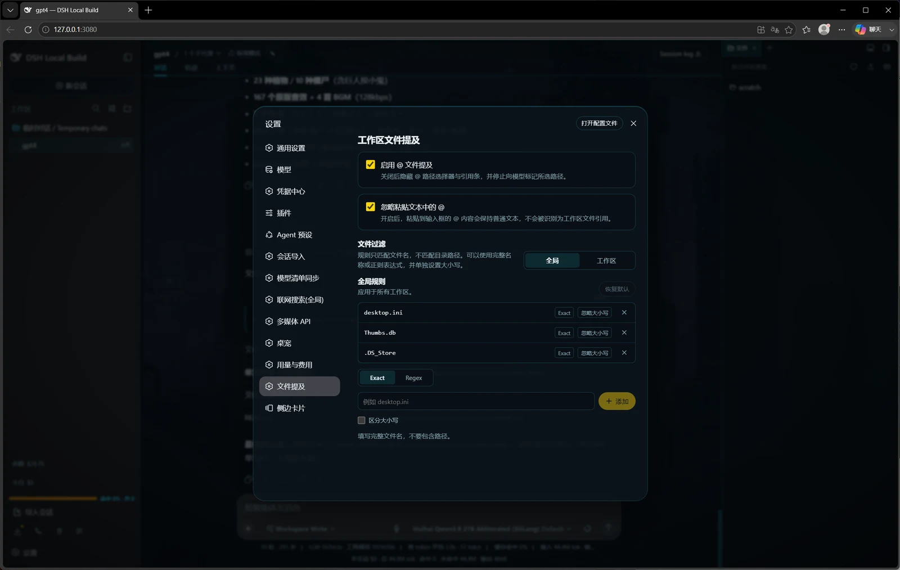

**功能**

输入框输入 `@` 搜索工作区文件并插入路径引用；「忽略粘贴文本中的 @」；文件过滤分全局 / 工作区两层规则。

**我们做了什么**

未修改。套件的拖文件插件与它配合：拖进来的文件以 `@.dsh-uploads/<名>` 写进输入框，走同一种引用。

### 图 26 · 设置 → 侧边卡片

*dsh-better-sidebar · 社区（照搬）*

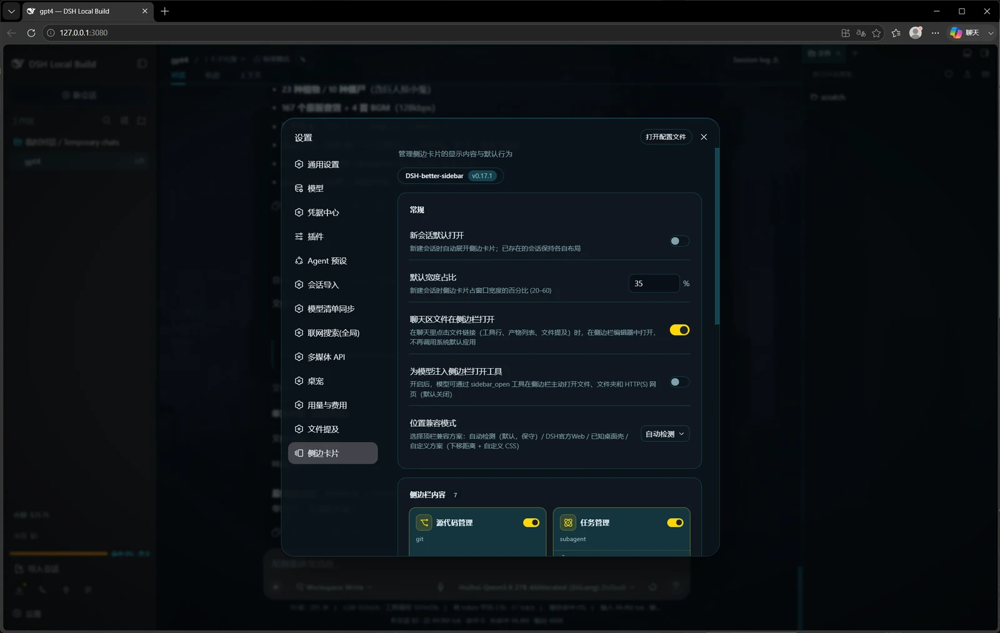

**功能**

VS Code 式右侧工作台（文件、编辑器、终端、Git、浏览器、后台任务）的设置：新会话默认打开、默认宽度、聊天区文件在侧边栏打开、为模型注入侧边栏工具、位置兼容模式，以及各内容项的开关。

**我们做了什么**

未修改。图 15 右侧的「文件」面板就是它。

### 图 27 · 轨迹

*本体自带*

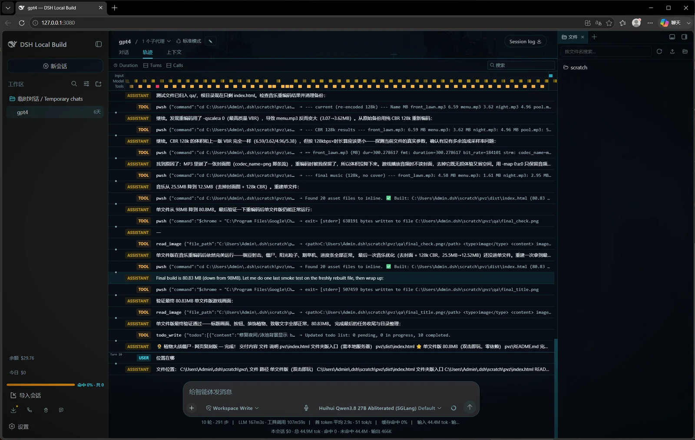

**功能**

会话轨迹视图：Duration / Turns / Calls 三种刻度，时间带，按顺序列出每一步的文字、工具调用与结果预览。

**我们做了什么**

本体自带，未改动。与下一张「上下文」对照：轨迹回答"做了什么"，上下文回答"模型此刻背着什么"。

### 图 28 · 上下文

*dsh-context 0.40.1 · 社区（照搬）*

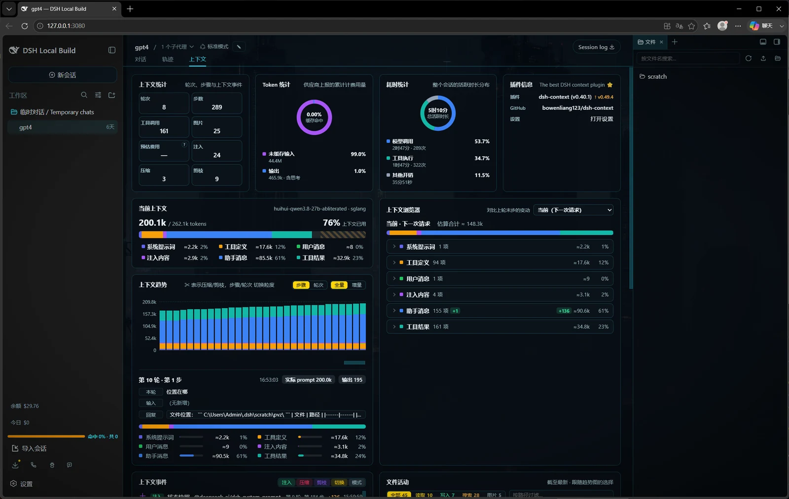

**功能**

上下文仪表盘：**上下文统计**（轮次、步数、工具调用、注入、压缩、剪枝次数）；**Token 统计**（缓存命中环）；**耗时统计**（模型调用 / 工具执行 / 其他）；**当前上下文**（200.1k / 262.1k，已用 76%，拆成系统提示词、工具定义、用户消息、注入内容、助手消息、工具结果）；**上下文趋势**（每次请求一根柱，标出压缩与剪枝）；**上下文浏览器**（每一项可展开到实际内容）；**上下文事件**；**文件活动**。

**我们做了什么**

- 未修改；需要 0.40 以上版本，启动器自检会点名过旧的版本。
- 在这里能直观看到套件各处的效果：工具定义占了多少、控制甲板 / 搜索 / 记忆注入了什么、压缩发生在哪一步、当前离压缩阈值还有多远。

---

<a id="beyond"></a>

## 03 · 截图里看不到的部分

有些能力没有自己的面板，或者面板只露出一角。这里按用途补齐。

### 安全

- **危险命令拦截**（`dsh-safe-guard`，原创）：`rm -rf /`、无 lease 的 `git push --force`、裸设备写入、`mkfs`、Windows 盘符根删除 / 格式化、fork 炸弹等直接拦下，不打扰正常确认流；在控制甲板「安全规则」里可以加自己的**拒绝**、**需确认**（弹审批）、**自动放行**正则，改完 1.5 秒生效。
- **密钥进系统钥匙串**（`dsh-credentials-keyring`，原创）：API Key 存进 Windows 凭据管理器而不是明文文件；环境变量仍然优先；钥匙串出问题时只会读不到，不会丢密钥。
- **手机远程的局域网围栏**（`dsh-lan-fence`，原创）：开了手机扫码远程后，未配对的局域网设备访问 dsh 的 `/api` 一律 403，配对通道不受影响；纯插件实现，升级本体不会重开这个口子。
- **只本机可用**：启动器只监听 127.0.0.1，每个请求都要带令牌；套件所有能写配置的接口都拒绝跨站请求和外来 Host。

### 对话

- **临时对话**（`dsh-temp-chat`，原创）：侧栏一个按钮开一个不属于任何项目的对话，放在共用的「临时对话」工作区，用纯聊天预设（不能动文件和终端）；不会自动删除，想清理时一键删目录。
- **拖文件**（`dsh-drop-files`，原创）：把任意非图片文件拖进对话区，文件存进当前工作区的 `.dsh-uploads/`，输入框自动写入 `@.dsh-uploads/<名>`，模型用文件工具读；单个文件最多 25 MB；PDF / Office / 压缩包会存下来但模型读不出内容，拖入时会提示。
- **皮肤工坊**（`dsh-skin-studio` + Skill `skin-studio`，原创）：在对话里让模型给启动器或 dsh 做皮肤，它会先问风格、主色、明暗、背景图，写好直接落盘启用；没有图且模型不能生图时会向你要图，不会瞎编。
- **模型悬停价格**（`dsh-price-hint`，原创）：模型选择器里悬停任意模型，显示输入 / 输出 / 缓存每百万 tokens 的价格。
- **快建工作区**（`dsh-quick-workspace`，原创）：启动器仪表盘输入路径一键新建工作区（目录不存在会创建）。
- **前端皮肤注入**（`dsh-skin-loader`，原创）：把启动器里选的前端皮肤套到 dsh 网页上。

### 本体自带、默认不开的能力（上游包，我们挂上了）

| 能力 | 作用 |
|---|---|
| 持久终端（`dsh-terminal` 三件） | 模型可以开一个持久的 PTY 终端，交互式发命令、读输出、发信号，配合后台作业 |
| 定时提醒（`dsh-schedule`） | 按时间点或固定频率提醒 agent |
| LSP 代码智能（`dsh-lsp` 三件） | 配了 TypeScript 语言服务器，模型可以跳转定义、查引用、看类型 |
| MCP 客户端 + 参考记忆服务器 | 官方示例接法的知识图谱记忆（实体 / 关系 / 观察），与套件的记忆插件是两套独立机制 |
| Claude Code / Codex hook 桥 | 直接复用 Claude Code、Codex 格式的 hooks.json |

---

<a id="memory"></a>

## 04 · 上下文与记忆管理

对应启动器的「记忆与上下文」页和 `dsh-memory-lite` 插件。这一章讲：dsh 自己是怎么管上下文的、哪些东西会进上下文、你能在哪里控制它们、记忆是怎么记又怎么用的。

### 1. dsh 自己是怎么做的

- 对话历史只追加、不截断。快到上限时（上下文窗口的 80%），dsh 自动把最旧的一段历史压成一段摘要，模型之后看到的是摘要而不是原文；`/compact` 命令可以手动触发。
- 上限由每个模型的 `contextWindow` 决定，默认 262,144；本地模型往往装不了这么多，要在启动器「模型参数」页按模型改成真实值，压缩才会在正确的位置发生。
- 本体原生没有跨会话的记忆：换一个会话，模型什么都不记得。

### 2. 哪些东西会进上下文，在哪里调

| 会进上下文的内容 | 来自 | 在哪里调 | 默认预算 |
|---|---|---|---|
| 系统提示词条目 | 控制甲板「提示词」 | 控制甲板 | 按条目顺序 |
| 世界书命中的设定、user 前置提示 | 控制甲板「世界书 / 提示词」 | 控制甲板 | 8000 字符，扫描最近 6 条 |
| 搜索结果（触发词模式） | 联网搜索 | dsh 设置「联网搜索（全局）」 | 可设字符预算，最多打开 5 个网页 |
| 网页正文（工具模式「打开正文」、`web_fetch`） | 联网搜索 | 同上 | 每页 2000 字符（可调）；整页读取上限 200,000 字符 |
| 记忆召回 | 记忆与上下文 | 启动器「记忆与上下文 → 设置」 | 4000 字符，最多 5 条 |
| 图片的文字描述（非视觉模型） | 图片理解 | dsh 设置 → 插件 → 图片理解 | 4 MP / 20 MB 以内的图 |
| 工具定义 | 本体与各插件注册的工具 | 控制甲板「工具开关」；临时对话默认屏蔽全部工具 | 截图里约 94 项、17.6k tokens |

这几处注入都是**作为单独一条上下文放在你的消息之后**，你的原话不会被改写。想看效果：输入框旁的上下文环、会话的「上下文」分页（社区插件 `dsh-context`）、启动器记忆页的压力条。

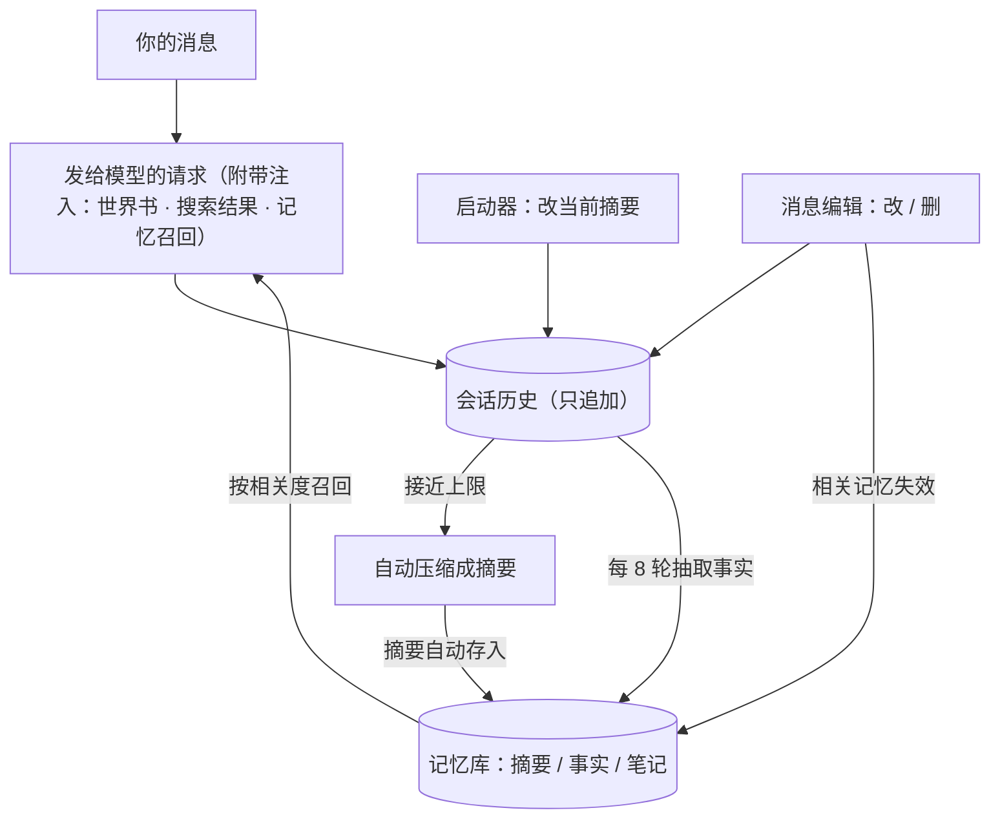
```mermaid
flowchart TB
  U["你的消息"] --> REQ["发给模型的请求（附带注入：世界书 · 搜索结果 · 记忆召回）"]
  REQ --> LOG[("会话历史（只追加）")]
  LOG -- "接近上限" --> CMP["自动压缩成摘要"]
  CMP -- "摘要自动存入" --> MEM[("记忆库：摘要 / 事实 / 笔记")]
  LOG -- "每 8 轮抽取事实" --> MEM
  MEM -- "按相关度召回" --> REQ
  EDIT["启动器：改当前摘要"] --> LOG
  CE["消息编辑：改 / 删"] --> LOG
  CE -- "相关记忆失效" --> MEM
```

### 3. 会话上下文分页：看和改压缩摘要

- **看**：每个会话（打开与否都行）的上下文占用与压缩阈值、当前生效的摘要、压缩历史。
- **改**：直接编辑摘要文字，保存后下一次请求起模型就按你的文字继续；原文仍在会话日志里，随时可追溯。
- **立即压缩**：不等到阈值，现在就压。**存入长期记忆**：把当前摘要存成一条记忆。
- 什么时候不能改：会话正在回答、正在压缩、或这段摘要已经被更新的压缩替代。

### 4. 长期记忆分页：跨会话记住东西

**记什么。** 三类条目：
- **摘要**——每次自动压缩产生的摘要自动存一份（每个会话留最新的）；
- **事实**——每 8 轮对话，由会话自己用的模型抽取一次"值得长期记住的事"（可关掉，也可改间隔）；
- **笔记**——你在页面上手写，或模型通过 `memory_note` 工具写。

每条有范围：**全局**（关于你的）或**仅此工作区**（关于某个项目的）；可以钉住、编辑、删除、导入导出、一键清空未钉住的。

**怎么用。** 新会话第一轮，钉住的和相关的条目会作为一条上下文放在你的消息之后；之后每一轮只补充还没注入过的相关条目。注入方式可选「首轮钉住 + 相关 / 只首轮 / 不注入」，每次最多几条、总字数多少都可调。召回按关键词匹配（支持中文），也可以接本地向量接口（LM Studio / Ollama）做语义召回；设置页有「召回测试」，输一句话就能看到会注入什么。模型侧还有 `memory_recall` / `memory_note` 两个工具，可关。

**改了源对话之后。** 用消息编辑改了或删了某条消息，从它抽出来的事实和摘要会失效：留在记忆页里加标签供你检查，不再自动召回；如果已经注入到别的会话，那些会话下一步会收到一条撤回或更正提示。在记忆页把一条文本保存一次，等于确认它，重新生效。

### 5. 文件在哪

- 设置：`~/.dsh/memory-lite.json`（是否启用、自动存摘要、自动抽取事实、抽取间隔、注入方式、每次条数、字数预算、是否给模型工具、向量接口）。
- 数据：`~/.dsh/memory/memory.json`（条目）与 `vectors.json`（可选向量）。
- 两者都在启动器「存储空间」的配置备份里；恢复后 dsh 运行中也会合并进来。

### 6. 常见问题

**会多花模型调用吗？** 只有事实抽取（每 8 轮一次短请求，用会话自己的模型，可关）和你手动点的「立即压缩」；召回和注入都在本地完成。

**改了摘要，原文还在吗？** 在。改摘要是追加一条新记录，原文留在会话日志里；「上下文」分页的事件列表能看到这次编辑。

**记忆会把别的项目的东西带进来吗？** 事实分全局 / 工作区两档，工作区范围只在同一目录召回；非首轮有相关性门槛；总注入量有预算；用「召回测试」可以提前看。

---

<a id="roster"></a>

## 05 · 全部插件清单：原创 / 二改 / 照搬

**原创** = 我们从零写的（可能在用法上参照别的软件，但没有用它的代码，会注明）；**二改** = 以别人的开源项目为基础改出来的，保留上游许可，注明改了什么；**照搬** = 原样使用的第三方项目，一行未改。版本号为 2026-09-11 本机实测。

### 程序

独立程序，不是 dsh 插件。

| 插件 / 程序 | 版本 | 归属 | 职责 | 界面位置 |
|---|---|---|---|---|
| `DSH 启动器` | 13 页 | 原创 | 一键启动 / 退出、插件与 Skill 市场、会话与存储、更新与自检、Tokens 统计、控制甲板、模型参数、凭据中心、记忆与上下文、皮肤、日志；中英双语。交互体验致敬秋叶 aaaki 的 ComfyUI 整合包启动器（参照体验，无代码引用）。 | launcher/ |

### 套件插件 · 原创

19 个。

| 插件 / 程序 | 版本 | 归属 | 职责 | 界面位置 |
|---|---|---|---|---|
| `dsh-control-deck` | 0.3.1 | 原创 | SillyTavern 级控制甲板：多条分级提示词、正则脚本、世界书、采样覆盖、工具开关、预设、ST JSON 导入导出，改完 1.5 秒生效。用法对齐 SillyTavern，未引用其代码。 | 启动器「控制甲板」 |
| `dsh-safe-guard` | 0.2.0 | 原创 | 危险命令拦截 + 自定义拒绝 / 需确认 / 自动放行规则。 | 控制甲板「安全规则」 |
| `dsh-credentials-keyring` | 0.1.0 | 原创 | API Key 存进 Windows 凭据管理器。 | 凭据中心「来源」列 |
| `dsh-skin-loader` | 0.1.0 | 原创 | 给 dsh 网页套皮肤。 | 启动器「外观皮肤」 |
| `dsh-price-hint` | 0.1.0 | 原创 | 模型选择器悬停显示价格。 | dsh 模型选择器 |
| `dsh-quick-workspace` | 0.1.0 | 原创 | 输入路径一键新建工作区。 | 启动器仪表盘 |
| `dsh-skin-studio` | 0.1.0 | 原创 | 在对话里让模型做皮肤（`skin_studio` 工具）。 | 对话 |
| `dsh-local-reasoning` | 0.1.1 | 原创 | 任意模型的上下文上限 / 最大输出 / 思考档位；本地模型自动探测并教会档位；OpenRouter `:online` 变体。 | 启动器「模型参数」 |
| `dsh-web-search-plus` | 0.5.0 | 原创 | 联网搜索四种方式、六种来源、`web_fetch` 网页读取、自动打开正文。触发词用法对齐 SillyTavern 的 WebSearch 扩展，未引用其代码。 | dsh 设置「联网搜索（全局）」、控制甲板 |
| `dsh-memory-lite` | 0.1.0 | 原创 | 可编辑的压缩摘要、立即压缩；长期记忆（摘要 / 事实 / 笔记）自动注入与 `memory_recall` / `memory_note` 工具。 | 启动器「记忆与上下文」 |
| `dsh-chat-editor` | 0.1.0 | 原创 | 改 / 删 / 折叠任意消息，从任意轮次分叉。 | 会话头 ✎ |
| `dsh-temp-chat` | 0.1.1 | 原创 | 不属于任何项目的临时对话。 | 侧栏按钮 |
| `dsh-media-lab` | 0.1.1 | 原创 | 生图 / 生视频 / 语音合成 / 语音识别，九种供应商 + 自定义接口，结果在对话里播放。 | dsh 设置「多媒体 API」 |
| `dsh-desktop-pet` | 0.2.2 | 原创 | 桌宠：人格、设定集、独立 API、主动搭话、提醒、语音、序列帧动画、看屏 / 操作电脑权限、三种窗口。 | dsh 设置「桌宠」、侧栏 |
| `dsh-lan-fence` | 0.1.0 | 原创 | 手机远程时封住未配对设备的 `/api`。 | （无面板） |
| `dsh-provider-sync` | 0.2.0 | 原创 | OpenRouter 模型清单自动同步，可推理模型写好思考档位。 | dsh 设置「模型清单同步」 |
| `dsh-drop-files` | 0.1.1 | 原创 | 把任意文件拖进对话。 | 对话拖放 |
| `dsh-credentials-center` | 0.3.0 | 原创 | 一页管全部 API 密钥：绑定关系、别名、备用密钥、默认模型。 | 启动器「凭据中心」+ dsh 设置 |
| `dsh-import-note` | 0.1.0 | 原创 | 一张说明卡：会话导入不会覆盖系统提示词。 | dsh 设置 → 插件 |

### 套件插件 · 二改

3 个，均基于 MIT 项目，保留上游许可。

| 插件 / 程序 | 版本 | 归属 | 上游 / 许可 | 职责 | 界面位置 |
|---|---|---|---|---|---|
| `dsh-cost-meter-plus` | 1.5.19-plus.4 | 二改 | Han-1413141/dsh-cost-meter 1.5.19 · MIT | 上游：会话 / 当日 / 历史费用、官方价格同步、90+ 模型价格目录、7 家 Coding Plan 额度、预算提醒、中英双语。**我们改的**：多厂商余额、OpenRouter 价格自动同步、缓存命中条、会话行 token 拆分、本地路由免费、设置页先看钱。 | dsh 设置「用量与费用」、侧栏 |
| `dsh-token-usage-plus` | 2.1.0-plus.1 | 二改 | Tastelessor/dsh-usage-stats 2.1.0 · MIT | 上游：用量统计卡 + 热力图 + 官方峰谷价换算。**我们改的**：去掉峰谷价显示、从费用账本补 OpenRouter 价格。默认不挂载（费用页已覆盖），仍在仓库。 | （默认不挂载） |
| `dsh-vision-bridge-zh` | 0.4.5-zh.2 | 二改 | @goodandready/dsh-vision-bridge 0.4.5 · MIT | 上游：让纯文本模型"看图"（自动改写 + 26 个视觉工具：描述、OCR、定位、裁剪、长截图、PDF、视频等）。**我们改的**：中文界面，修正多图比较、目录限制、竞速判定等几处问题。 | dsh 设置 → 插件「图片理解」 |

### 社区插件 · 照搬

9 个 + 1 个 MCP 服务器，在启动器插件市场里装，一行未改。另有两个候选被否决：`dsh-auto-approval`（与当前本体不兼容）、`dsh-filesnap`（卸载后录过的会话打不开）。

| 插件 / 程序 | 版本 | 归属 | 上游 / 许可 | 职责 | 界面位置 |
|---|---|---|---|---|---|
| `dsh-context` | 0.40.1 | 照搬 | bowenliang123 · Apache-2.0 | 上下文仪表盘（构成、趋势、事件、浏览器、文件活动）与 `/context` 命令。需要 0.40 以上。 | 会话「上下文」分页 |
| `dsh-at-file` | 0.6.3 | 照搬 | omdsh-dev · MIT | 输入框 `@` 引用工作区文件。 | dsh 设置「文件提及」 |
| `dsh-better-sidebar` | 0.17.1 | 照搬 | omdsh-dev · MIT | VS Code 式右侧工作台：文件 / 编辑器 / 终端 / Git / 浏览器 / 后台任务。 | dsh 设置「侧边卡片」、右侧面板 |
| `@linxin666/dsh-remote-web-ui` | 0.3.10 | 照搬 | zhu1090093659/dsh-web · Apache-2.0 | 手机 / 电脑扫码配对远程使用同一份 Web GUI，一次性令牌、可吊销设备、可选 Cloudflare 隧道。 | 侧栏手机图标 |
| `dsh-automation` | 0.1.4 | 照搬 | Ephemeral-AI-Lab · MIT | 会话内定时 / 循环自提示。 | 对话 |
| `dsh-chat-import` | 0.8.2 | 照搬 | Nwflower · MIT | 导入 Claude Code / Codex / ChatGPT / Cursor / Gemini 等 19 种 agent 的会话；双向同步。 | 侧栏「导入会话」、dsh 设置「会话导入」 |
| `dsh-voice-input-plugin` | 0.1.1 | 照搬 | CrazyGummies · MIT | 输入框麦克风，浏览器语音识别，零密钥。 | 输入框 |
| `dsh-notification` | 0.1.1 | 照搬 | nishit130 · MIT | agent 完成 / 出错 / 等待审批时的桌面与 webhook 通知。 | （后台） |
| `@syncended/dsh-retry` | 0.2.2 | 照搬 | syncended · MIT | 模型临时错误自动重试，中断会话恢复。 | （后台） |
| `@modelcontextprotocol/server-memory` | 2026.7.4 | 照搬 | Model Context Protocol 项目 · MIT | MCP 知识图谱记忆服务器，经本体 MCP 客户端挂载。 | 模型工具 |

### 本体与内置可选能力 · 照搬

deepseek-harness 官方代码，零改动。

| 插件 / 程序 | 版本 | 归属 | 上游 / 许可 | 职责 | 界面位置 |
|---|---|---|---|---|---|
| `deepseek-harness（core/）` | 0.1.1-rc.2 | 上游 | deepseek-ai · MIT | 全量内置的上游源码，一行未改；启动器可升级到任意上游版本。自带 11 个开发规程 Skill。 | core/ |
| `dsh-terminal / -bash / tool-terminal` | 0.1.1-rc.2 | 上游 | in-tree | 持久终端与六个模型工具。 | profile 补丁 |
| `dsh-schedule` | 0.1.1-rc.2 | 上游 | in-tree | 定时提醒。 | profile 补丁 |
| `dsh-lsp / lsp-stdio / tool-lsp` | 0.1.1-rc.2 | 上游 | in-tree | LSP 代码智能（TypeScript）。 | profile 补丁 |
| `dsh-mcp-client` | 0.1.1-rc.2 | 上游 | in-tree | MCP 客户端。 | profile 补丁 |
| `dsh-hooks-claude-code / -codex` | 0.1.1-rc.2 | 上游 | in-tree | Claude Code / Codex hooks 桥。 | profile 补丁 |

### 统计

| 类别 | 数量 |
|---|---|
| 原创程序 | 1（DSH 启动器） |
| 原创插件 | 19 |
| 二改插件 | 3（cost-meter-plus、token-usage-plus、vision-bridge-zh） |
| 照搬的社区插件 | 9 + 1 个 MCP 服务器 |
| 照搬的本体内置可选包 | 10 |
| 原创 Skill | 7 工程 + 3 dsh 内 |
| 本体自带 Skill | 11（照搬） |
| 原创皮肤 | 启动器 3 · 前端 2 |
| 本体代码改动 | 0 行 |

---

<a id="skills"></a>

## 06 · Skill 清单

两类：给 **Claude Code** 用的工程 Skill（`skills/`，复制到 `~/.claude/skills/`），和给 **dsh 内的模型**用的 Skill（`dsh-skills/`，安装时复制到 `~/.dsh/skills/`，启动器「Skill 管理」页可见）。全部原创。

### 工程 Skill（Claude Code，7 个）

| Skill | 用来 |
|---|---|
| `dsh-architecture` | 弄懂 dsh 的插件系统、profile / bundle / patch、回合流程，改本体前先读 |
| `dsh-plugin-dev` | 写 dsh 插件：工具、hook、权限门、命令、模型适配器 |
| `dsh-frontend-dev` | 改 dsh 网页界面：面板、设置卡、侧栏项、主题 |
| `dsh-env-ops` | 搭环境、升级、排查构建 / 安装 / 启动错误（Windows 为主） |
| `dsh-playbook` | 怎么跑、怎么配模型和 key、怎么更快更便宜、怎么装插件 |
| `dsh-testing` | 该跑哪些测试、怎么写、快照怎么更新 |
| `dsh-local-models` | LM Studio / Ollama 本地模型的路由、思考档位、上下文对齐 |

### dsh 内 Skill（3 个）

| Skill | 用来 |
|---|---|
| `skin-studio` | 让模型给启动器或 dsh 做皮肤（变量表、模板、背景图用法） |
| `control-deck-authoring` | 让模型帮你写提示词、正则、世界书、预设，或迁移 SillyTavern 资产 |
| `desktop-pet` | 让模型带你做一只桌宠：问需求、写人设、列素材、出图、写进插件 |

### 随本体而来（照搬）

本体自带 11 个开发规程 Skill（代码评审、文档标准、推送前检查、翻译等），在启动器 Skill 页列为 repo 来源。

---

<a id="skins"></a>

## 07 · 皮肤与美术

启动器皮肤和 dsh 前端皮肤分开管理，都在启动器「外观皮肤」页切换、导入。

| 皮肤 | 端 | 归属 | 说明 |
|---|---|---|---|
| `default` | 启动器 | 原创 | 明 / 暗 / 跟随系统三态 |
| `cyberpunk-2077` | 启动器 + 前端 | 原创 | 霓虹黄 × 电青、切角卡片、glitch、电流 / 闪电特效；美术由即梦 AI 生成 |
| `night-city-holo` | 启动器 + 前端 | 原创 | 石墨底、全息青细线、2077 金激活态、矢量导航图标，无扫描线无闪烁；背景为 gpt-image-2 生成的夜之城 |
| 社区皮肤 | 前端 | 社区作者（照搬） | 启动器「获取社区皮肤」从 npm 转换成本地 CSS 后使用（曾用过 miku、matrix、minecraft、xp 等十余款），沿用各包许可，不入库 |

其它美术：桌宠全息 UI 三件套（气泡、输入条、发送键）随桌宠插件附带；桌宠「王胖子」的表情序列帧由 gpt-image-2 生成后本地抠像。

---

<a id="principles"></a>

## 08 · 许可与致谢

- 套件原创代码 **MIT**（`LICENSE`）。
- 二改插件沿用上游 MIT：[Han-1413141/dsh-cost-meter](https://github.com/Han-1413141/dsh-cost-meter)、[Tastelessor/dsh-usage-stats](https://github.com/Tastelessor/dsh-usage-stats)、[@goodandready/dsh-vision-bridge](https://www.npmjs.com/package/@goodandready/dsh-vision-bridge)。
- 照搬的社区插件各自许可（MIT / Apache-2.0）见清单；社区皮肤归原作者。
- 控制甲板与联网搜索的用法对齐 [SillyTavern](https://github.com/SillyTavern/SillyTavern) 与其 WebSearch 扩展（参照用法，不含其代码）。
- 启动器交互体验致敬 [秋叶 aaaki 的 ComfyUI 整合包启动器](https://space.bilibili.com/12566101)。
- 本体：[deepseek-ai/deepseek-harness](https://github.com/deepseek-ai/deepseek-harness)（MIT）。
- 启动器美术由即梦 AI 生成；夜之城背景与桌宠序列帧由 gpt-image-2 生成。

截图拍摄于 2026-09-11，本体 0.1.1-rc.2；启动器截图为 dsh 未运行状态。

---
