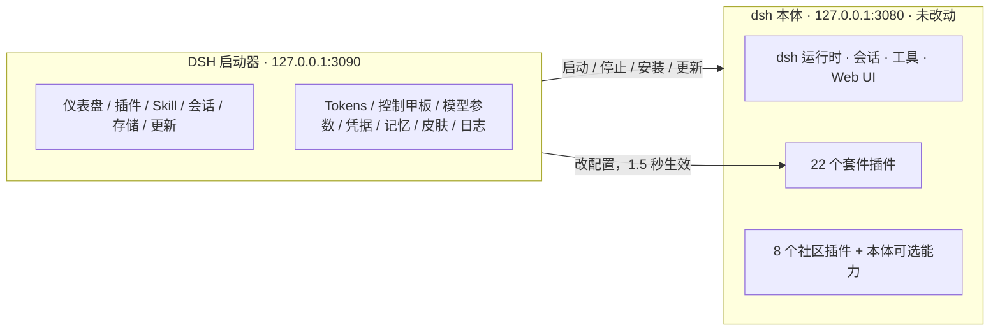
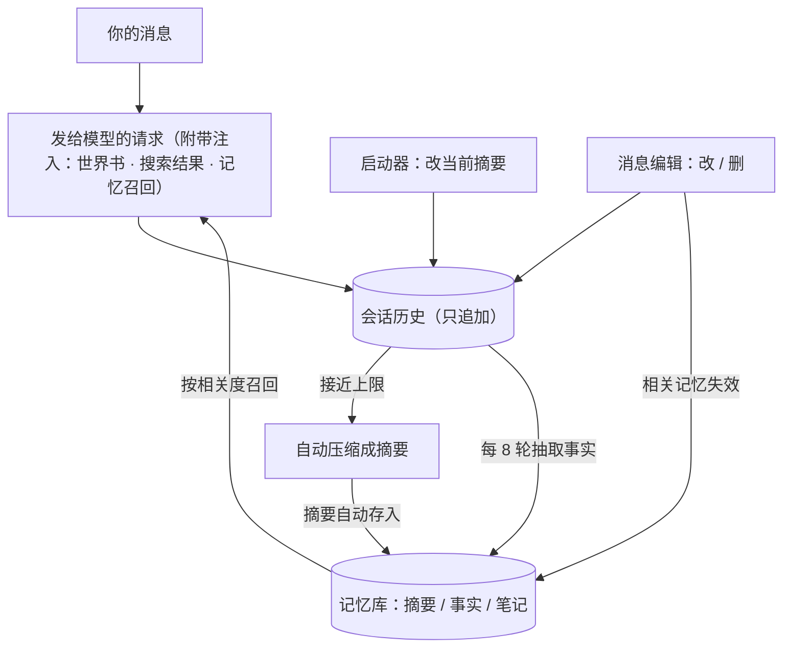

<!-- GENERATED FILE: built by docs/showcase-src/build.mjs from docs/showcase-src/content/*.mjs. Edit the sources, then run: node docs/showcase-src/build.mjs -->

# DSH CyberWorkStation

**中文** | [English](README.md)

DSH CyberWorkStation 是给 [DeepSeek Harness（dsh）](https://github.com/deepseek-ai/deepseek-harness) 配的一个桌面启动器和 22 个插件，面向想把 dsh 当日常工具而不是命令行实验品来用的人：双击启动，所有设置和密钥集中在一处，随时看得到模型在做什么、花了多少钱，新功能装上就能用，不用打开配置文件。上游本体原样放在 `core/` 里，所以这一切在本体升级之后都还在。

内置的本体是 dsh 0.1.5-rc.2（上游 tag `dsh-v0.1.5-rc.2`）。

`core: 0.1.5-rc.2` · `plugins: 22` · `skills: 10` · `license: MIT`

觉得有用的话点个 star，方便更多 dsh 用户看到。


## 目录

- [这是什么](#overview)
- [DSH 启动器：13 个页面](#launcher)
- [dsh 本体里的界面](#dsh)
- [截图里看不到的部分](#beyond)
- [上下文与记忆管理](#memory)
- [全部插件清单：原创 / 二改 / 照搬](#roster)
- [Skill 清单](#skills)
- [给贡献者](#contributors)
- [皮肤与美术](#skins)
- [许可与致谢](#license)

---

<a id="overview"></a>

## 这是什么

dsh 装好之后是一个命令行 agent，带一个能用但很朴素的网页界面。围绕它的一切，从选模型到装插件，都要在终端里敲命令或者改 `settings.yaml`。这个仓库在本体外面包了两层，让整套流程都在屏幕上完成。

第一层是 DSH 启动器，一个独立的小程序。双击打开是一个 13 页的窗口，覆盖 dsh 从装好到日常使用会遇到的事：启动和停止本体、安装插件和 Skill、查看会话和存储、更新和自检环境、看 Tokens 统计、编辑控制甲板、调模型参数、管理凭据、编辑记忆与上下文、切换皮肤、看日志。

第二层是 22 个插件，它们直接住在 dsh 自己的页面里：设置里多出凭据中心、模型清单同步、联网搜索、多媒体 API、桌宠和用量与费用；对话里多出消息编辑、临时对话、拖文件和思考档位。这些面板都嵌在本体原有的位置：设置弹窗里多一个分区，侧栏里多一个图标，会话头多一个按钮，没有一处是浮在界面之上的补丁。22 个里 19 个是为本套件写的，3 个是在别人 MIT 项目上改出来的；另外还原样用了 8 个社区插件，文末的清单逐个列出了来源。

本文里说的「本体」，指的是原样放在 `core/` 里的上游 deepseek-harness。它按发布的样子直接使用，所以更新页才能把它整体换成任意一个上游版本。

有几个特性决定了这套东西用起来的感觉。所有功能都是插件或独立程序，升级本体不会丢掉任何一项。在启动器页面或 dsh 设置里改的配置，大约 1.5 秒内生效，没有「重启一下」这一步。API Key 只进 dsh 的凭据库，装了钥匙串插件就进 Windows 凭据管理器，不会出现在任何配置文件里。启动器和 dsh 都只监听本机。

### 组成一览

| 组成 | 数量 | 说明 |
|---|---|---|
| DSH 启动器 | 13 个页面 · 中英双语 · 3 款皮肤 | `launcher/`，双击 `DSH启动器.exe`；本体约 5 秒启动 |
| 套件插件 | 22 个（原创 19 · 二改 3） | `plugins/`，安装时自动注册 |
| 社区插件 | 8 个 + 1 个 MCP 记忆服务器 | 在启动器插件市场里装，不进仓库 |
| 本体内置可选能力 | 10 个上游包 | 持久终端、定时提醒、LSP、MCP 客户端、Claude Code / Codex hook 桥 |
| 工程 Skill | 7 个（Claude Code） | 架构 / 插件 / 前端 / 运维 / 玩法 / 测试 / 本地模型 |
| dsh 内 Skill | 3 个 | 皮肤工坊、控制甲板编写、桌宠制作 |
| 皮肤 | 启动器 3 款 · 前端 2 款 · 社区皮肤按需转换 | 启动器「外观皮肤」页管理 |



### 快速开始

前置：Windows 10/11、Git、Node.js `^22.19 || >=24`（推荐 24 LTS）、Edge 或 Chrome。

```bat
git clone https://github.com/WZZNNE/DSH-CyberWorkStation.git
cd DSH-CyberWorkStation
setup.cmd
```

`setup.cmd` 会安装依赖、构建本体（首次约 5–10 分钟）、注册全部套件插件和 Skill，然后打开启动器。之后启动器就是入口：双击 `launcher/DSH启动器.exe`，按「一键启动」，再从仪表盘打开网页界面。API Key 在启动器「凭据中心」页或 dsh 设置的「凭据中心」分区里填，填的时候顺手绑定到用它的功能上。

---

<a id="launcher"></a>

## DSH 启动器：13 个页面

启动器是一个跑在 dsh 旁边的独立程序。双击 `DSH启动器.exe`，它以无地址栏的应用窗口打开 `http://127.0.0.1:3090`，只监听本机，页面自带访问令牌。页面列在窗口左侧，左下角的「中 → EN」把整个启动器切成另一种语言。

这一节和下一节的截图拍摄时本体是 0.1.1-rc.2，比现在内置的旧；启动器截图是在本体离线时拍的。需要从运行中的 dsh 读数据的页面（模型参数、凭据中心、记忆与上下文）显示的是占位提示；dsh 在线后它们长什么样，在各图说明里写了。

### 图 1：仪表盘


仪表盘是打开就落到的那一页，它先回答两个问题：dsh 在不在跑，接下来该去哪。顶部横幅显示状态，OFFLINE 或 RUNNING。往下四张卡片：本体版本、Node 版本、当前默认模型（旁边直接链到凭据中心去改），以及带你进入 dsh 的「打开 WEB UI」。「文件夹」一栏输入绝对路径就能新建工作区，下面四张快捷卡分别在资源管理器里打开本体仓库、`~/.dsh` 主目录、插件目录和会话日志目录。中间的控制台实时滚动本体启动和运行时的输出。「一键启动」和「退出」在右下角。

本体已构建时，启动约 5 秒；没构建过就回退到源码方式启动。重复点击不会启动第二份。「退出」只停 dsh 自己的进程。在「文件夹」栏输入的工作区按下按钮就存在了，刷新 dsh 页面就能选到；dsh 自带的「+」按钮没法给未分组会话新建工作区，所以新工作区都从这一栏来。

用 `cyberpunk-2077` 皮肤时，「一键启动」带电流特效，RUNNING 状态用翻牌动画切入。另外，在地址后面加 `#deck` 这类锚点可以直接打开对应页面。

### 图 2：插件管理


这一页把 dsh 的插件命令行变成了一张表单。顶部输入 npm 包名或 `link:` 本地路径就能安装。下面的表格列出 web profile 里的每个插件：版本、来源（npm / link）、是否作为 bundle 层挂载，以及「卸载」；社区插件和套件插件混排在同一张表里。再往下是「插件市场」，搜 npm 直接安装；还有「内置组合行」，以只读方式列出本体 profile 自己挂载的一百多个条目。

这一页上的所有操作，加上更新页的插件一键更新，都走本体自己的插件命令，结果和你在命令行里敲完全一样。凭据钥匙串和局域网围栏这两个插件被 profile 补丁引用，因此受保护：从这里卸载会被拒绝，并指引你去看迁移步骤，避免下次启动去加载一个已经不存在的模块。市场只显示 dsh 生态内的 npm 结果，皮肤包不会混进插件列表，因为皮肤有自己的市场。清单里的社区插件都是这样装进来的。

### 图 3：Skill 管理


Skill 来自两个地方，这一页两处都列：用户目录 `~/.dsh/skills`，套件安装时会把 `control-deck-authoring`、`desktop-pet`、`skin-studio` 放进去；以及本体源码自带的 12 个开发规程。每行标出来源和用途。底部的「Skill 市场」按关键词搜 GitHub 仓库，下载解压到用户目录。

三个 dsh 内 Skill 是套件自己写的：皮肤工坊让模型替你设计皮肤；控制甲板编写让它帮你写提示词、正则和世界书，或者迁移 SillyTavern 资产；桌宠制作让模型带你从人设一路做到素材。仓库另有 7 个给 Claude Code 用的工程 Skill，不在这一页上，见 [Skill 清单](#skills)。

### 图 4：对话管理


`~/.dsh/sessions` 下的全部会话都在这里，按工作目录分组，最新的在前。每个组头显示数量和最近活动时间，可以按工作区或会话 id 过滤。「打开会话文件夹」直达资源管理器；展开一组，可以对单个会话「导出 ZIP」，这一步需要 dsh 在线。组名前的「≈」表示这个目录是推断出来的，不是记录下来的。

这一页是只读的：没有删除按钮，删会话请在资源管理器里做。截图里 `tmp\2026…` 那些目录是「临时对话」插件为每次临时会话建的草稿目录。

### 图 5：存储空间


上表统计 9 个目录的占用（本体仓库、`~/.dsh`、会话、存储、profile、插件、用户 Skill、启动器、node_modules），每一行都能直接打开。下面的配置备份把套件在 `~/.dsh` 下的配置打成一个 JSON：`settings.yaml`、控制甲板与预设、联网搜索、安全规则、模型参数、记忆库、profile 补丁、Skill、hooks、前端皮肤。「预览内容」在写入任何东西之前先列出文件；「导入恢复」在替换之前会把现有文件另存一份。

备份从不包含密钥文件和会话日志。恢复只接受白名单内的文件，越出预期路径或超过大小限制的包会被拒绝，恢复完会告诉你哪些文件需要重启 dsh 才生效。记忆库不需要重启：恢复的记忆库在 dsh 运行中就会被合并进来。

### 图 6：更新推送


「版本」卡对比本地本体与上游最新版本，给出三条路：就地更新本体（git pull + 构建）、升级到上游最新 tag、升级到你指定的 tag。「插件」卡一次更新 profile 里的全部插件。下面的自检跑八项：Node 版本、pnpm、端口、本体检出、插件 peer 链接、配置文件、内置 CLI 是否已构建、web profile 已注册的插件。这些操作的输出都在底部滚动。页面上还有一张卡，用来修复本体 0.1.5 起不再接受的旧格式会话日志：先预览，停掉 dsh 后再修复。

「升级到 tag」把本体整体换成任意上游版本并重新构建，套件功能不受影响。自检认识每一个套件插件，新加的插件不需要登记就会被检查。

### 图 7：Tokens 统计


Tokens 页是一个 Claude Code 风格的用量总览。顶部是 Overview / Models 两个分页和 All / 30d / 7d 三个时间窗。往下八张卡片一眼给出会话数、消息数、总 tokens、活跃天数、当前与最长连续天数、最忙的一天和最常用模型；再往下是一张 26 周热力图；最底下按日列出每天的调用数、缓存命中与未命中、输出量和费用。

数据来自费用插件的账本，启动器只读它，不另记一份。本地模型算免费：指向本机地址的路由一律不计费，除非路由本身填的是付费厂商并配了该厂商的凭据。Models 分页按模型拆分 tokens 与费用。

### 图 8：控制甲板


控制甲板是一个参照 SillyTavern 做的提示词工作台，用来在不改文件的前提下决定模型收到什么。顶栏是预设（保存 / 载入 / 删除）和导入 / 导出，可以整份导出、导入，也可以导 SillyTavern 的世界书、正则脚本、提示词预设 JSON。往下是七个分页。「提示词」里可以写多条分级注入的提示词，支持 `{{date}}`、`{{model}}`、`{{random:a,b}}` 这类宏，还能设注入间隔。「正则脚本」作用于用户输入、世界书或助手消息的显示。「世界书」在关键词命中时注入设定，字段和 SillyTavern 一样齐全。「采样与上下文」把温度、最大输出、停止词放在一个总开关后面，外加工具开关。「联网搜索」与 dsh 设置里的同名分区共用一份配置，「安全规则」放你自己的拒绝、需确认、自动放行规则，最后一页是「上手指南」。页底一个「保存并热载」一次写入全部分页。

注入不改写你的原话：提示词和命中的世界书作为单独一条上下文放在你的消息之后。字段与 SillyTavern 同名同义，用过 SillyTavern 的人不用重新学。写坏的正则拖不垮 dsh：规则在独立线程里跑，超时的会被停用并在状态行里标出来。载入预设或导入还没返回时你继续改的内容，不会被回来的结果覆盖；保存失败时草稿也留在原处。

字段速查在 `control-deck-authoring` Skill 里，可以直接让模型替你写。

### 图 9：模型参数


在这里给任意模型设上下文上限（`contextWindow`）与最大输出（`maxTokens`），能改档位的路由还可以设思考档位。工具栏上是探测 LM Studio / Ollama、给未声明档位的本地模型一键补齐推荐档位、刷新，以及按模型 id 过滤；在这里写进去的档位，之后在 dsh 的模型选择器里就能直接选到。

dsh 起来之后，每条路由（DeepSeek 官方、OpenRouter、本地）的每个模型都列出当前生效值，每行单独保存，不会碰到其他行的草稿。本地模型按家族写入档位，选择器里的效果见图 16。上下文上限也在这里改：dsh 默认 262,144，而本地服务的窗口往往只有 8k，两边对不上，压缩就会发生在错的位置。OpenRouter 的每一行可以一键加 / 删 `:online` 联网变体。

### 图 10：凭据中心


dsh 运行时，这一页列出每一个 API 凭据引用（如 `OPENROUTER_API_KEY`）：是否已配置、存在哪里、绑定在哪些功能上（模型路由、多媒体、联网搜索、桌宠、记忆向量）、别名与备注、设置 / 替换 / 删除三个动作，以及备用密钥。可以添加新引用，也可以只看有绑定的。下方两张卡管模型这一侧：「模型清单」卡上的「刷新模型清单」把 OpenRouter 最新目录同步进路由；「dsh 默认模型」卡先选路由再选模型。dsh 设置里有同名分区，两边写的是同一处。

引用列表是自动汇总的，新路由或新插件出现即自动列出，不需要任何登记步骤；密钥值从不回显。一个引用可以存多把密钥，点一下切换，被换下的自动留作备用。默认模型写入前先对着路由清单校验，不存在的 id 不会落进配置。

### 图 11：记忆与上下文


这一页分三个分页。「会话上下文」显示每个会话的上下文占用和压缩摘要，摘要可以直接改，详细用法见 [上下文与记忆管理](#memory)。「长期记忆」列出摘要、事实、笔记三类条目，可以搜索、钉住、改范围、编辑、删除、导入导出。「设置」决定是否自动存摘要、是否自动抽取事实、注入方式和每次条数、要不要给模型记忆工具、是否启用向量召回，底下还有一个召回测试。

本体压缩后写下的摘要原本只能看不能改，会话之间也不记得任何事。这一页把两件事都补上了：可编辑的摘要和跨会话的记忆。

### 图 12：外观皮肤


这一页分三块。界面设置：给 `default` 皮肤选明 / 暗 / 跟随系统。启动器皮肤：`cyberpunk-2077`、`default`、`night-city-holo`，切换即时生效，可以导入 CSS。前端皮肤对 dsh 网页界面做同样的事：「(无)」恢复原生，`cyberpunk-2077` 和 `night-city-holo` 内置，可以导入，「获取社区皮肤」打开市场，刷新 dsh 页面就套上。截图里两端用的都是夜之城全息皮肤。

启动器皮肤和 dsh 前端皮肤分开管理，都能导入自制 CSS。社区皮肤市场把 npm 上的皮肤包转换成本地 CSS，之后像自制皮肤一样切换、删除，不会混进插件系统。两款内置皮肤各自长什么样，见 [皮肤与美术](#skins)。

### 图 13：内部日志


日志页汇集四个来源：启动器日志、dsh 输出、本体更新、插件更新。顶部的工具条可以只看 ERROR、按关键词过滤、复制当前内容或下载完整文件，日常排查需要的都在。

更新、皮肤转换、备份恢复的输出都落在这里，日志里从不出现访问令牌。

---

<a id="dsh"></a>

## dsh 本体里的界面

下面 14 张图是 dsh 自己的页面。面板有的是套件插件加的，有的来自社区插件，有的是本体自带，每个标题下面那一行写了来源。

### 图 14：消息编辑

*dsh-chat-editor · 原创*


会话标题栏的 ✎ 打开这个面板：整条对话的每个节点都在这里，标出角色、轮次、字数，以及模型现在还看不看得到它（被压缩遮住的会标出来）。每条消息四个操作。改和删除同时作用于你看到的和模型看到的；折叠只收起显示，点一下就展开；分叉从这条消息之前新开一个会话。截图里正在编辑一条助手消息。

你的消息和助手消息都能改、能删。改过的助手消息会落成一条带说明的更正；删除不可撤销，原文仍在会话日志里，但界面和模型都不会再看到它。分叉可以从任何已完成的轮次开始，第一轮除外。改或删了消息，从这些消息里抽出来的记忆也会随之失效，见 [上下文与记忆管理](#memory)。

### 图 15：对话主界面

*本体 + 多个插件*


一次真实会话，套件和社区加进来的东西都在画面里。左栏：「临时对话 / Temporary chats」分组；左栏底部的余额、今日费用和缓存命中条；「导入会话」和一排图标，分别是手机远程、临时对话、桌宠、桌宠对话。会话头：✎ 和「对话 / 轨迹 / 上下文」三个分页。输入框旁：麦克风和模型选择器。底部：两行统计，上行是本体自带的，下行是费用插件的本会话费用与 token 拆分。右侧：「文件」面板。整页配色来自前端皮肤 `night-city-holo`。

布局还是你熟悉的那个布局，新东西只出现在本体预留的位置上：侧栏底部的一排图标、设置里的分区、会话头的按钮、输入框旁的图标。

还有几处入口在画面之外：把非图片文件拖进对话区，它会存进工作区并在输入框里写入引用；输入 `@` 弹出文件选择器；`/context` 命令弹出上下文构成；桌宠在 dsh 内是一个可拖动的浮窗。

### 图 16：思考档位

*本体选择器 + dsh-local-reasoning*


模型选择器旁的档位下拉提供 Default / Off / Low / Medium / Xhigh。选择器是本体的，但本地模型原本没有任何档位，这里显示的档位是「模型参数」页写进去的。

下拉里出现哪些档位取决于路由：本地模型的档位来自「模型参数」页（见图 9），OpenRouter 的来自「模型清单同步」（见图 20）。思考只有开 / 关两档的模型（如 Qwen3），选 Off 附加 `/no_think`，其他档位附加 `/think`。新会话的模型在创建时锁定；在选择器里换模型会同时改写全局默认模型。

### 图 17：设置 → 凭据中心

*dsh-credentials-center · 原创*


与启动器凭据中心页是同一份数据，这里按每个引用一张卡呈现：名称、状态、来源、「设置 / 替换」「删除」「备用密钥」；第二行是别名、备注和一排绑定标签，标签显示这把密钥用在哪些模型路由、多媒体、搜索或桌宠上。左侧是设置弹窗的完整分区列表：通用、模型、凭据中心、插件、Agent 预设、会话导入、模型清单同步、联网搜索（全局）、多媒体 API、桌宠、用量与费用、文件提及、侧边卡片。

装了凭据钥匙串插件之后，密钥保存在 Windows 凭据管理器里；同名环境变量仍然优先。

### 图 18：设置 → 插件 → 插件配置

*本体槽位 + 多个插件的卡片*


每个带设置的插件一张卡。「终端」「Agent 循环」「网页搜索」是本体自带的。「上下文」卡是社区插件 `dsh-context` 的偏好设置。「图片理解」来自 `dsh-vision-bridge-zh`：图片先交给选定的视觉模型描述，再交给当前对话模型，纯文本模型也就能处理图片了。「会话导入 · 系统提示词」来自 `dsh-import-note`。旁边的「插件列表」是只读的已装清单。

「会话导入 · 系统提示词」卡只说一件事：导入的会话不会覆盖 dsh 或任何插件的系统提示词。「图片理解」是社区视觉桥的中文界面分支，路由和配置不变。

### 图 19：设置 → 会话导入

*dsh-chat-import · 社区（照搬）*


社区插件自己的设置页：导入系统提示词开关（默认关），以及双向同步。外部 → DSH 巡检 Claude、Codex 或 Grok Build 新增的会话并增量导入；DSH → 外部把 DSH 新增的轮次写回去。间隔按秒设，有「立即同步」按钮。

原样使用，没有改动，支持 19 种 agent 的会话导入（Claude Code、Codex、ChatGPT、Cursor、Gemini、opencode、Kimi CLI 等）和三种反向导出，侧栏的「导入会话」就是它的入口。

### 图 20：设置 → 模型清单同步

*dsh-provider-sync · 原创*


这个分区让 OpenRouter 路由的模型清单保持最新：上次同步时间、同步间隔（24 小时）、「立即同步」、给 Claude 系模型名加提示的开关，以及每条路由的计数（截图里 474 个模型，本次新增 16、有改动 23、带思考档位 310）。凭据中心页的「刷新模型清单」按钮调用的也是它。

一次同步会加入新模型，刷新名称、上下文和输出上限，给可推理的模型写好思考档位，你手改过的字段原样保留。Claude 系模型名后会附上「不可走 OpenRouter 原生搜索」的提示，因为 OpenRouter 的服务端联网搜索对 Claude 不响应；联网搜索插件会让 Claude 改走工具检索。

### 图 21：设置 → 联网搜索（全局）

*dsh-web-search-plus · 原创*


联网搜索只在这里配一次，启动器控制甲板的「联网搜索」分页是同一份配置。方式在四种里选：关闭、让模型自己决定、按触发词自动搜索、走 API 供应商的搜索。搜索来源选引擎：SearXNG（截图里是自建实例）、Serper、SerpApi、Tavily、Brave、DeepSeek 官方。「打开正文」在搜到结果之后再打开前 N 条网页，把正文一并交给模型。「网页读取 web_fetch」开关让模型能读任意公网网页。下面是「保存」「测试搜索」和只读的「已保存凭据」卡。

四种方式对应四种场景。关闭是离线工作。「让模型自己决定」给模型一个搜索工具，需要时它自己调用。「按触发词」是给不支持工具调用的本地模型准备的，SillyTavern 式：命中反引号短语、关键词或正则就先搜再答。「供应商搜索」是 OpenRouter 的服务端搜索，按次另计费，Claude 系模型除外（见图 20）。`web_fetch` 只读公网地址，私网与回环地址一律拒绝。dsh 自带的预设也提供一个 `web_fetch` 工具，同一套开关和地址规则对它同样生效，所以模型调用哪一份都碰不到私网地址。「打开正文」省掉一次工具往返，正文抽取可以接本地 trafilatura 服务。密钥经 dsh 凭据库保存，「测试搜索」直接看结果与耗时。

### 图 22：设置 → 多媒体 API

*dsh-media-lab · 原创*


生图、生视频、语音合成、语音识别共用一个面板。每一类选供应商、接口地址、模型（可以拉取列表）、尺寸或分辨率、API 密钥，「试生成」跑一次真实的往返，让你在模型用到之前就知道这套设置能不能通。生成的文件保存在 `~/.dsh/media`，直接在对话里显示和播放；本地服务不用填密钥。截图里生图走 OpenRouter 的 gpt-image-2，生视频走 OpenRouter 的 hailuo-3。

模型多出四个工具：`generate_image`、`generate_video`、`text_to_speech`、`transcribe_audio`，结果直接出现在对话里。支持九种供应商（OpenAI 兼容、OpenRouter、Gemini、Veo、Replicate、fal、ElevenLabs、Fish Audio、MiniMax）加自定义 HTTP 接口；「共享全局 API」直接借用模型页保存的路由，同一把密钥不用填第二次。图生视频、参考图引导生图、TTS 音色预设、旧文件自动清理都在内。生图、生视频、语音合成、语音识别四栏各用各自所选供应商的密钥，不互相借用；供应商返回的内网地址会被拒绝。

### 图 23：设置 → 桌宠

*dsh-desktop-pet · 原创*


页面顶部管当前桌宠（新建、删除）和启用、显示两个开关，接着是人格设定（名称、人格与说话方式、外观描述、开场白、作用范围）和对话模型（跟随 dsh、共享 DSH 供应商，或自己的接口与密钥）。再往下是设定集（世界书）、表情动作与序列帧、主人画像、权限、主动搭话频率、语音、提醒、外观、桌面窗口。

桌宠有自己的人格、设定集、多模态 API 和对话记录。它知道你在做什么（任务开始和完成各说一句），会主动搭话，频率分四档，能定提醒、能说能听、能给自己画图。它可以出现在三种窗口里：dsh 页面里的浮窗；桌面精灵（逐像素透明，可拖动缩放，点一下就能说话）；Edge 应用窗口。dsh 重启后桌面窗口会恢复。看屏幕和操作电脑各有三档权限（不允许 / 每次询问 / 完全允许），一旦对话里出现了不是你亲手打的内容，比如截图、搜索结果、上传的素材，控制请求就必须弹卡确认。表情可以是一张静图配动作，也可以是 8–24 帧、自定帧率的序列帧动画。

桌宠对话在侧栏 💬 打开的独立页面里管理。「外观」分区可以调气泡样式，或者让图片模型直接画出气泡、输入条、发送键三件套。配套 Skill `desktop-pet` 让模型带你从人设一路做到素材。

### 图 24：设置 → 用量与费用

*dsh-cost-meter-plus · 二改*


页面从上到下：先是界面语言开关和官方账户余额（总余额、赠送、充值，可以刷新）；接着是今日、本月、累计三张费用卡和今日会话明细；再往下是 Token 用量统计、热力图和按模型统计；最后是预算、价格表和各家 Coding Plan 额度面板。

上游 [dsh-cost-meter](https://github.com/Han-1413141/dsh-cost-meter) 提供本会话 / 当日 / 历史费用、官方价格同步、90 多个模型的价格目录、7 家 Coding Plan 额度、预算与提醒、中英双语。这个分支加了多厂商余额（DeepSeek / OpenRouter / 本地 / OpenAI，各按其 API 能给的显示）、OpenRouter 价格自动同步、侧栏缓存命中条、会话行 token 拆分、本地路由免费，并把余额和费用放到了设置页最上面。

### 图 25：设置 → 侧边卡片

*dsh-better-sidebar · 社区（照搬）*


VS Code 式右侧工作台（文件、编辑器、终端、Git、浏览器、后台任务）的设置：新会话默认打开、默认宽度、聊天区文件在侧边栏打开、为模型注入侧边栏工具、位置兼容模式，以及每个内容项的开关。

图 15 右侧的「文件」面板就是这个插件。

### 图 26：轨迹

*本体自带*


轨迹分页把这次会话按时间摊开：顶部可以在 Duration / Turns / Calls 三种刻度之间切换，下面是一条时间轴，再往下按顺序列出每一步的文字、工具调用和结果预览。

轨迹回答的是「做了什么」，下一张图的「上下文」分页回答的是「模型此刻背着什么」。

### 图 27：上下文

*dsh-context 0.52.2 · 社区（照搬）*


仪表盘开头是上下文统计（轮次、步数、工具调用、注入、压缩、剪枝次数）和带缓存命中环的 Token 统计，然后是模型调用、工具执行、其他开销的耗时。当前上下文（200.1k / 262.1k，已用 76%）拆成系统提示词、工具定义、用户消息、注入内容、助手消息、工具结果。趋势图每次请求一根柱，标出压缩与剪枝；上下文浏览器里每一项都能展开到实际内容；后面是上下文事件和文件活动。

需要 0.40 以上版本，版本过旧时启动器自检会提示。套件各处的效果在这里都看得见：工具定义占了多少、控制甲板 / 搜索 / 记忆注入了什么、压缩发生在哪一步、当前离压缩阈值还有多远。

---

<a id="beyond"></a>

## 截图里看不到的部分

有些功能没有自己的面板，或者面板只露出一角。这里按用途分组说明。

### 安全

危险命令拦截（`dsh-safe-guard`，原创）。`rm -rf /`、无 lease 的 `git push --force`、裸设备写入、`mkfs`、Windows 盘符根删除和格式化、fork 炸弹这类命令直接拦下，其他命令照常走确认流程，插件不额外打扰。在控制甲板「安全规则」分页里可以加自己的拒绝、需确认（弹审批卡）和自动放行正则。

密钥进系统钥匙串（`dsh-credentials-keyring`，原创）。API Key 存进 Windows 凭据管理器，而不是明文文件。环境变量仍然优先；钥匙串出问题时只是暂时读不到，已存的密钥不会被删除或覆盖。

手机远程的局域网围栏（`dsh-lan-fence`，原创）。开了手机扫码远程之后，未配对的局域网设备访问 dsh 的 `/api` 一律 403，配对通道照常工作。它是纯插件实现，升级本体之后围栏还在。

只本机可用。启动器的每个请求都要带令牌，套件所有能写配置的接口都拒绝跨站请求和外来 Host。

### 对话

临时对话（`dsh-temp-chat`，原创）。侧栏一个按钮开一个不属于任何项目的对话，放在共用的「临时对话」工作区里，用纯聊天预设，没有文件也没有终端。不会自动删除，想清理时用清理按钮删掉目录。

拖文件（`dsh-drop-files`，原创）。把任意非图片文件拖进对话区，它会存进当前工作区的 `.dsh-uploads/`，输入框里自动写入 `@.dsh-uploads/<名>`，模型用文件工具读；单个文件最多 25 MB。PDF、Office、压缩包会存下来，但模型读不出内容，拖入时会提示。

皮肤工坊（`dsh-skin-studio` + Skill `skin-studio`，原创）。在对话里让模型给启动器或 dsh 做皮肤。它会先问风格、主色、明暗和背景图，然后写好 CSS 直接启用。没有图而模型又不能生图时，它会向你要一张，而不是自己编一张。

### 更小的部件

有三个插件完全不需要面板。`dsh-price-hint` 在模型选择器里悬停任意模型时显示输入、输出、缓存每百万 tokens 的价格。`dsh-quick-workspace` 是仪表盘「文件夹」一栏背后的实现，目录不存在就创建。`dsh-skin-loader` 把「外观皮肤」页里选的前端皮肤套到 dsh 网页上。

### 本体自带、默认不开的能力（上游包）

| 能力 | 作用 |
|---|---|
| 持久终端（`dsh-terminal` 三件） | 模型可以开一个持久的 PTY 终端，交互式发命令、读输出、发信号，配合后台作业 |
| 定时提醒（`dsh-schedule`） | 按时间点或固定频率提醒 agent |
| LSP 代码智能（`dsh-lsp` 三件） | 配了 TypeScript 语言服务器，模型可以跳转定义、查引用、看类型 |
| MCP 客户端 + 参考记忆服务器 | 官方示例接法的知识图谱记忆（实体 / 关系 / 观察），与套件的记忆插件是两套独立机制 |
| Claude Code / Codex hook 桥 | 直接复用 Claude Code、Codex 格式的 hooks.json |

---

<a id="memory"></a>

## 上下文与记忆管理

这一章对应启动器的「记忆与上下文」页和 `dsh-memory-lite` 插件。先说 dsh 自己是怎么做的，再说哪些东西会进上下文、每一处在哪里控制，最后说记忆是怎么记、怎么召回、怎么纠正的。

### 1. dsh 自己是怎么做的

对话历史只追加、不截断。快到上限时（上下文窗口的 80%），dsh 把最旧的一段历史压成一段摘要，之后模型看到的是摘要而不是原文；`/compact` 命令可以手动触发同一个步骤。

上限由每个模型的 `contextWindow` 决定，默认 262,144。本地模型的窗口通常小得多，要在启动器「模型参数」页按模型改成真实值，原因见图 9。

本体原生没有跨会话的记忆。换一个新会话，模型从零开始。

### 2. 哪些东西会进上下文，在哪里调

| 会进上下文的内容 | 来自 | 在哪里调 | 默认预算 |
|---|---|---|---|
| 系统提示词条目 | 控制甲板「提示词」 | 控制甲板 | 按条目顺序 |
| 世界书命中的设定、user 前置提示 | 控制甲板「世界书 / 提示词」 | 控制甲板 | 8000 字符，扫描最近 6 条 |
| 搜索结果（触发词模式） | 联网搜索 | dsh 设置「联网搜索（全局）」 | 可设字符预算，最多打开 5 个网页 |
| 网页正文（工具模式「打开正文」、`web_fetch`） | 联网搜索 | 同上 | 每页 2000 字符（可调）；整页读取上限 200,000 字符 |
| 记忆召回 | 记忆与上下文 | 启动器「记忆与上下文 → 设置」 | 4000 字符，最多 5 条 |
| 图片的文字描述（非视觉模型） | 图片理解 | dsh 设置 → 插件 → 图片理解 | 4 MP / 20 MB 以内的图 |
| 工具定义 | 本体与各插件注册的工具 | 控制甲板「工具开关」；临时对话默认屏蔽全部工具 | 图 27 里约 94 项、17.6k tokens |

这几处注入都是作为单独一条上下文放在你的消息之后，你的原话不会被改写。想看效果，看输入框旁的上下文占用环、会话的「上下文」分页（社区插件 `dsh-context`），或者启动器记忆页里的占用条。



### 3. 会话上下文分页：看和改压缩摘要

这个分页显示每个会话（打开与否都行）的上下文占用与压缩阈值、当前生效的摘要和压缩历史。摘要文字可以直接改，保存之后，从下一次请求起模型就按你的文字继续，原文仍在会话日志里。「立即压缩」不等到阈值，现在就压；「存入长期记忆」把当前摘要存成一条记忆。会话正在回答、正在压缩，或者这段摘要已经被更新的压缩替代时，编辑会被拒绝。

### 4. 长期记忆分页：跨会话记住东西

记忆库里有三类条目。摘要来自自动压缩，每个会话保留最新一份。事实每 8 轮由会话当前使用的模型抽取一次，挑出值得长期记住的事，可以关掉或改间隔。笔记是你在页面上手写的，或者模型通过 `memory_note` 工具写的。

每条记忆都有范围：「全局」记的是关于你本人的事，「仅此工作区」记的是某个项目的事。条目可以钉住、编辑、删除、导入导出，未钉住的可以一次清空。

新会话第一轮，钉住的和相关的条目作为一条上下文放在你的消息之后；之后每一轮只补充还没注入过的相关条目。注入方式（首轮钉住加相关、只首轮、不注入）、每次注入条数和字数预算都可以调。召回按关键词匹配，支持中文，也可以接本地向量接口（LM Studio、Ollama）做语义召回；设置分页的「召回测试」输一句话就能看到会注入什么。模型侧还有 `memory_recall` 和 `memory_note` 两个工具，可以关。

用消息编辑改了或删了某条消息，从它抽出来的事实和摘要会失效：它们留在记忆页里，加上标签供你检查，不再自动召回；如果某条已经注入到别的会话，那些会话在下一步会收到一条撤回或更正提示。在记忆页重新保存一次这条记忆，等于确认它，重新生效。

### 5. 文件在哪

设置在 `~/.dsh/memory-lite.json`（是否启用、自动存摘要、自动抽取事实、抽取间隔、注入方式、每次条数、字数预算、是否给模型工具、向量接口）。数据在 `~/.dsh/memory/memory.json`（条目）和 `vectors.json`（可选向量）。两者都在启动器「存储空间」的配置备份里，恢复后 dsh 运行中也会合并进来。

### 6. 常见问题

会多花模型调用吗？只有事实抽取（每 8 轮一次短请求，用会话自己的模型，可以关）和你手动点的「立即压缩」；召回和注入都在本地完成。

改了摘要，原文还在吗？在。改摘要是追加一条新记录，原文留在会话日志里，「上下文」分页的事件列表能看到这次编辑。

记忆会把别的项目的东西带进来吗？事实分全局和工作区两档，工作区范围只在同一目录召回；非首轮有相关性门槛；总注入量有预算；用「召回测试」可以提前看到结果。

---

<a id="roster"></a>

## 全部插件清单：原创 / 二改 / 照搬

原创指为本套件写的：用法可能参照了别的软件，但没有用它的代码，表里会注明参照了谁。二改指在别人的开源项目上改出来的，保留上游许可，并列出改了什么。照搬指原样使用的第三方项目。版本号是写作时实际安装的版本。

### 程序

独立程序，不是 dsh 插件。

| 插件 / 程序 | 版本 | 归属 | 职责 | 界面位置 |
|---|---|---|---|---|
| `DSH 启动器` | 13 页 | 原创 | 一键启动 / 退出、插件与 Skill 市场、会话与存储、更新与自检、Tokens 统计、控制甲板、模型参数、凭据中心、记忆与上下文、皮肤、日志；中英双语。交互体验致敬秋叶 aaaki 的 ComfyUI 整合包启动器（参照体验，无代码引用）。 | launcher/ |

### 套件插件 · 原创

19 个。

| 插件 / 程序 | 版本 | 归属 | 职责 | 界面位置 |
|---|---|---|---|---|
| `dsh-control-deck` | 0.3.1 | 原创 | 参照 SillyTavern 做的控制甲板：多条分级提示词、正则脚本、世界书、采样覆盖、工具开关、预设、ST JSON 导入导出。只参照用法，未引用其代码。 | 启动器「控制甲板」 |
| `dsh-safe-guard` | 0.2.0 | 原创 | 危险命令拦截 + 自定义拒绝 / 需确认 / 自动放行规则。 | 控制甲板「安全规则」 |
| `dsh-credentials-keyring` | 0.1.0 | 原创 | API Key 存进 Windows 凭据管理器。 | 凭据中心「来源」列 |
| `dsh-skin-loader` | 0.1.0 | 原创 | 给 dsh 网页套皮肤。 | 启动器「外观皮肤」 |
| `dsh-price-hint` | 0.1.0 | 原创 | 模型选择器悬停显示价格。 | dsh 模型选择器 |
| `dsh-quick-workspace` | 0.1.0 | 原创 | 输入路径新建工作区。 | 启动器仪表盘 |
| `dsh-skin-studio` | 0.1.0 | 原创 | 在对话里让模型做皮肤（`skin_studio` 工具）。 | 对话 |
| `dsh-local-reasoning` | 0.1.1 | 原创 | 任意模型的上下文上限 / 最大输出 / 思考档位；本地模型自动探测并写入档位；OpenRouter `:online` 变体。 | 启动器「模型参数」 |
| `dsh-web-search-plus` | 0.5.0 | 原创 | 联网搜索四种方式、六种来源、`web_fetch` 网页读取、自动打开正文。触发词用法对齐 SillyTavern 的 WebSearch 扩展，未引用其代码。 | dsh 设置「联网搜索（全局）」、控制甲板 |
| `dsh-memory-lite` | 0.1.0 | 原创 | 可编辑的压缩摘要、立即压缩；长期记忆（摘要 / 事实 / 笔记）自动注入与 `memory_recall` / `memory_note` 工具。 | 启动器「记忆与上下文」 |
| `dsh-chat-editor` | 0.1.0 | 原创 | 改 / 删 / 折叠任意消息，从任意轮次分叉。 | 会话头 ✎ |
| `dsh-temp-chat` | 0.1.1 | 原创 | 不属于任何项目的临时对话。 | 侧栏按钮 |
| `dsh-media-lab` | 0.1.1 | 原创 | 生图 / 生视频 / 语音合成 / 语音识别，九种供应商 + 自定义接口，结果在对话里播放。 | dsh 设置「多媒体 API」 |
| `dsh-desktop-pet` | 0.2.2 | 原创 | 桌宠：人格、设定集、独立 API、主动搭话、提醒、语音、序列帧动画、看屏 / 操作电脑权限、三种窗口。 | dsh 设置「桌宠」、侧栏 |
| `dsh-lan-fence` | 0.1.0 | 原创 | 手机远程时封住未配对设备的 `/api`。 | （无面板） |
| `dsh-provider-sync` | 0.2.0 | 原创 | OpenRouter 模型清单自动同步，可推理模型写好思考档位。 | dsh 设置「模型清单同步」 |
| `dsh-drop-files` | 0.1.1 | 原创 | 把任意文件拖进对话。 | 对话拖放 |
| `dsh-credentials-center` | 0.3.0 | 原创 | 一页管全部 API 密钥：绑定关系、别名、备用密钥、默认模型。 | 启动器「凭据中心」+ dsh 设置 |
| `dsh-import-note` | 0.1.0 | 原创 | 一张说明卡：会话导入不会覆盖系统提示词。 | dsh 设置 → 插件 |

### 套件插件 · 二改

3 个，均基于 MIT 项目，保留上游许可。

| 插件 / 程序 | 版本 | 归属 | 上游 / 许可 | 职责 | 界面位置 |
|---|---|---|---|---|---|
| `dsh-cost-meter-plus` | 1.5.19-plus.4 | 二改 | Han-1413141/dsh-cost-meter 1.5.19 · MIT | 上游：会话 / 当日 / 历史费用、官方价格同步、90+ 模型价格目录、7 家 Coding Plan 额度、预算提醒、中英双语。这里加的：多厂商余额、OpenRouter 价格自动同步、缓存命中条、会话行 token 拆分、本地路由免费、设置页把余额和费用放在最上面。 | dsh 设置「用量与费用」、侧栏 |
| `dsh-token-usage-plus` | 2.1.0-plus.1 | 二改 | Tastelessor/dsh-usage-stats 2.1.0 · MIT | 上游：用量统计卡 + 热力图 + 官方峰谷价换算。这里加的：去掉峰谷价显示、从费用账本补 OpenRouter 价格。默认不挂载，费用页已经覆盖它的功能；留给想单独看用量页的人。 | （默认不挂载） |
| `dsh-vision-bridge-zh` | 0.4.5-zh.2 | 二改 | @goodandready/dsh-vision-bridge 0.4.5 · MIT | 上游：让纯文本模型「看图」（自动改写 + 26 个视觉工具：描述、OCR、定位、裁剪、长截图、PDF、视频等）。这里加的：中文界面，多图比较和目录处理更可靠。 | dsh 设置 → 插件「图片理解」 |

### 社区插件 · 照搬

8 个 + 1 个 MCP 服务器，在启动器插件市场里装，原样使用。另有两个 npm 上能看到的插件不建议与当前本体搭配：`dsh-auto-approval`（与当前本体不兼容）、`dsh-filesnap`（卸载后录过的会话打不开）。

| 插件 / 程序 | 版本 | 归属 | 上游 / 许可 | 职责 | 界面位置 |
|---|---|---|---|---|---|
| `dsh-context` | 0.52.2 | 照搬 | bowenliang123 · Apache-2.0 | 上下文仪表盘（构成、趋势、事件、浏览器、文件活动）与 `/context` 命令。需要 0.40 以上。 | 会话「上下文」分页 |
| `dsh-better-sidebar` | 0.19.1 | 照搬 | omdsh-dev · MIT | VS Code 式右侧工作台：文件 / 编辑器 / 终端 / Git / 浏览器 / 后台任务。 | dsh 设置「侧边卡片」、右侧面板 |
| `@linxin666/dsh-remote-web-ui` | 0.3.22 | 照搬 | zhu1090093659/dsh-web · Apache-2.0 | 手机 / 电脑扫码配对远程使用同一份 Web GUI，一次性令牌、可吊销设备、可选 Cloudflare 隧道。 | 侧栏手机图标 |
| `dsh-automation` | 0.2.0-alpha.0 | 照搬 | Ephemeral-AI-Lab · MIT | 会话内定时 / 循环自提示。需要 Node ≥ 24（Node 22 下请用它的 0.1.4）。 | 对话 |
| `dsh-chat-import` | 0.11.5 | 照搬 | Nwflower · MIT | 导入 Claude Code / Codex / ChatGPT / Cursor / Gemini 等 19 种 agent 的会话；双向同步。 | 侧栏「导入会话」、dsh 设置「会话导入」 |
| `dsh-voice-input-web` | 0.1.2 | 照搬 | CrazyGummies · MIT | 输入框麦克风，浏览器语音识别，不需要密钥。 | 输入框 |
| `dsh-notification` | 0.1.1 | 照搬 | nishit130 · MIT | agent 完成 / 出错 / 等待审批时的桌面与 webhook 通知。 | （后台） |
| `@syncended/dsh-retry` | 0.2.3 | 照搬 | syncended · MIT | 模型临时错误自动重试，中断会话恢复。 | （后台） |
| `@modelcontextprotocol/server-memory` | 2026.7.4 | 照搬 | Model Context Protocol 项目 · MIT | MCP 知识图谱记忆服务器，经本体 MCP 客户端挂载。 | 模型工具 |

### 本体与内置可选能力 · 照搬

deepseek-harness 官方代码，未改动。

| 插件 / 程序 | 版本 | 归属 | 上游 / 许可 | 职责 | 界面位置 |
|---|---|---|---|---|---|
| `deepseek-harness（core/）` | 0.1.5-rc.2 | 上游 | deepseek-ai · MIT | 全量内置的上游源码，没有改过；启动器可升级到任意上游版本。自带 12 个开发规程 Skill。 | core/ |
| `dsh-terminal / -bash / tool-terminal` | 0.1.5-rc.2 | 上游 | in-tree | 持久终端与六个模型工具。 | profile 补丁 |
| `dsh-schedule` | 0.1.5-rc.2 | 上游 | in-tree | 定时提醒。 | profile 补丁 |
| `dsh-lsp / lsp-stdio / tool-lsp` | 0.1.5-rc.2 | 上游 | in-tree | LSP 代码智能（TypeScript）。 | profile 补丁 |
| `dsh-mcp-client` | 0.1.5-rc.2 | 上游 | in-tree | MCP 客户端。 | profile 补丁 |
| `dsh-hooks-claude-code / -codex` | 0.1.5-rc.2 | 上游 | in-tree | Claude Code / Codex hooks 桥。 | profile 补丁 |

### 统计

| 类别 | 数量 |
|---|---|
| 原创程序 | 1（DSH 启动器） |
| 原创插件 | 19 |
| 二改插件 | 3（cost-meter-plus、token-usage-plus、vision-bridge-zh） |
| 照搬的社区插件 | 8 + 1 个 MCP 服务器 |
| 照搬的本体内置可选包 | 10 |
| 原创 Skill | 7 工程 + 3 dsh 内 |
| 本体自带 Skill | 12（照搬） |
| 原创皮肤 | 启动器 3 · 前端 2 |
| 本体代码改动 | 0 行 |

---

<a id="skills"></a>

## Skill 清单

Skill 分两类。工程 Skill 给 Claude Code 用，放在 `skills/`，复制到 `~/.claude/skills/` 之后，Claude Code 在这个仓库里干活时会照着它们来。给 dsh 内的模型用的 Skill 放在 `dsh-skills/`，安装时复制到 `~/.dsh/skills/`，在启动器「Skill 管理」页可以看到。全部是为本套件写的。

### 工程 Skill（Claude Code，7 个）

| Skill | 用来 |
|---|---|
| `dsh-architecture` | 弄懂 dsh 的插件系统、profile / bundle / patch、回合流程，深入本体内部之前先读 |
| `dsh-plugin-dev` | 写 dsh 插件：工具、hook、权限门、命令、模型适配器 |
| `dsh-frontend-dev` | 改 dsh 网页界面：面板、设置卡、侧栏项、主题 |
| `dsh-env-ops` | 搭环境、升级、排查构建 / 安装 / 启动错误（Windows 为主） |
| `dsh-playbook` | 怎么跑、怎么配模型和 API Key、怎么更快更便宜、怎么装插件 |
| `dsh-testing` | 该跑哪些测试、怎么写、快照怎么更新 |
| `dsh-local-models` | LM Studio / Ollama 本地模型的路由、思考档位、上下文对齐 |

### dsh 内 Skill（3 个）

| Skill | 用来 |
|---|---|
| `skin-studio` | 让模型给启动器或 dsh 做皮肤（变量表、模板、背景图用法） |
| `control-deck-authoring` | 让模型帮你写提示词、正则、世界书、预设，或迁移 SillyTavern 资产 |
| `desktop-pet` | 让模型带你做一只桌宠：问需求、写人设、列素材、出图、写进插件 |

### 随本体而来（照搬）

本体自带 12 个开发规程 Skill（代码评审、文档标准、推送前检查、翻译等），在启动器 Skill 页列为 repo 来源。

---

<a id="contributors"></a>

## 给贡献者

套件插件就是 `plugins/dsh-*` 这些目录，纯 ES 模块包，没有构建步骤。`plugins/_shared` 是共享包 `@dsh-suite/kit`，里面是套件各接口共用的会话读取和只允许本机写入的围栏；`launcher/peer-links.mjs` 把它和本体的包一起链接到插件旁边，插件才能直接 import。启动器在 `launcher/`，`server.mjs` 在最上层，各部分在 `lib/` 下。`core/` 里原样内置的本体从不手改。

仓库根目录下的常用命令：`npm run lint`（ESLint，flat config）、`npm run peer-links`（重建插件链接）、`npm run readme:zh`（本文由 `docs/showcase-src/content` 生成）、`npm run repair:preview` / `npm run repair`（修复旧会话日志的脚本，需要先停 dsh）。

注释用英文。套件文件统一 LF，由 `.gitattributes` 保证；内置本体保留它自己的规则。

---

<a id="skins"></a>

## 皮肤与美术

两类皮肤都在启动器「外观皮肤」页切换和导入，下表说明各自的来源和样子。

| 皮肤 | 端 | 归属 | 说明 |
|---|---|---|---|
| `default` | 启动器 | 原创 | 明 / 暗 / 跟随系统三态 |
| `cyberpunk-2077` | 启动器 + 前端 | 原创 | 霓虹黄 × 电青、切角卡片、glitch、电流 / 闪电特效；美术由即梦 AI 生成 |
| `night-city-holo` | 启动器 + 前端 | 原创 | 石墨底、全息青细线、2077 金激活态、矢量导航图标，无扫描线无闪烁；背景为 gpt-image-2 生成的夜之城 |
| 社区皮肤 | 前端 | 社区作者（照搬） | 启动器「获取社区皮肤」从 npm 转换成本地 CSS 后使用（可用 miku、matrix、minecraft、xp 等），沿用各包许可，不入库 |

桌宠的全息 UI 三件套（气泡、输入条、发送键）随桌宠插件附带。桌宠「王胖子」的表情序列帧由 gpt-image-2 生成。

---

<a id="license"></a>

## 许可与致谢

- 套件原创代码 MIT（`LICENSE`）。
- 二改插件沿用上游 MIT：[Han-1413141/dsh-cost-meter](https://github.com/Han-1413141/dsh-cost-meter)、[Tastelessor/dsh-usage-stats](https://github.com/Tastelessor/dsh-usage-stats)、[@goodandready/dsh-vision-bridge](https://www.npmjs.com/package/@goodandready/dsh-vision-bridge)。
- 照搬的社区插件各自许可（MIT / Apache-2.0）见清单；社区皮肤归原作者。
- 控制甲板与联网搜索的用法对齐 [SillyTavern](https://github.com/SillyTavern/SillyTavern) 与其 WebSearch 扩展（参照用法，不含其代码）。
- 启动器交互体验致敬 [秋叶 aaaki 的 ComfyUI 整合包启动器](https://space.bilibili.com/12566101)。
- 本体：[deepseek-ai/deepseek-harness](https://github.com/deepseek-ai/deepseek-harness)（MIT）。
- 启动器美术由即梦 AI 生成；夜之城背景与桌宠序列帧由 gpt-image-2 生成。
