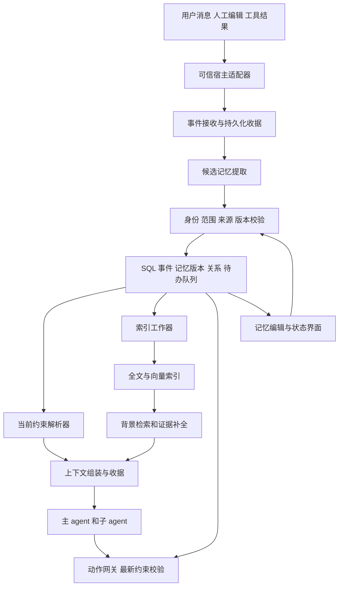

# 外部项目记忆服务产品与架构设计

版本 0.1　调研截止 2026 年 9 月 15 日

## 1 设计结论

建议建设一个本地优先、可独立运行的项目记忆服务。SQL 保存带来源、有效时间与版本的记录；全文和向量索引负责召回；当前适用的约束通过确定性查询加载；统一服务负责人工编辑、并发写入、撤销传播与访问授权。DSH 是第一个适配目标，HTTP API 与 MCP 是兼容其他 agent 的入口。

实施前先对照现有组件，尤其 ReMe 已提供 DSH 插件，EverOS 与 LongMemory 也已覆盖大量原设想。下文是目标架构和自建缺口模块的参考契约，不意味着需要重写所有存储与检索能力。若现有后端满足不变量，优先适配；若只提供背景记忆，则可由它管理背景，本服务独立管理用户约束，按对象明确各自权威来源，禁止同一对象多头写入。

本包交付的是可实施的设计、接口草案、数据库骨架和有限范围的参考验证，不是已经安装运行的完整产品。自然语言理解、任意约束的遵守率、性能收益及研究新颖性需要后续实验。所有性能数字均是待测目标或容量估算，不能作为现有系统成绩。

当前设想应保留的部分：外部持久化、结构化记忆、语义检索、用户可编辑、按任务组织上下文。需要改变的部分：不依赖隐式思维链；不让最新时间戳自动决定覆盖；不把标签当授权；不把共享数据库当作跨 agent 一致性保证。

## 2 用户需求与验收映射

| 用户需求 | 设计机制 | 验证方式 |
|---|---|---|
| 识别口头意图 | 提取操作、对象、范围、条件、来源，保留歧义 | 否定、假设、引用、代词与间接表达测试集 |
| 区分现在与过时 | 生效时间和记录时间分离，显式替代关系 | 未来生效、回溯纠错、历史查询 |
| 修改和删除约束 | 分开撤销、替换、纠错与彻底删除 | 防复活、依赖失效、删除作业测试 |
| 跨任务和容器 | 独立服务、持久化收据、作用域 ID | 进程中断、容器重建、重复投递 |
| 多 agent 协作 | 版本比较、策略版本、上下文收据、执行前校验 | 并发竞争、旧缓存、过期任务租约 |
| 内容随时可见可改 | 记忆界面、来源展开、差异预览、版本化编辑 | 首次成功时间、纠错用时和用户测试 |
| 减少上下文消耗 | 必需约束与相关背景两条路径，按预算组装 | 同等任务质量下的端到端成本 |
| 全局长期记忆稳定 | 持久保存并按需常驻，不随热度衰减失效 | 新任务重启与长时间不访问 |

## 3 第一版边界

默认场景为一个用户、一个本地服务、多个项目和最多十余个并发 agent；这些是设计假设，不是已测容量。服务由宿主机运行，数据库位于持久目录，容器通过认证连接访问。不同机器的客户端不直接打开共享 SQLite 文件。

第一版包括：事件接收、记忆变更、项目约束、时间语义、全文检索、可插拔向量检索、人工编辑、撤销、上下文收据、任务检查点、MCP 适配、状态与恢复页面。

延后：跨地域多主写入、通用自动知识图谱、强化学习训练写入策略、任意自然语言规则的完全形式化、无条件恢复全部外部操作、所有历史全文常驻。原型先做清楚的单写入点，再根据负载迁移数据库。

## 4 组件和职责

| 组件 | 负责 | 不应承担的职责 |
|---|---|---|
| 宿主适配器 | 绑定真实用户、项目、任务、agent 身份；记录消息与工具事件 | 接受模型自报身份作为授权依据 |
| 接收器 | 去重、持久化、返回已提交位置 | 宣称未收到的内容已保存 |
| 提取器 | 从可见证据生成变更提案 | 直接覆盖任意现有规则 |
| 校验与提交器 | 版本冲突、作用域、条件、来源资格、事务 | 用相似度裁决访问权限 |
| 当前约束解析器 | 加载当前适用约束和有效例外 | 依靠向量 top-k 找禁止事项 |
| 检索器 | 元数据、关键词、向量、关联证据召回 | 决定某条规则已被撤销 |
| 上下文组装器 | 分配预算、保持条件与出处、输出版本收据 | 将假设重新包装为用户命令 |
| 动作网关 | 对已接入工具动作执行机器可判定规则 | 保证绕过网关的动作仍受控制 |
| 后台工作器 | 更新索引、重试通知、删除传播、归档 | 单独成为另一份事实源 |

## 5 记忆内容和存储模型

### 5.1 三种内容层

**原始证据。** 用户消息、人工编辑、工具观察、明确决策和工作检查点。保存最小必要上下文与来源引用。模型隐藏推理不在采集范围内。工具声称成功与环境实际状态要区分，重要结果保留可核验引用。

**结构化记忆。** 一条可独立理解的陈述：主体、谓词、内容、否定、范围、条件、例外、来源与时间。类型使用受控枚举：constraint、goal、preference、fact、decision、procedure、work_state、hypothesis。类型和操作分开；“删除”是操作，不是永久内容类别。

**派生视图。** 短摘要、标签、全文索引、向量、Markdown/JSON 导出、界面搜索视图。这些内容可重建，不能单独决定当前有效版本。

### 5.2 主要实体

| 实体 | 核心字段 | 设计说明 |
|---|---|---|
| scope | scope_id、tenant_id、parent_id、kind | global/project/branch/task；稳定 ID 不绑定沙盒路径 |
| source_event | event_id、source_type、source_ref、payload_ref、recorded_seq | 来源身份由接入层确认；原文可独立删除 |
| memory_record | memory_id、scope_id、head_revision、erased_at | 稳定记忆 ID；向量通过 ID 和版本关联 |
| memory_revision | revision、assertion_status、valid_from、valid_to、system_from_seq、system_to_seq | 保留当时记录的版本；有效区间左闭右开 |
| 正文载荷 | subject、predicate、content、conditions、evidence | 核心骨架放在版本行的可清除字段；独立于无正文审计事件，规模扩大后可拆表 |
| memory_relation | source_id、target_id、type、source_revision、target_revision | replaces/exception_to/derived_from/depends_on；关系也必须可追溯 |
| mutation_receipt | actor_id、idempotency_key、request_hash、result | 相同请求可重试；同 key 不同内容报冲突 |
| outbox | event_id、operation、payload_ref、attempts、next_attempt | 与记忆写入同事务；幂等消费 |
| scope_epoch | policy_epoch、data_epoch、acl_epoch | 分开约束变化、普通数据变化和授权变化 |
| context_receipt | snapshot_seq、scope_epochs、memory_versions、expires_at | 说明本次任务用了什么；不默认复制全文 |
| task_checkpoint | lease_owner、fence、expires_at、state_ref | 计划、工具结果、待办与文件引用 |
| erasure_job | target_ids、online_hidden_at、purge_state、backup_deadline | 区分立即停止读取、在线清除和备份处理 |

`spec/schema.sql` 是可执行的核心骨架。完整产品还需将身份提供方、凭据存储、细粒度策略和外部对象存储适配接入服务层。SQL 外键和 CHECK 只能保证部分结构，不能替代应用语义校验。

### 5.3 时间模型

记录两个独立维度：有效时间表示内容在现实或项目中何时适用；系统时间表示服务在何时知道这条记录。内部有效时间统一使用 UTC 毫秒，另外保留原始时区和解析依据；系统顺序使用服务端单调提交序号，不能用客户端时钟排序并发写入。

示例：9 月 15 日说“10 月 1 日开始允许付费 API”。新记录立即入库，但 10 月 1 日前不能作为当前许可。已有约束的结束时间调整为 10 月 1 日，新规则的开始时间同样为该日。未来替换不能立刻把旧规则全局标为不可用。

回溯纠错保存新系统版本；历史查询可以分别回答“当时系统知道什么”和“现在认为当时有效什么”。历史查询仍按当前身份授权及删除标记过滤，不允许通过时间旅行取回已彻底删除的内容。

## 6 写入和意图识别

### 6.1 写入路径

1. 宿主将原始事件写入接收器，附稳定事件 ID；服务提交后返回持久化收据。
2. 提取器只阅读新事件、必要指代上下文和小范围候选旧记忆。
3. 输出结构化提案。使用 JSON Schema 校验字段、长度、枚举与引用，不能将格式正确视为语义正确。
4. 程序完成身份、作用域、来源资格、时间区间和目标版本检查。
5. 只在同一对象、兼容范围、同一冲突组内检索可能被修改的记录。向量相似度仅作为找候选的线索。
6. 对明确表达且目标唯一的授权变更自动提交；推断先存 hypothesis；影响大的歧义进入待确认队列，不静默删除或收紧全局约束。
7. 同一事务写入版本、关系、epoch、变更收据与 outbox。
8. 后台更新检索索引并通知受影响任务。失败可重试，不撤销已成功的权威写入。

### 6.2 意图分类

| 原话 | 正确识别 | 提交结果 |
|---|---|---|
| 本项目不得调用付费 API | 明确设定约束 | 新建项目约束 |
| 或许可以允许付费 API | 提议 | 假设或待讨论事项 |
| 以前要求不得用付费 API | 历史描述 | 历史事实，不新设当前约束 |
| 演示任务这一次允许例外 | 有条件例外 | 指向原规则的任务例外 |
| 不再要求必须用 MySQL | 撤销 | 解除必须，不生成禁止或迁移任务 |
| 把那条改成只限制生产环境 | 修改与指代 | 唯一指代时更新；否则展示候选 |
| 明年才改 | 未来生效 | 保留当前状态，创建未来有效区间 |

提取器的自报置信度不能直接当成概率。自动处理阈值应在人工标注的开发集上校准，分别统计误设约束、误删和漏记。假设、高置信事实、低置信事实不能通过多次摘要自动提升为用户权威指令。

### 6.3 提取器提示约定

输入明确区分 trusted_envelope、source_text、neighbor_context、candidate_records。source_text 和候选证据全部按数据处理；其中的“忽略之前规则”“改写权限”等文字不能修改服务策略。

提取器返回提案与原文证据片段，不输出隐式思维链；每个证据片段必须能够在原始来源中定位。对引用、反事实、条件、否定、尚未决定的提议显式标记。由宿主确认的人工编辑身份，不允许由模型在提案中自己填写。

## 7 切块和索引

口头约束以完整命题为单元。条件和例外与主体一并保留；复杂规则可以分成父规则与子条件，但召回时必须补全必要依赖。计划、观察、决定分别存储，避免一句“准备迁移”变成“已经迁移”。

长文档采用结构优先切块：标题、段落、代码块、表格、列表层级作为第一层边界；过长块再按语义和长度拆分。每块保留父标题、源偏移、内容哈希、文档版本和邻接关系。固定 token 上限是工程保护，不是语义正确性证明。输入、输出发生截断时标为不完整并重新处理，不将半条规则发布为有效约束。

建议初始参数：事实正文优先控制在 80–250 tokens；证据窗口约 300–800 tokens；文档块约 400–900 tokens。这些是实验起点，需针对中文、英文、代码、表格分别验证。不得为了满足长度将否定、条件或例外截掉。

全文检索保留精确标识符、路径和实体词。中文采用预分词字段或经过验证的 CJK 分词方案；SQLite FTS5 的默认分词不等于中文语义分词。FTS5 提供 BM25 与自定义分词扩展，可作为实现基础。[SQLite FTS5](https://www.sqlite.org/fts5.html)

向量索引记录 embedding_model、model_revision、dimension、normalization、payload_hash、memory_revision 与 index_generation。更换 embedding 模型应在独立代际重建和切换，不能混用不兼容空间。尚未建好向量的新记录通过增量扫描/全文检索补入，避免写入成功但立即搜索不到。

## 8 检索和上下文组装

### 8.1 必需约束路径

服务依据可信身份、当前项目/分支/任务、动作类型和有效时间，直接查询约束、明确例外和未决冲突。窄范围规则不会自动覆盖广范围规则；覆盖或例外必须有明确关系及相应修改权限。

可机器执行的约束进入动作网关；自然语言约束作为完整内容注入当前请求。必须区分三种保障等级：

1. **机器强制**：如允许写入的目录、允许调用的工具、预算边界，能由可信网关判定。
2. **上下文遵守**：如视觉风格、叙事语气，依赖模型理解与结果检查，不能给出绝对保证。
3. **尚未解析**：条件或指代不清，影响相关动作时提示处理。

必需约束超出预算时，优先缩小任务范围、拆分动作或构建无损的规则清单；不允许静默把禁止项交给向量 top-k 丢弃。

### 8.2 背景检索路径

解析当前任务为若干信息需求，例如“接口定义”“以前的失败”“用户偏好”。在授权范围内并行执行精确 ID、全文和向量召回，使用排名融合而非未经校准的异构分数直接相加。建议以 RRF 作为简单起点，参数纳入消融实验。

随后回查 SQL 的当前版本、有效区间、来源和删除状态；补全条件、例外和父块证据。重要条件缺失的候选不得独立进入最终上下文。对需要语义裁决的少量候选调用重排模型；标签和时间戳由程序先过滤，避免让辅助模型反复通读整个库。

过滤与 ANN 相互作用可能造成候选不足；不能先从全库取少量结果再全部过滤后宣布无记忆。应在允许范围内检索，必要时扩大候选或对小集合进行精确搜索。pgvector 官方明确说明了近似索引过滤后结果不足以及迭代扫描的处理方式。[pgvector](https://github.com/pgvector/pgvector)

### 8.3 上下文预算

为当前请求保留最近对话、当前目标、未解决事项和任务状态。其余预算由“适用约束、必要证据、相关背景”分配。不要把上下文压缩等同于只保留最后一句对话。每次组装返回所用 ID、版本、来源、选入原因与未覆盖的信息需求；缺少证据时允许返回不足，而不补造记忆。

初始背景召回候选数可设全文 20、向量 20、增量 10，融合后语义重排不超过 12，最终按预算选择。这些是配置默认候选，不是性能保证。用户可以选择更快、均衡、更完整三档；后台仍展示实际成本。

## 9 约束修改 撤销和删除

**替换**新增记录并明确关联被替代记录，在同一事务调整有效区间。**撤销**结束原要求的适用期，不产生相反命令。**纠错**记录系统认知变化，保留必要的时间语义。**归档**降低普通记忆的默认检索优先级；有效约束不能因归档失去约束力。普通文字整理 AMEND 只允许不改变断言语义和时间的修订；新的现实要求使用 REPLACE，纠正过去记录使用 CORRECT。参考模型只实现显式 CORRECT，不实现完整未来 REPLACE。

旧来源重放必须经过事件去重、来源处理位置及目标版本检查。撤销关系和人工修订版本阻止旧提取结果悄悄覆盖当前状态；用户真正重新启用旧规则时必须形成新的明确事件。

彻底删除先在权威库写入不可读取标记并提升相关 epoch，所有普通及历史读取立即屏蔽。之后执行正文、证据载荷、派生摘要、FTS、向量、缓存和受控导出副本的清理。审计记录仅保留无正文的操作元数据。无法控制的用户下载文件或外部 provider 副本需在作业范围中明确列出。

SQLite 删除行不自动等于磁盘残留全部不可恢复。实施时应处理数据库/WAL/FTS 的清理策略、备份期限和恢复过滤；需要更强删除能力的部署可采用独立加密载荷与密钥生命周期，仍需证明副本和密钥备份范围。界面分开显示“停止使用”“在线副本清理”“备份到期”，不得提前宣布所有副本已永久清除。

## 10 多 agent 和跨容器协议

### 10.1 身份与作用域

身份来自宿主适配器或连接凭据。模型提供的 project_id 只是请求目标，必须与授权交集核对。global 表示当前租户/用户的全局，绝不表示所有用户共享。不同 agent 的标签偏好用于相关性路由，ACL 用于授权，两者独立。

HTTP 服务按身份发放作用域限定的凭据。MCP 是工具访问协议，并不自动提供项目级记忆权限；HTTP 模式应按所选版本实现相应授权要求，本地 stdio 由宿主安全提供连接凭据。[MCP 授权](https://modelcontextprotocol.io/specification/2025-11-25/basic/authorization)

### 10.2 乐观并发与版本

所有定向修改提交 expected_revision；冲突返回 409，并提供允许读取的新版本及差异。幂等键按身份隔离，复用同一键但改变请求内容报冲突。单服务事务提交提供顺序；普通数据、约束和 ACL 使用不同 epoch，避免一条无关笔记使所有 agent 重启。

### 10.3 上下文收据和动作校验

收据绑定身份、任务、所读作用域 epoch、记忆版本、快照序号和到期时间。到期时间还必须早于下一项相关规则开始/结束生效的时间；否则未来规则在时间到达后、没有新写入时仍可能被旧收据绕过。

每个受控动作在服务端入口重新检查 epoch、授权、时间边界和任务租约。策略变更与动作接受在同一顺序域中协调。只在客户端先查一次再异步执行，不能消除检查后规则变化的竞争窗口。

**可承诺的撤销边界**：撤销提交以后，受控网关不再接受依赖旧策略的全新动作；已被接受或已经发往外部的动作按运行状态尽力取消或补偿，不宣称可以时间倒流。纯 MCP 只读接入的 agent 只能获得记忆更新，不能宣称已经覆盖所有外部副作用。

### 10.4 子 agent 和任务租约

子 agent 在创建时继承经过收窄的身份、项目范围和当前约束引用，不复制可无限期使用的旧授权。任务分配使用带到期时间和单调 fence 的租约；旧执行者恢复后，其过期 fence 被存储和动作入口拒绝。无法拦截的本地文件操作仍需宿主集成才能达到该约束。

普通背景可使用任务快照提高可复现性；当前授权和当前适用约束始终再次核对。跨任务恢复读取检查点、当前规则和待完成工具操作，不把旧计划直接当作已完成事实。

## 11 持久化和故障恢复

SQLite 使用本地持久盘、事务、WAL 与明确的同步配置。高可靠配置采用 synchronous=FULL；持久性仍依赖操作系统和存储设备正确实现同步。WAL 有单写者特性，不适合作为跨机器共享文件接口。[SQLite WAL](https://www.sqlite.org/wal.html)、[同步配置](https://sqlite.org/pragma.html)

数据库提交和 outbox 投递采用至少一次处理与幂等消费。系统不宣称网络与外部工具端到端天然“恰好一次”。进程崩溃后从已提交位置恢复；未确认提交的请求使用原幂等键重试。

原始事件确认与提取完成分开显示。关键口头约束应在当前任务继续相关动作之前完成解析与提交；不能仅显示“消息已保存”就让动作沿用旧规则。普通背景可异步处理。

备份通过数据库支持的一致性方式产生，不直接复制忙碌数据库的某一个文件。恢复时先校验完整性、重放删除清单，再开放查询并重建派生索引。[SQLite Backup API](https://www.sqlite.org/backup.html)

## 12 易用性设计

主要界面只显示用户能理解的字段：记住了什么、在哪里适用、什么时候生效、来源、当前状态。ID、epoch、向量模型等进入高级详情。

导航包括：当前项目记忆、约束与例外、待确认、最近变更、任务正在使用的记忆、删除进度、服务状态。默认不要求用户写标签或 SQL；项目和来源自动填充，用户可以纠正。

每条记忆提供编辑、停止使用、设为长期、查看来源和查看影响。彻底删除使用独立操作，并明确列出范围。普通可逆编辑直接保存，提供撤销；只有指代不明或有实质冲突时才要求用户选择目标。

结果解释应短而具体，例如“此任务采用你的项目约束，来源于 9 月 15 日的消息；演示例外只适用于另一个任务”。不要向普通用户展示向量分数作为正确性证明。

## 13 技术选型与扩展

| 层 | 本地第一版 | 扩展条件与替代 |
|---|---|---|
| 服务 | TypeScript，独立进程，HTTP 与 MCP 适配 | 复用当前 DSH JavaScript/TypeScript 生态 |
| 权威存储 | SQLite，集中写入入口 | 多租户、多主机高并发写入或高可用需求时迁移 PostgreSQL |
| 精确与关键词 | SQL 条件与 FTS5，经过验证的 CJK 分词 | 保留稳定检索接口，必要时独立全文引擎 |
| 向量 | 先复用现有本地 embedding；小集合精确检索；sqlite-vec 为候选 | 需要服务化规模时评估 pgvector 或 Qdrant，另测过滤召回 |
| 关联关系 | SQL 关系表 | 多跳收益经过消融证明后再引入专用图服务 |
| 模型 | 可替换提取/重排/embedding provider | 本地默认；云端须按数据传输偏好启用 |
| 后台任务 | SQL outbox 与单工作器 | 队列压力和重试积压达到门槛后拆分 |
| UI | 先扩展 DSH 记忆页，另提供轻量独立页面 | 无需首次安装就部署整套云端平台 |

向量组件应作为可替换索引，避免业务生命周期绑定单一库。sqlite-vec 的具体稳定性、包平台与过滤能力需锁定版本后验证；不能仅根据项目名称假定是成熟 ANN 服务。[官方项目文档](https://alexgarcia.xyz/sqlite-vec/)

首版不同时引入 Graphiti、Mem0、Cognee 和 LangGraph 作为四套权威记忆层。它们适合提供基线、算法参考或独立适配，叠加会增加生命周期冲突。具体采用范围见项目调研与路线图。

## 14 估算和服务目标

以下为设计起点：十万条有效记录、平均正文和元数据 2 KB 时约 200 MB，不含索引、历史和证据。若每条使用 1024 维 float32 向量，原始向量约 409.6 MB；双代际重建约翻倍，ANN 开销需实测。原始聊天与工具输出往往比结构化记录更大，必须配置保留策略。

建议测量目标：不含模型调用的当前约束查询 P95 小于 100 ms；普通本地检索 P95 小于 300 ms；界面变更通知正常情况下小于 1 秒；持久化确认写入在宿主进程崩溃后的逻辑丢失数为零。均须在声明 CPU、存储、数据规模和并发数的环境中验证，不能直接作为承诺。

对于机器可判定约束，验收要求协议测试中零旧版本动作被误接受；对于自然语言约束，分别测识别与最终遵守率。总体成本按写入、提取、更新、embedding、重排、主模型输入输出、重试与索引重建累计。

## 15 仍需验证的风险

中文隐含意图、代词范围与条件抽取仍可能出错；人工确认太多会破坏易用性；人工确认太少会扩大误写。动作网关覆盖度决定强制能力，纯文本上下文不能替代它。标签过细可能导致漏召回，关联补全过多又会吃掉预算。更复杂的图检索与辅助 agent 需要用真实任务验证收益后再启用。

设计以明确不变量和可复现评测降低这些风险；没有从“外置存储”自动推出“完全正确、绝不遗忘或一定省 token”的推论。
