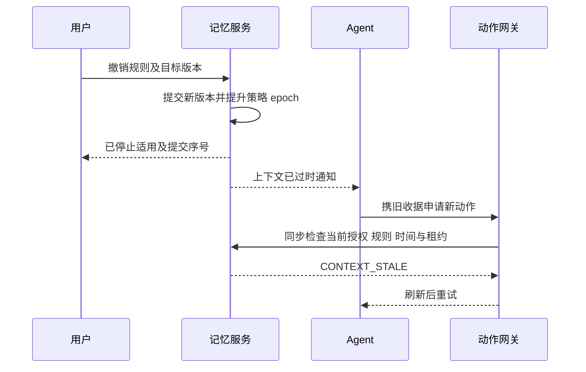

# 外部项目记忆服务数据与接口协议

## 1 协议范围

本文为 0.1 版接口设计。`spec/openapi.json` 是机器可读的核心 HTTP 契约；`spec/schema.sql` 是 SQLite 核心存储骨架；`spec/examples.json` 包含输入样例。它们没有启动实际 HTTP/MCP 服务。身份提供方、模型提供方、索引工作器和真实工具网关需要按本文实现。

HTTP 与 MCP 共用同一业务层，不能各自维护一套状态。所有会改变有效记忆的操作均经过来源、身份、范围、版本和幂等校验。默认拒绝未知字段；协议升级需增加 schema_version。JSON 格式可校验不代表事实正确。

## 2 可信请求信息

连接层确定 actor_id、tenant_id、可访问 scope、凭据版本。请求体不能自行提升身份。宿主适配器可以将真实用户消息登记为 user_message；模型直接调用 memory.propose 只能登记为 agent_proposal。两者不能通过一个 source_type 字符串互相冒充。

`Idempotency-Key` 用于写入重试。服务将规范化请求的摘要与该身份、幂等键一起保存。相同内容返回同一结果；不同内容返回 `IDEMPOTENCY_CONFLICT`。认证与授权必须在返回缓存结果前执行。

时间传输统一为 RFC 3339 UTC 字符串，SQL 中统一为 UTC 毫秒；系统提交顺序使用服务端 commit_seq。输入时区、相对时间解析上下文存于来源元数据。版本与时间不得由客户端自己宣称已获批准。

## 3 记忆对象

一个读取响应的概念示例：

```json
{
  "memory_id": "mem_api_budget",
  "revision": 3,
  "scope_id": "project_alpha",
  "kind": "constraint",
  "subject": "external_api",
  "predicate": "paid_usage",
  "content": "本项目不得调用付费 API；经过明确授权的演示任务可例外。",
  "assertion_status": "accepted",
  "valid_from": "2026-09-15T00:00:00Z",
  "valid_to": null,
  "conditions": {"environment": ["production", "development", "demo"]},
  "source": {"event_id": "evt_41", "source_type": "user_message"},
  "evidence_refs": [{"event_id": "evt_41", "quote": "本项目不得调用付费 API；经过明确授权的演示任务可例外。"}],
  "relations": [],
  "enforcement": "context_only"
}
```

例中为虚构来源；真实写入必须核对引用是否确实来自相应原始消息。若另存证据偏移，应约定编码与边界。`enforcement` 只有完成机器规则映射、覆盖范围验证后才可标为 `tool_guarded`。

`assertion_status` 表示是否被接纳，不能混同是否当前生效；当前生效还取决于有效区间、作用域、条件、例外及是否删除。正文类型为 hypothesis 的推断不会自动转换为 constraint。

## 4 操作语义

| 操作 | 目标 | 结果 | 必要检查 |
|---|---|---|---|
| ASSERT | 新陈述 | 新建稳定 ID 与首版 | 来源资格、重复事实、冲突候选 |
| AMEND | 同一陈述的文字或元数据 | 创建不改变断言语义及有效期的新版本 | expected_revision；语义改变须转 REPLACE 或显式 CORRECT |
| REPLACE | 旧陈述与新陈述 | 调整有效区间并记录 replaces | 对象、范围、时间、修改权限 |
| REVOKE | 当前要求 | 结束适用区间 | 明确目标，不能生成相反命令 |
| EXCEPT | 明确原规则 | 建立有范围有时限的例外记录 | 必须有授予例外的权限 |
| CORRECT | 错误历史认知 | 新系统版本，可调整过去有效期 | 保留纠错来源与历史语义 |
| ARCHIVE | 普通背景 | 改变存储/召回层级 | 不解除仍有效的硬约束 |
| ERASE | 内容及受控派生副本 | 立即屏蔽并启动清除作业 | 精确目标、删除权限、范围清单 |

REVOKE 目标在更早时间已失效时返回原幂等结果或状态冲突，不能把原结束时间推迟。取消尚未生效的记录形成空有效区间，不能生成负区间。REPLACE 未来生效时旧内容在未来边界前继续适用。CORRECT 是用户明确纠错后的回溯语义，不应用于未来要求切换。多个并列条件不一定互斥，不用相似度自动清空同一标签全部内容。

## 5 核心 HTTP API

| 方法与路径 | 用途 | 返回 |
|---|---|---|
| POST /v1/events | 宿主登记原始用户/工具事件 | event_id、committed_seq、extraction_state |
| POST /v1/proposals | agent 提交有证据的候选变更 | proposal_id、accepted/pending/rejected |
| POST /v1/mutations | 授权提交结构化变更 | memory_id、revision、commit_seq、epoch |
| POST /v1/context | 获取适用约束和相关背景 | 内容包、证据、context_receipt、未覆盖需求 |
| GET /v1/memories/{id} | 当前记录或历史版本 | 有权限的记录与来源 |
| POST /v1/action-checks | 动作网关核对收据与约束 | allowed、reason、当前 epoch |
| POST /v1/erasures | 屏蔽内容并启动删除作业 | job_id、online_hidden_at、进度 |
| GET /v1/erasures/{id} | 查看清除范围与进度 | 各副本状态、备份截止 |
| GET /v1/changes | 获取身份可见的增量变更 | 游标、变更 ID、next_cursor |
| PUT /v1/checkpoints/{task_id} | 保存工作检查点 | revision、commit_seq |
| GET /v1/health | 服务基本健康 | 非敏感状态 |

初版 OpenAPI 覆盖上述契约的核心形状；未定义的 UI 搜索、任务租约管理和身份管理端点按下一版扩展，不能以“HTTP 契约已有文件”宣称完整服务实现。

### 5.1 错误码

| HTTP | 业务码 | 调用方处理 |
|---|---|---|
| 400 | INVALID_SCHEMA | 修改字段或长度，不盲目重复 |
| 401 | UNAUTHENTICATED | 由宿主重新获取凭据 |
| 403 | SCOPE_DENIED | 显示允许范围，不尝试换标签绕过 |
| 404 | NOT_FOUND | 不向无权方暴露记录是否存在 |
| 409 | VERSION_CONFLICT | 重读当前版本并重新形成变更 |
| 409 | IDEMPOTENCY_CONFLICT | 同一键被错误复用，修正调用逻辑 |
| 409 | CONTEXT_STALE | 刷新约束和上下文收据 |
| 409 | LEASE_STALE | 停止旧任务执行，由调度器重新分配 |
| 422 | AMBIGUOUS_TARGET | 显示允许读取的候选，确定目标 |
| 422 | EVIDENCE_MISMATCH | 重新核对来源，不直接升格为事实 |
| 503 | STORAGE_UNAVAILABLE | 不确认已保存；对受控动作停止放行 |
| 503 | MODEL_UNAVAILABLE | 普通检索可降级；未完成解析的关键变更保持待处理 |

## 6 读取一致性

`context` 请求携带任务范围、查询、动作类别、背景预算与可选历史时点。授权范围取请求与连接权限的交集。响应显式区分 constraints、background、unresolved；用户指令与证据按来源标识，绝不把检索到的任意文本作为新的系统指令。

读取步骤：

1. 取得允许作用域及 ACL epoch；记录当前 snapshot_seq。
2. 确定性加载有效约束与必要例外。
3. 在允许范围内查询全文、向量和未完成索引的增量记录。
4. 回查 SQL 当前或请求历史版本；屏蔽已删除内容。
5. 检查所有必需依赖可用且有权读取。若例外无权读取，应输出可执行的解析结果或停止相关动作，不能以“没看到例外”伪造完整解释。
6. 根据预算补齐证据、去重并返回未覆盖需求。
7. 写入上下文收据；计算到期时间为默认期限、相关时间边界和授权期限的最小值。

索引工作器只能将 `(memory_id, revision, payload_hash, generation)` 全部仍匹配的结果发布为 ready。删除发生后，旧 embedding 回调到达不得重新插入可见结果。

## 7 条件和例外

第一版机器规则语言仅支持白名单字段与有限表达式：all、any、eq、in、exists，以及经过宿主规范化的资源范围。禁用任意脚本、SQL、正则执行与网络查询表达式。扩展操作符需要独立测试。

“作用范围更小”不是通用优先级。项目要求允许被任务例外覆盖时，例外需要明确 exception_to、授权者、有效区间和条件。一个用户要求不能更改服务部署方的访问控制政策。自然语言要求和服务控制面的权限策略是两类对象。

内容关系不能盲目做传递推断：A 从 B 派生，B 被纠错后，A 应标为待重算或暂不用于相关决策，不能自动推断 A 的反命题。派生内容保留所有支持来源；删除一个来源后，若剩余证据仍足够，可重新生成干净版本，不能原样保留可能含被删正文的摘要。

## 8 关键写入事务

```text
BEGIN IMMEDIATE
  认证主体已由连接层绑定
  查验 scope 与修改权限
  查验 idempotency key 与请求摘要
  查验目标 expected_revision
  追加提交顺序与无正文审计事件
  关闭旧系统版本，建立新系统版本与有效区间
  更新 head_revision 与显式关系
  提升受影响 policy/data epoch
  写入 outbox 与幂等回执
COMMIT
返回已持久化收据
```

修改多个相关记录（如一条未来替换）必须在同一事务内完成。进程在 COMMIT 前退出全部回滚；COMMIT 后响应丢失，重试返回原回执。模型和外部网络调用不要放入长时间写事务。

## 9 撤销与动作的顺序边界



`action-checks` 是动作网关内部构件。若外部客户端拿到 allowed 后自行延迟执行，服务无法保证期间没有撤销，因此不能把这类预检查作为原子许可。强保证路径由网关在动作接受/派发时再次协调检查，并记录 action_id、accepted_seq、dispatch_state。已发出的动作遵循其外部系统取消/补偿能力。

未来规则切换还需时钟边界检查；仅比较 policy_epoch 不够，因为没有新写入时有效时间也会变化。

## 10 MCP 映射

建议暴露 `memory.context`、`memory.get`、`memory.propose`、`memory.checkpoint`。普通 agent 默认不暴露原始管理员 ERASE/任意 SQL 接口。用户界面与可信宿主可以调用授权的 mutation/erasure 流程。

工具输入 Schema 和 HTTP 数据形状复用。固定连接凭据限定最大作用域；每任务身份由原生适配器绑定或使用相应隔离连接。模型填写 actor_id、user_edit 等字段必须被忽略或拒绝。

MCP 的协议与授权以选定版本为准，不宣称规范自动包含此文的撤销或事务语义。适配层仍需按客户端能力处理重连、事件游标和版本更新。[MCP 规范](https://modelcontextprotocol.io/specification/2025-11-25/basic)

## 11 删除协议

删除作业的状态为 accepted、online_hidden、purging、backup_pending、completed 或 failed。online_hidden 在权威事务提交后生效，completed 只在作业声明范围全部处理并核验后使用。

删除记录不保存被删正文；工作器通过稳定对象 ID 和版本处理派生对象。恢复旧备份前必须导入最新删除清单；删除清单应在备份策略中独立可恢复。导出到用户自管目录的文件列为不受控副本，不能自动宣称已经清理。

agent 内存和第三方模型请求的已发送内容无法靠 SQL 删除撤回。对本服务控制的运行上下文发出失效事件，必要时由宿主重建任务上下文。UI 明确区分这些范围，禁止把“向量已删除”作为彻底删除成功。

## 12 协议不变量

I1 未授权身份不得读取正文、来源、候选摘要或历史版本。I2 新写入记录只有提交后才能获得持久化确认。I3 同一幂等键不会产生两次不同修改。I4 并发旧版本不能静默覆盖。I5 索引结果必须回查权威版本。I6 未来替换不会提前解除当前约束。I7 删除标记覆盖历史查询与旧索引回调。I8 有效约束不因热度衰减消失。I9 旧上下文和过期租约不能通过受控动作入口。I10 对外副作用只能按真实接入覆盖范围承诺顺序与恢复。

参考验证脚本验证其中一部分 SQL 与程序状态行为；完整产品验收还需真实客户端、模型、并发进程、网关和存储故障测试。详见评测文件和验证结果。
