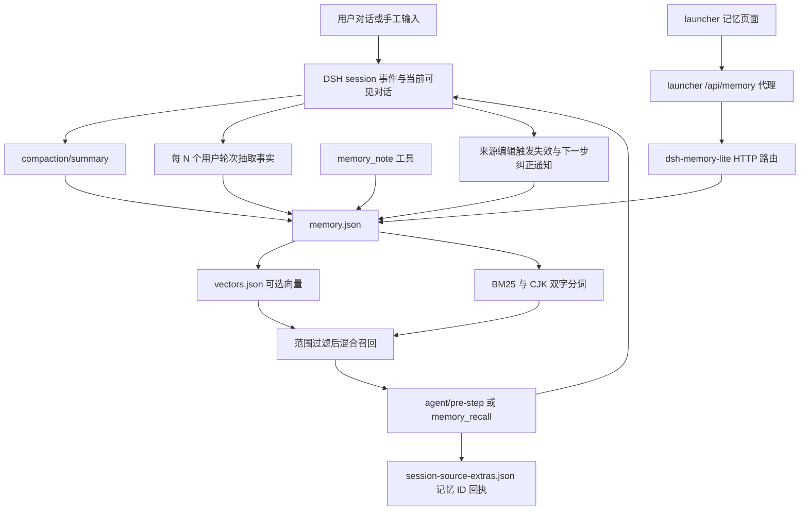
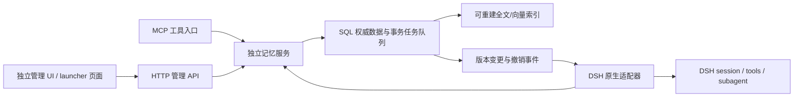

# 本地代码审查与渐进集成方案

> 审查日期：2026-09-15。性质：只读代码审查与设计建议。范围：`dsh-memory-lite`、launcher 记忆页面与代理、core MCP 客户端、hooks 和子 agent 生命周期说明。没有读取用户记忆数据库、对话日志或凭据；没有修改既有代码或运行服务。文中的行为结论来自当前工作目录源码与 README；静态推导的风险均不等于已经运行复现的缺陷。

## 1. 结论

当前仓库已经拥有一个可工作的轻量记忆原型，尤其在“来源对话发生编辑后，撤回先前自动提取的记忆”“记录哪些记忆已经进入模型上下文”方面，已有可继承的实现。新方案适合建设为独立记忆服务，通过 MCP 暴露模型工具、HTTP 提供管理与宿主接口，再由 DSH 原生插件承担可信身份绑定、必需约束注入、记忆使用回执及执行前检查。

现有插件不应被描述为已经具备完整的跨 agent 约束一致性：其自动提取、摘要存储与注入跳过 subagent；数据以 JSON 保存；人工编辑和删除的传播范围有限；本机 HTTP 访问防护不是逐 agent 的授权。具体证据如下。

## 2. 现有组件、版本和许可

| 组件 | 当前代码中的事实 | 证据 |
|---|---|---|
| DSH CyberWorkStation | 根 package 版本 `1.11.1`；仓库根许可证为 MIT，版权声明为 DSH Suite contributors | [package.json](H:/DSH-CyberWorkStation/package.json:3)、[LICENSE](H:/DSH-CyberWorkStation/LICENSE:1) |
| dsh-memory-lite | package 版本 `0.1.0`，ESM，运行入口 `lib/index.js`，声明 MIT | [package.json](H:/DSH-CyberWorkStation/plugins/dsh-memory-lite/package.json:2)、[license 字段](H:/DSH-CyberWorkStation/plugins/dsh-memory-lite/package.json:49) |
| DSH core | package 版本 `0.1.5-rc.2`，MIT，版权声明 DeepSeek | [package.json](H:/DSH-CyberWorkStation/core/package.json:3)、[LICENSE](H:/DSH-CyberWorkStation/core/LICENSE:1) |
| launcher | 已有“记忆与上下文”页面；可管理长期记忆、查看与编辑压缩摘要、测试召回；通过插件完成存取 | [README](H:/DSH-CyberWorkStation/launcher/README.md:19) |
| 外部记忆 MCP 示例 | 默认关闭的 Memorix、MCP Reference Memory、Engram 示例，文档内有其测试 pin；示例存在不意味着服务已安装或当前已启动 | [指南](H:/DSH-CyberWorkStation/core/docs/user/guide/mcp-memory.md:15) |

以上版本和许可只证明本地当前文件内容；不能把这些本地 pin 当成上游最新版本，也不能据此替代未来依赖选型时对具体版本、依赖和模型权重许可的核验。

## 3. 当前数据流

### 3.1 写入与提取

- `compaction/summary` 事件会保存顶层会话摘要；同一会话未钉住的旧摘要被替换，钉住的保留。自动存储不包含 subagent。见 [index.js](H:/DSH-CyberWorkStation/plugins/dsh-memory-lite/lib/index.js:231)、[摘要替换](H:/DSH-CyberWorkStation/plugins/dsh-memory-lite/lib/store.js:270)。
- 自动事实提取在 `agent/status = idle` 后触发，使用该会话的实际模型路由；按已完成的用户轮次和 watermark 判断是否需要提取；提取期间源对话版本变化则丢弃结果。见 [提取过程](H:/DSH-CyberWorkStation/plugins/dsh-memory-lite/lib/index.js:258)、[版本检查](H:/DSH-CyberWorkStation/plugins/dsh-memory-lite/lib/index.js:286)。
- 提取结构目前只有 `{text, global}`，最多 8 条、每条 300 字符；包含文本截断和 bullet fallback，按 token Jaccard ≥ 0.8 去重。它尚未显式表达约束主体、条件、例外、否定、来源证据片段、生效时间、替代对象。见 [抽取指令与解析](H:/DSH-CyberWorkStation/plugins/dsh-memory-lite/lib/extract.js:10)、[去重](H:/DSH-CyberWorkStation/plugins/dsh-memory-lite/lib/extract.js:53)。
- `memory_note` 允许模型选择 `workspace` 或 `global`，按执行会话 cwd 保存；工具描述要求用于用户请求记住的内容或长期决策，但执行层未看到独立的“是否获准写全局”策略检查。见 [工具实现](H:/DSH-CyberWorkStation/plugins/dsh-memory-lite/lib/index.js:420)。这不等于用户存在越权访问，只说明此处尚不是多租户授权层。

### 3.2 存储与持久性

- 默认数据在 `DSH_HOME/memory/memory.json`，向量在 `vectors.json`；`DSH_HOME` 可配置，默认 `~/.dsh`。它们位于应用数据目录，是否在沙盒之外取决于实际部署挂载方式，路径名称本身不能提供保证。见 [路径定义](H:/DSH-CyberWorkStation/plugins/dsh-memory-lite/lib/index.js:41)、[文件定义](H:/DSH-CyberWorkStation/plugins/dsh-memory-lite/lib/store.js:100)。
- 主存储包含 items、watermarks、withdrawals，使用临时文件写入和 rename。`memory.json` 与 `vectors.json` 各自写入，代码没有把两者放在同一个事务中，也未看到此写入函数显式执行文件和目录的持久化同步。见 [writeAtomic](H:/DSH-CyberWorkStation/plugins/dsh-memory-lite/lib/store.js:60)、[两个保存函数](H:/DSH-CyberWorkStation/plugins/dsh-memory-lite/lib/store.js:208)。因此不能把“返回成功”扩大为对突然断电的完整保证。
- 保存前检测磁盘修改并按 ID、`updatedAt` 合并；内存中本次尚未保存的删除用集合阻止同次合并复活。这个集合在保存后清空，并不是跨实例、长期保留的删除墓碑。见 [合并与清理](H:/DSH-CyberWorkStation/plugins/dsh-memory-lite/lib/store.js:181)。README 明确指出：在 1.5 秒轮询窗口里由外部手工删除的记录，可能被下次保存加回。见 [README 的文件语义](H:/DSH-CyberWorkStation/plugins/dsh-memory-lite/README.md:40)。
- `session-source-extras.json` 另存插件元数据，按稳定 message ID 关联，支持 fork lineage；其写入有独占锁。这与 memory 主存储的保存机制不同，不宜混为“全部已有跨进程事务锁”。见 [sidecar 说明与位置](H:/DSH-CyberWorkStation/plugins/_shared/session-read.js:120)、[记录方法](H:/DSH-CyberWorkStation/plugins/_shared/session-read.js:324)。
- 向量生成使用进程内 Promise 队列；查询向量等待上限 2.5 秒，失败返回 lexical 路径。异步向量写回目前按 ID，没有 `content_hash + embedding_model_revision` 的条件提交。静态推导：在向量请求尚未完成时编辑或删除记录，需要防止旧向量回写。见 [embedding 队列](H:/DSH-CyberWorkStation/plugins/dsh-memory-lite/lib/index.js:180)。

### 3.3 召回与注入

- 范围是 `global` 或 cwd 路径精确归一匹配；路径统一小写并替换分隔符。尚无稳定 project ID、组织、任务、agent 角色等独立维度。见 [visibleIn](H:/DSH-CyberWorkStation/plugins/dsh-memory-lite/lib/recall.js:87)。迁移到 Linux 或容器路径变化时，需要重新定义项目标识和路径映射。
- 检索为 BM25 与可选 cosine 混合，附带 pin、同工作目录和时间加分；向量与词法可以分别满足召回门槛。见 [rank](H:/DSH-CyberWorkStation/plugins/dsh-memory-lite/lib/recall.js:107)。这属于相关性排序，不是约束优先级或事实冲突消解。
- 首轮加入钉住与相关项，后续主要加入未在该 session 注入过的相关项；注入有字符预算。通过事件/sidecar 判断内容是否实际进入会话，避免未落地的调用错误消耗“已注入”标记。见 [pre-step](H:/DSH-CyberWorkStation/plugins/dsh-memory-lite/lib/index.js:319)、[memory_recall 回执](H:/DSH-CyberWorkStation/plugins/dsh-memory-lite/lib/index.js:399)。
- 重要约束目前仍可能因 topK、预算或仅首轮 pin 策略缺席；代码没有“当前全部适用硬约束必须被编译并装入”的独立路径。

### 3.4 编辑、撤销与删除

- 编辑来源对话会把该会话之前自动抽取/压缩的记录标记为 stale，连 pinned 项也停止自动召回；已有来源元数据支持再次提取时水位重置。见 [invalidateSource](H:/DSH-CyberWorkStation/plugins/dsh-memory-lite/lib/context.js:269)。这是有价值的现成基础，但范围是 session 级自动记录，未细化到具体证据跨度。
- 已进入其他会话的失效记忆会在下一步收到可重放的撤回或纠正通知；即使关闭新 recall 注入，通知分支仍先执行。但插件被禁用时整个分支跳过，subagent 也跳过；sidecar 无法写入时通知保留待发，原运行继续。见 [分支与通知](H:/DSH-CyberWorkStation/plugins/dsh-memory-lite/lib/index.js:319)。因此通知是最终传播，不是执行前强一致检查。
- **普通记录的首次编辑/直接删除，不应被宣称已经全面传播。** 文本编辑分支只在旧记录已 stale、已有 withdrawnRecall 或 withdrawals 时创建纠正记录；直接删除仅调用 `remove`。`remove` 删除 item 和向量并记录本轮删除 ID，不创建新的 withdrawal。静态推导：普通有效 note 已被另一个会话使用时，首次改字或直接删除，现有通知机制不必然通知该会话。见 [编辑条件](H:/DSH-CyberWorkStation/plugins/dsh-memory-lite/lib/index.js:755)、[删除路由](H:/DSH-CyberWorkStation/plugins/dsh-memory-lite/lib/index.js:778)、[remove](H:/DSH-CyberWorkStation/plugins/dsh-memory-lite/lib/store.js:259)。需在实现阶段用聚焦测试确认和修复，不属于本次已修改内容。
- withdrawals 保存旧文本前缀和纠正文本；旧 append-only 会话仍保留；无自动到期或清除 API。因此当前 delete 是活跃集合删除，不能称为物理清除。见 [README 保留限制](H:/DSH-CyberWorkStation/plugins/dsh-memory-lite/README.md:58)。
- 压缩摘要编辑通过 `agent.runMaintenance` 追加真实 compaction 事件，检查忙碌、活动 turn、当前 checkpoint 和 token meter，成功后 flush。不会直接重写原 session 文件。见 [editSummary](H:/DSH-CyberWorkStation/plugins/dsh-memory-lite/lib/index.js:617)。这套方式应继续保留在 DSH 适配层。

### 3.5 UI 与访问控制

- launcher 已有搜索、pin、范围切换、编辑、删除、导入导出、清理；请求未携带记录版本。见 [UI 操作](H:/DSH-CyberWorkStation/launcher/public/memory.js:168)。并发人工编辑适合增加版本冲突提示与差异比较。
- launcher 将 `/api/memory/*` 代理到插件；当前页面依赖 DSH 已运行。见 [代理](H:/DSH-CyberWorkStation/launcher/server.mjs:943)。独立服务可以解除这个运行依赖，同时保留页面交互习惯。
- 插件路由检查 loopback Host、Origin、fetch-site 和 JSON Content-Type，并允许其他 loopback origin。见 [路由防护](H:/DSH-CyberWorkStation/plugins/dsh-memory-lite/lib/index.js:714)、[共享 fence](H:/DSH-CyberWorkStation/plugins/_shared/fence.js:34)。这是本机 Web 请求防护，不校验组织身份或某 agent 可读写的项目；管理页 `GET items` 不带 cwd 时列出所有内容属于本机管理用途，不适合直接暴露为多租户数据接口。

## 4. MCP、hooks 与 subagent 的接入现实

### 4.1 MCP 适合工具互通，但不会自动解决身份传播

core MCP 客户端支持 stdio 与 Streamable HTTP，只桥接 tools，尚不支持 MCP resources/prompts。HTTP 服务必须独立运行；DSH 不负责数据库初始化、迁移、供应商账号或 HTTP 服务监督。见 [指南](H:/DSH-CyberWorkStation/core/docs/user/guide/mcp-memory.md:11)、[客户端 README](H:/DSH-CyberWorkStation/core/packages/mcp/mcp-client/README.md:12)。

当前调用代码发出 `tools/call` 的工具名与模型参数，HTTP 连接使用配置中的固定 headers；没有在这里自动附带可信 session/task/agent 标识。见 [callToolUncached](H:/DSH-CyberWorkStation/core/packages/mcp/mcp-client/src/tools.ts:81)、[transport](H:/DSH-CyberWorkStation/core/packages/mcp/mcp-client/src/transport.ts:31)。所以“参数里有 project_id”不能直接成为授权依据。

建议接入方式：

1. 原型可采用单用户、单项目绑定的 MCP 连接，服务端凭连接身份限制项目；模型只能缩小搜索范围，不能扩大权限。
2. 多任务使用 DSH 原生适配器，由真实 `exec.agent.session` 和可信项目注册表确定 subject/scope，向记忆服务兑换短期任务凭证；凭证不进入模型文本。
3. 通用 MCP 客户端若需要共享同一服务，可在宿主侧提供每任务绑定的 MCP 代理；代理添加身份并过滤能力，服务端仍再次检查。不得依赖模型自行填报角色标签。
4. 配置客户端超时与故障状态提示。重连只解决连接恢复；超时的变更必须用同一幂等键查询/重试，不能把重新连上当成操作未执行。

### 4.2 hooks 适合观测和兼容，关键约束更适合原生扩展点

现有 Claude Code bridge 能在 `agent/pre-step`、`tools/pre-execute`、`tools/post-execute` 等时机增加上下文或阻止工具，但 README 明确列出兼容限制。`SessionStart` 是 detached，可能错过首个模型请求；某些错误继续运行；部分输入输出字段会被简化。Codex bridge 未支持 subagent hooks，Claude bridge 的 subagent start 只尽力投递到仍活着的进程内子任务。见 [Claude hook 映射](H:/DSH-CyberWorkStation/core/packages/hooks/hooks-claude-code/README.md:85)、[Claude 限制](H:/DSH-CyberWorkStation/core/packages/hooks/hooks-claude-code/README.md:172)、[Codex 限制](H:/DSH-CyberWorkStation/core/packages/hooks/hooks-codex/README.md:168)。

因此：hooks 可以实现初期事件采集与提示，不能单独作为“首请求前全部约束生效”“所有工具动作都经过授权”的保证。完整接入用 DSH 原生插件在请求构建前等待约束快照，在具体受控工具的执行器中检查权限和版本；对无法语义验证的自然语言限制，仍只能提供提示和后验检查，不能声称硬保证。

### 4.3 与 core 的日志和生命周期约束配合

core 要求模型可见内容可以从 session 日志重建，新输入要有 session event；扩展行为优先走插件而非修改 agent-loop。见 [core 约定](H:/DSH-CyberWorkStation/core/AGENTS.md:111)。现有 sidecar 正是为了避免把未文档化字段塞进受版本校验的 `user/message.source`。新适配器宜使用正式定义的 `memory/context-attached`、`memory/context-revoked` 等事件或严格兼容现有 sidecar；不能随手增加 source 字段后假设旧日志迁移仍工作。

子 agent 核心已有持久化 descriptor、父子相邻权限、cold resume、inbox 与停止前复查等生命周期实现。应把外部记忆租约关联这些真实身份，避免另造一套互相矛盾的 agent 名册。见 [continuable flow](H:/DSH-CyberWorkStation/core/packages/subagent/subagent/README.md:95)、[ownership](H:/DSH-CyberWorkStation/core/packages/subagent/subagent/README.md:101)。外部服务的租约不应替代 core 的生命周期，只管理记忆快照与授权有效期。

## 5. 建议的独立服务与适配接口

本节全部是拟议能力，当前仓库尚未实现。

| 接口组（建议名） | 调用者 | 关键职责 |
|---|---|---|
| `POST /v1/events` | 可信宿主适配器 | 持久化用户消息、工具结果、人工编辑等获准采集事件；幂等 source_event_id；保存原始与规范化来源引用 |
| `POST /v1/changes:propose` | 提取器 / MCP 工具 | 提出新增、替换、撤销、纠错；含证据、作用范围、前置版本；服务端评估写入权限 |
| `POST /v1/changes:commit` | 内部服务 / 受权管理 UI | 在同一 SQL 事务中写记忆版本、关系、状态、审计元数据与待更新索引/通知任务 |
| `POST /v1/context:compile` | 可信宿主适配器 | 返回全部适用约束的紧凑表达、相关背景、来源、snapshot_id、scope_epoch 和内容版本；必需约束溢出必须明确拒绝或缩小任务，不能静默截断 |
| `memory_search`、`memory_get`、`memory_propose_change` | MCP 模型调用 | 小工具集合，候选检索与变更提案；角色与租户以服务端认证身份为准 |
| `POST /v1/receipts` | 宿主适配器 | 区分已编译、已提交给模型、已在工具结果中落地、已确认刷新；回执引用 event/message ID、版本和内容哈希 |
| `GET /v1/changes?after=cursor` | 宿主适配器 | 顺序读取撤销与更新，支持断线重放；推送只用于加速，可靠性来自持久 cursor |
| `POST /v1/leases`、续租、结束租约 | 宿主适配器 | 绑定真实任务、父子关系、项目权限、快照 epoch、过期时间和递增 fencing token |
| `POST /v1/actions:authorize` | 受控工具执行器 | 动作前检查当前约束 epoch、凭证及机器可验证政策；记录决策与对应 memory IDs |
| `POST /v1/purge-jobs` | 受权管理 UI | 明确删除范围，跟踪原文、派生项、向量、缓存、历史投影和备份处理状态；返回部分完成与无法控制的副本说明 |

HTTP 与 MCP 应共用业务层，避免两套权限或更新规则。MCP 只负责模型能理解的工具；UI 不应迫使用户填写 chunk、embedding 或锁参数。用户看到的是“适用哪里、何时生效、谁说的、目前状态、修改影响哪些任务”。

## 6. 渐进集成路径

### 阶段 A：独立单用户服务与可见管理

实现 SQL 记录、版本、来源、完整命题、作用范围、撤销、变更提案及简单全文搜索。先允许手工记忆和明确的“请记住”工具，不强依赖 LLM 提取。服务由自己的进程/容器运行，数据目录显式挂载到持久卷；DSH 只连接它。先用语义最简单的检索与过滤证明生命周期可靠，再增加向量。

### 阶段 B：现有 JSON 导入与并行评估

增加只读导入器，将旧 ID 映射为新稳定 ID，保留 source、sessionId、scope、cwd、createdAt、updatedAt、meta、withdrawals 与来源版本。对没有原始证据的旧事实标记“历史导入，证据未验证”；不能自动升级为用户明确规则。旧路径转换为 project ID 要通过项目注册表完成，不能仅按文件夹名字猜。

导入后进行数量、状态、文本哈希与撤销关系校验，先做只读对照检索。导入器需有 `migration_id + legacy_id` 幂等约束；重新导入旧备份不能覆盖新的撤销或 purge 状态。向量是派生数据，允许重建；为可比性可以记录旧模型和来源，但不要把旧向量维度当成新模型可用。

### 阶段 C：DSH 原生适配器与 launcher 切换

保留 UI 的搜索、编辑、pin 等交互，后端代理转向独立服务；新增“撤销要求”和“彻底删除”两个明确动作，以及版本冲突、来源、影响任务、撤销进度。修改保存携带 `If-Match` 或 `expected_version`。

在当前 `agent/pre-step` 集成点构建正式约束上下文和回执；在 `session/event` 收集已获准的持久事件；利用实际 `exec.agent.session` 确定身份。切换时只保留一个写入权威：旧插件可留作摘要查看/编辑宿主，但关闭与新服务重复的自动提取、长期记忆注入及同名写工具。不要长期双写两个可编辑权威库。

### 阶段 D：多 agent、容器恢复与执行检查

接入子 agent 创建/恢复事件、短期范围凭证、scope epoch、撤销游标与执行器检查。恢复前重新取当前权限和当前约束，不恢复旧凭证。将后台提取和向量生成放入持久任务队列，任务携带输入版本和内容哈希；旧任务结果在提交时失效。

迁移回退应通过新服务导出一个经验证的兼容视图再切回旧服务，保留迁移以来的变更；简单恢复旧 JSON 会丢失新记忆并可能复活已删内容，不作为默认回退方式。

## 7. 可靠性红队：必须设计与验收的 12 项

| 场景 | 必须具备的机制 | 最小验收案例 |
|---|---|---|
| 1. 两个 agent 同改一条规则 | 乐观并发版本检查；无条件覆盖不得作为更新默认值；冲突显式保留 | A、B 均读 v7，A 提交 v8；B 基于 v7 提交返回冲突，不能静默覆盖 |
| 2. 网络超时后重复提交 | 幂等键与 operation 状态；事务提交结果可查询 | 服务已提交但响应丢失，客户端同键重试仍只有一条变更和同一 operation ID |
| 3. 索引更新与数据库提交之间崩溃 | 事务 outbox/持久任务；向量按内容哈希、模型版本条件写入；读后核验活跃版本 | v2 提交后进程崩溃，重启能重建索引；v1 的延迟 embedding 不得覆盖 v2 |
| 4. 撤销发生在检索后、工具执行前 | scope epoch、执行前检查、陈旧上下文刷新；关键机器政策由执行器强制检查 | 检索得到允许上传，用户随后撤销，旧快照不能启动新的上传动作 |
| 5. 已运行/离线 agent 继续使用旧记忆 | 持久撤销 cursor、租约到期、必要动作 fail-closed、恢复重新取快照 | 离线 10 分钟的子任务重连后先刷新；不能先完成写操作再补通知 |
| 6. 旧聊天或备份重新提取使规则复活 | 变更关系、撤销/删除屏障、导入 generation 检查；来源处理版本 | 撤销规则后重新导入旧备份并重跑提取，默认检索仍不恢复旧规则 |
| 7. purge 后派生副本残留 | 删除任务清单、依赖图、索引/缓存/摘要/证据处理、备份保留声明 | 删除原始消息后，相关事实/向量/摘要不再可检索；UI明确已控制与未控制副本，不伪称全网清除 |
| 8. 磁盘写失败、进程被终止或突然断电 | 明确提交/确认点、合适持久化配置、完整性检查与恢复流程 | 在每个提交阶段注入故障；仅已确认持久化的事件承诺恢复，未确认事件可幂等重传 |
| 9. 工具已产生实际副作用但结果未记录 | intent/started/confirmed/unknown 状态；外部幂等键与核验；不可盲目重放 | 文件已写或支付/部署已执行后宿主崩溃，恢复先查实际状态；不能把缺少成功日志当成未执行 |
| 10. 子 agent 租约过期后旧进程复活 | 单调 fencing token，由服务/受控执行器拒绝旧 token；父子身份与真实任务绑定 | 同一任务 generation 2 已接管，generation 1 迟到提交被拒绝，不出现双主 |
| 11. 模型伪造标签、project_id 或来源权威 | 可信身份注入、服务端行级范围检查、user/assistant/tool 证据分离；拒绝模型自行提权 | 后端 agent 参数填写 global/admin 也不能扩大凭证范围；网页文本不能变成用户禁止规则 |
| 12. 回执误记、压缩丢约束或 token 预算不足 | 区分已检索与实际投递、稳定 ID/版本回执；约束独立于摘要重建；完整输出预算检查 | 被取消的请求不标记已展示；压缩后重新装入活跃约束；约束过多时显式缩小任务或拒绝开始 |

额外说明：执行前检查无法撤销已经开始的不可逆动作；如果要求更严格，必须把受控动作与 epoch 检查尽可能放到同一个可信执行服务里，规定动作进入不可取消阶段后的语义。自然语言约束也无法全部编译为确定性规则，应按“可机器检查”和“需要模型理解”分别报告保证强度。

## 8. 验证边界与下一步

本审查确认了接入点、存储格式和静态代码路径，没有启动模型、调用外部服务、读取用户私有记录或复现并发故障。以上发现足以支撑独立服务的设计与分阶段原型；不足以证明现有实现的吞吐、召回质量、崩溃恢复上限或多 agent 一致性。

实现阶段优先完成 12 个故障案例中的并发更新、重复提交、旧向量回写、撤销传播、purge 和副作用恢复测试，再比较完整成本与召回质量。当前方案最可继承的资产是 launcher 管理交互、来源失效机制、持久回执思路和 DSH 原生扩展点；最需要新建的是权威事务模型、可信范围授权、可撤销上下文快照与跨 agent 执行一致性。
